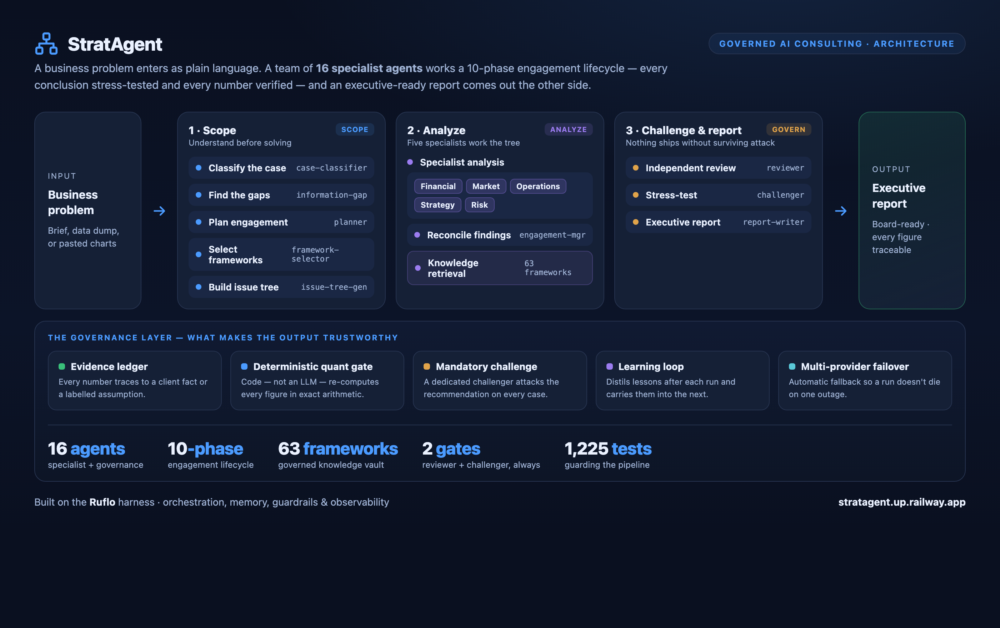
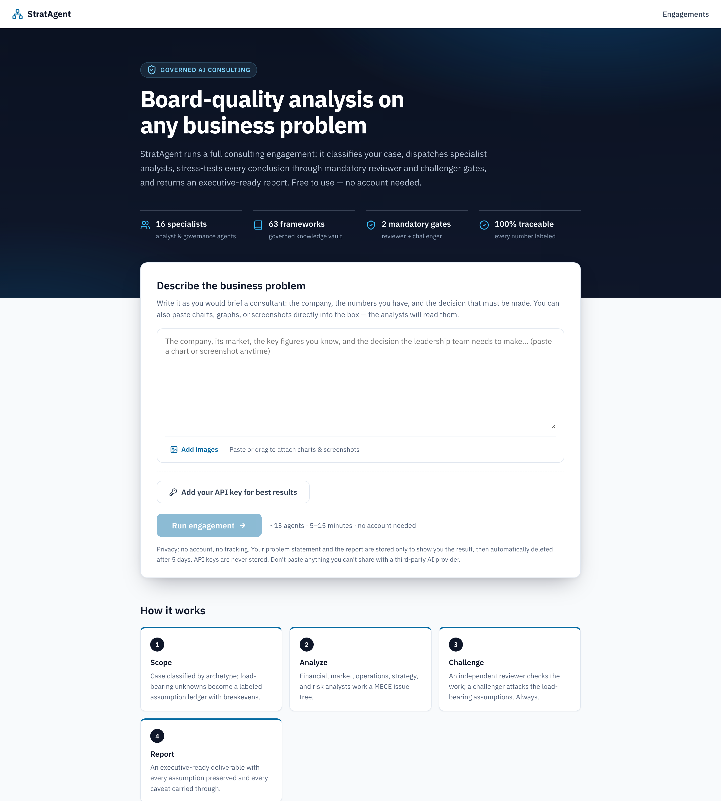
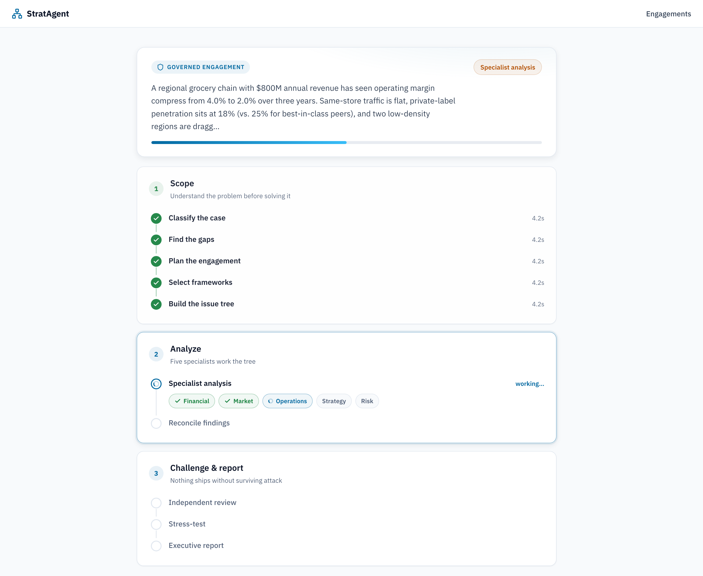
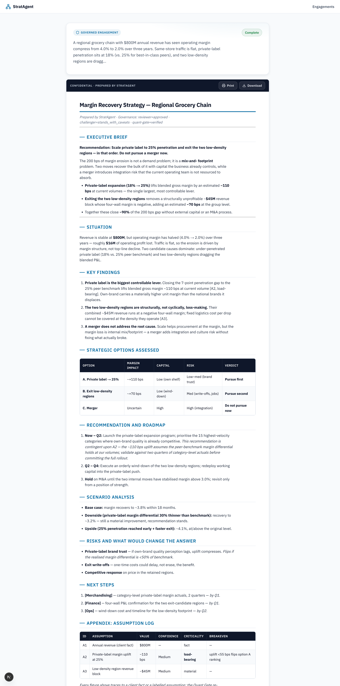

<div align="center">

# StratAgent

**Board-quality strategy analysis, on demand.**

Give it a business problem. It runs a full, *governed* consulting engagement —
classify → scope → frame → analyze → **review → challenge → verify** → report —
and hands back an executive-ready deliverable where every number traces to a
fact, a labeled assumption, or a machine-checked calculation.

[](https://stratagent.up.railway.app)

    

<br>



</div>

---

## 🚀 Use it now

**[stratagent.up.railway.app](https://stratagent.up.railway.app)** — paste a
business problem, watch the engagement run live, get an executive-ready
report. No signup, no install, free tier included.

That's the product. Everything below this point is a look under the hood —
architecture, workflow, and internal documentation — not a second way to run
StratAgent.

---

## 🎬 See it in action

<table>
<tr>
<td width="33%" align="center"><b>1. Describe the problem</b></td>
<td width="33%" align="center"><b>2. Watch it work</b></td>
<td width="33%" align="center"><b>3. Get the report</b></td>
</tr>
<tr>
<td></td>
<td></td>
<td></td>
</tr>
<tr>
<td>Write it like you'd brief a consultant — the company, the numbers, the
decision on the table. Paste charts or screenshots straight into the box.</td>
<td>Sixteen agents run in sequence: classify, scope, frame, five specialists
in parallel, then mandatory reviewer and challenger gates — all visible live.</td>
<td>An MBB-formatted deliverable. If the numbers don't check out, you get an
honest interim memo instead of a confident wrong answer — never the other way
around.</td>
</tr>
</table>

> [!IMPORTANT]
> **StratAgent is decision *support*, not a decision-maker.** The knowledge vault
> ships **no benchmark data** by design, so any number is a labeled `[ASSUMPTION]`
> unless *you* supplied it. A qualified human must verify every number and own the
> final recommendation. See [Appropriate Use](docs/beta/Beta-Program-Guide.md#5-ethics--appropriate-use-full).

## 🧭 What is StratAgent

StratAgent takes a raw business problem (a case-interview prompt, a real client
brief, or a messy data dump) and runs a complete consulting engagement end to
end. Its distinguishing feature is **governance in three layers**:

1. **Reviewer** — checks MECE coverage, evidence traceability, internal
   consistency, and confidence calibration across every analysis block.
2. **Challenger** — attacks the load-bearing assumptions and builds the
   strongest counter-case before anything ships.
3. **Quant Gate** — a *deterministic*, code-based verifier (not an LLM) that
   re-derives every formula in the engagement's assumption ledger and blocks
   the report if a single number doesn't tie out. LLMs are asked to get the
   math right; this layer *proves* it, in exact decimal arithmetic, or the
   engagement ships as an honest interim memo instead.

In independent evaluation this governance stack measurably caught
overconfidence and blind spots that a single-pass model shipped
([Research Evaluation](docs/reviews/v1.0-Research-Evaluation.md)), and in live
testing the Quant Gate has caught fabricated headline figures, silent rounding
errors, and unit mismatches that reviewer and challenger both missed.

## 🏗️ How it works

StratAgent is the **consulting vertical**; [Ruflo](https://github.com/ruvnet/ruflo)
is the **horizontal harness** it's built on. Two cooperating layers:

```
┌──────────────────────────────────────────────────────────────────────────┐
│  LLM layer (prompts)                                                      │
│    /solve-case  →  skills/solve-case/SKILL.md   (engagement orchestrator)  │
│    16 specialist subagents (agents/*.md)  —  classify … review … report    │
└────────────────┬───────────────────────────────────────────────────────────┘
                 │  dispatches subagents · reads/writes engagement artifacts
┌────────────────▼───────────────────────────────────────────────────────────┐
│  Python platform (packages/, deterministic libraries)                       │
│    state · persistence · replay        frozen core aggregate + event log    │
│    knowledge (vault retrieval) · planning · analysis · governance           │
│    reporting (render + validate) · orchestration (live validation gate)     │
│    evidence (provider seam) · telemetry (observability) · quant gate        │
└──────────────────────────────────────────────────────────────────────────┘
```

Design authority: [ADR-001](docs/architecture/ADR-001-System-Architecture.md) ·
[ADR-009: Deterministic Quant Gate](docs/architecture/ADR-009-Deterministic-Quant-Gate.md) ·
[Execution Flow](docs/architecture/Execution-Flow.md) ·
[Operations Runbook](docs/operations/Operations-Runbook.md).

### Agent workflow

```
/solve-case <problem>
  1  case-classifier ─────────── name the archetype, extract facts, list unknowns
  1b information-gap ─────────── surface load-bearing gaps → seed assumptions (source + band)
  2  planner ─────────────────── ordered, dependency-aware execution plan
  3  framework-selector ∥ issue-tree-generator  (MECE-validated)
  4  knowledge-agent ─────────── retrieve framework/domain notes from the vault
  5  analysts ────────────────── financial · market · operations · strategy · risk
  6  engagement-manager ──────── reconcile into ONE canonical ledger (quant-verifiable)
  7  quant gate  ⟵ DETERMINISTIC ─ re-derives every formula; blocks on mismatch
  8  reviewer  ⟵ MANDATORY ───── MECE, evidence, consistency, calibration, gaps
  9  challenger ⟵ MANDATORY ──── attack assumptions, counter-case, what-would-change
     report-writer ───────────── executive deliverable, gates cleared or honest interim
 10  knowledge-curator ───────── (optional) durable insights back to the vault
 11  reflector ──────────────── distils durable process lessons → next engagement
```

Governance gates are mandatory in every mode
([ADR-006](docs/architecture/ADR-006-Governance-and-Live-Validation.md)); agent
contracts are in [ADR-005](docs/architecture/ADR-005-Agent-Specifications.md).

### The learning loop

Every completed engagement — cleared or not — is reflected on: the reviewer's
notes, the challenger's counter-case, and (when it fired) the Quant Gate's
exact machine-generated defects are distilled into durable process lessons and
injected as guardrails into every future engagement's issue-tree step. The
platform gets stricter with use, not just busier.

## 🛠️ Tech stack

| Layer | Technology |
|---|---|
| **Backend** | Python 3.12 · FastAPI · SQLite · `uv` |
| **Frontend** | Next.js 15 · React 19 · TypeScript |
| **LLM providers** | Multi-provider free-tier chain (Gemini, Cerebras, OpenRouter, GitHub Models, Cloudflare Workers AI) with automatic failover, or BYOK (Anthropic, OpenAI, Groq, and others) |
| **Governance** | Reviewer + Challenger agents (LLM) · Quant Gate (deterministic Python, `decimal`-exact arithmetic, AST-sandboxed formula evaluation) |
| **Reference core** | 13 frozen Python packages — event-sourced state, replay engine, deterministic report validation |
| **Observability** | Custom telemetry package, per-engagement JSONL traces, OTel-ready spans |
| **Hosting** | Railway (backend + frontend, containerized) |
| **Quality bar** | `ruff` + `black` + `mypy --strict` + `pytest`, enforced across the reference core (954 tests) and the shipping dashboard (1,225 tests) — **2,179 passing** |

## ✨ Features

- **Full engagement lifecycle** — 13-state machine, 16 specialist agents, one command.
- **Governance by construction** — mandatory Reviewer + Challenger + a rework loop.
- **Deterministic Quant Gate** — every number in the assumption ledger is a
  client fact, a sourced assumption with a plausibility band, or a formula the
  platform re-evaluates in exact arithmetic; a report cannot ship with a
  number that doesn't tie out ([ADR-009](docs/architecture/ADR-009-Deterministic-Quant-Gate.md)).
- **Evidence discipline** — every number is a client fact or a labeled `[ASSUMPTION]`
  with a breakeven; labels survive into the report.
- **Learning loop** — durable process lessons distilled after every
  engagement, fed back into the next one automatically.
- **Unified knowledge vault** — one governed framework/domain store (60+ notes).
- **Evidence-provider seam** — pluggable sourced-evidence interface ([ADR-007]);
  none shipped (the platform never invents data).
- **Operational telemetry** — per-engagement JSONL traces, analytics, OTel-ready
  spans, kept separate from the domain event log.
- **Multi-provider resilience** — free-tier chain with automatic failover; a
  rate-limited run pauses and auto-resumes instead of failing.
- **Deterministic Python core** — frozen state, append-only event log, replay engine.

[ADR-007]: docs/architecture/ADR-007-Evidence-Providers.md

## 🧩 Development & self-hosting

The sections below are internal/contributor documentation — how the platform
is built and how to run a **development copy**. They are not a second product
surface: the [hosted dashboard](#use-it-now) above is how StratAgent is meant
to be used.

<details>
<summary>Docker self-host (dev/ops reference)</summary>

```bash
cd apps/dashboard
STRATAGENT_MOCK=1 docker compose up --build     # → http://localhost:3000
```

Mock mode runs the whole lifecycle with canned outputs — no API key, no
signup. Full options: [`apps/dashboard/README.md`](apps/dashboard/README.md).

</details>

<details>
<summary>Claude Code plugin (dev/ops reference)</summary>

Requires **Python ≥ 3.12**, **[uv](https://docs.astral.sh/uv/)**, and **Claude Code**.

```bash
uv sync
```

```
/plugin marketplace add .
/plugin install ruflo-stratagent@stratagent
/solve-case Our operating profit fell 18 points in a year — revenue is down and
costs are up. Why, and what's the fastest path to margin recovery?
```

Artifacts land in `engagements/<slug>/` (intake, plan, issue tree, analyses,
review, challenge, `state.json`, and `report.md`). Full guide:
[QUICKSTART](docs/guides/QUICKSTART.md) · [USER_GUIDE](docs/guides/USER_GUIDE.md).

</details>

## 📈 Example engagement

A genuinely-executed market-entry engagement (Northwind Cloud) was run during
evaluation. Engagement outputs are treated as **runtime artifacts** (the
`engagements/` directory is git-ignored, so they are reproduced when *you* run
`/solve-case`, not shipped). What ships in the repo is the committed evidence of
that run:

- Its **telemetry trace** (15 spans): [`docs/observability/samples/eng_northwind_eu.jsonl`](docs/observability/samples/README.md).
- The narrative in the [Research Evaluation](docs/reviews/v1.0-Research-Evaluation.md):
  the Challenger caught a **CLOUD Act sovereignty ceiling** the analysts missed,
  and the report honestly refused to call EU a 5-year NPV winner.

Two more pilots (`halberd-cost`, `harbor-vine-org`) plus single-pass baselines were
run the same way; their telemetry traces are in
[`docs/observability/samples/`](docs/observability/samples/README.md).

## 🗂️ Repository structure

```
plugins/ruflo-stratagent/   DOMAIN DEFINITION — commands, skill orchestrator, 16 agents
apps/dashboard/             SHIPPING PRODUCT — public web app (FastAPI + Next.js)
packages/                   REFERENCE CORE — 13 Python packages, frozen (954 tests)
scripts/                    CLI tools (validation, telemetry, schema)
tests/                      pytest suite for packages/ (954 tests)
knowledge-vault/            THE knowledge source of truth (governed notes)
engagements/                per-engagement artifacts + worked examples
docs/                       architecture, guides, operations, observability, beta, reviews
```

**Three artifacts, one product line.** The plugin's agents + vault are the
canonical consulting behaviour; `apps/dashboard/` is the production web app that
runs them (and reads the same `agents/*.md` at runtime); `packages/` is the
frozen, strictly-typed reference core. Which one to edit for a given change is
spelled out in
[ADR-008: Repository Topology](docs/architecture/ADR-008-Repository-Topology.md).

## 📚 Documentation index

| Area | Start here |
|---|---|
| **Operate it** | [Operations Runbook](docs/operations/Operations-Runbook.md) |
| Use it | [Quickstart](docs/guides/QUICKSTART.md) · [User Guide](docs/guides/USER_GUIDE.md) |
| Build on it | [Developer Guide](docs/guides/DEVELOPER_GUIDE.md) · [Multi-Model Engineering Workflow](docs/operations/Engineering-Workflow.md) |
| Architecture | [ADRs 001–010](docs/architecture/) · [Execution Flow](docs/architecture/Execution-Flow.md) |
| Observability | [Telemetry](docs/observability/Telemetry-Architecture.md) · [Dashboards](docs/observability/Dashboards.md) |
| Evidence & quality | [Research Evaluation](docs/reviews/v1.0-Research-Evaluation.md) · [RC1 Audit](docs/reviews/RC1-Engineering-Audit.md) |
| Try with users | [Beta Program](docs/beta/Beta-Program-Guide.md) |
| Roadmap & release | [ROADMAP](ROADMAP.md) · [CHANGELOG](CHANGELOG.md) |

## 🧭 Roadmap (short)

Populate an evidence provider (close the assumptions-only gap) · stand up
telemetry export + dashboards · larger genuine evaluation (n ≥ 12) · enterprise
hardening. Full list: [ROADMAP.md](ROADMAP.md).

## 💬 Questions, issues, or feedback?

Hit something broken, have a question, or want to talk about the project?
**[Open an issue](https://github.com/Darpan00720/Consulting-Agent/issues)** —
that's the one place to leave a comment and reach the team. Bug reports,
feature ideas, and "here's a case that broke it" are all welcome; the more
specific ("the conversion assumption is 2× too high"), the more useful.

## 🤝 Contributing

Contributions welcome — see [CONTRIBUTING.md](CONTRIBUTING.md) and the
[Code of Conduct](CODE_OF_CONDUCT.md). The one-line quality gate is `make check`
(`ruff` + `black --check` + `mypy` + `pytest`). Never modify the frozen core
(`packages/state|persistence|replay`) or an accepted ADR — supersede instead.

## 🔒 Security & support

Report vulnerabilities per [SECURITY.md](SECURITY.md). Getting-help paths are in
[SUPPORT.md](SUPPORT.md) and [FAQ.md](FAQ.md).

## 📄 License

[MIT](LICENSE) © 2026 Darpan. Built on [Ruflo](https://github.com/ruvnet/ruflo);
see [ACKNOWLEDGEMENTS.md](ACKNOWLEDGEMENTS.md). If you use StratAgent in research,
please [cite it](CITATION.cff).
