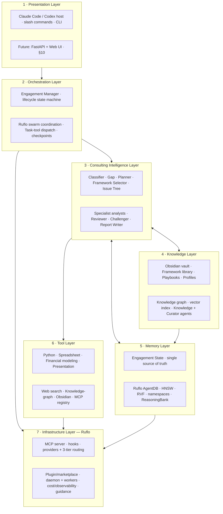
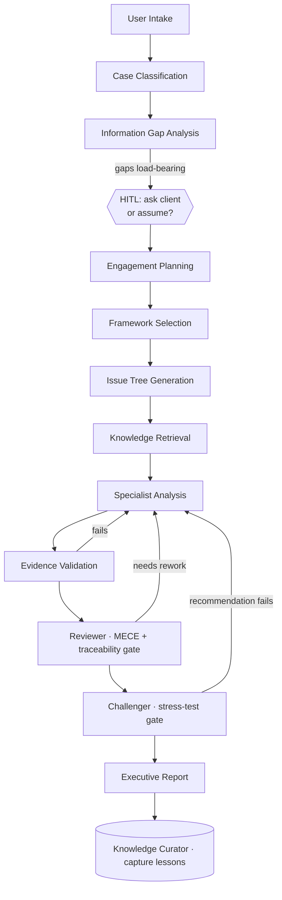
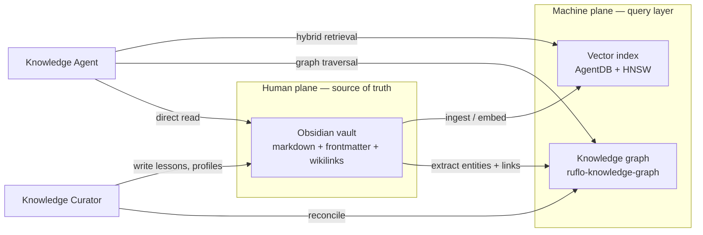
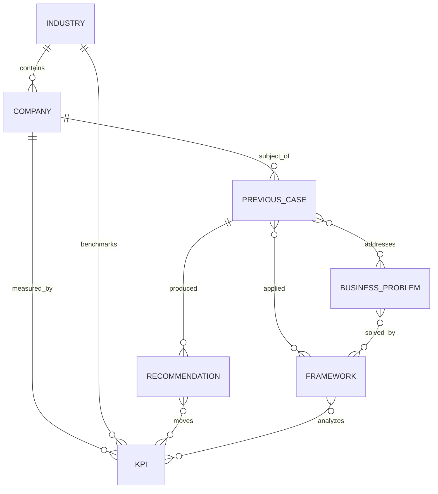
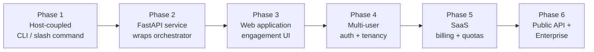

# ADR-001 — StratAgent System Architecture

> **Status:** Proposed (awaiting ratification before implementation)
> **Scope:** The definitive architecture blueprint for StratAgent. All subsequent
> ADRs and implementation work derive from this document.

**Decision drivers**
- Deliver real management-consulting reasoning, not chat-flavored summaries.
- Maximize reuse of proven agent infrastructure; build only the consulting vertical.
- Evidence-based, auditable output (every claim traces to fact / source / labeled assumption).
- Maintainable, modular, and able to grow into a multi-user SaaS without a rewrite.

**Alternatives considered**
1. **Build the full platform from scratch** — rejected: re-implements orchestration, memory, MCP, routing, observability that Ruflo already provides (see ADR-000 / Ruflo review).
2. **Use a generic agent framework (LangGraph/CrewAI/etc.)** — rejected: weaker memory/learning/governance story, no native Claude Code/Codex host integration, and still no consulting domain.
3. **Build the consulting vertical on Ruflo** — **chosen.** Ruflo is the infrastructure layer; StratAgent is the domain layer.

---

# 1. Executive Summary

## Vision
StratAgent is an **AI-native management-consulting platform**. It takes a raw
business problem — an interview-style prompt, a real client brief, or a messy
data dump — and runs a complete consulting engagement: it classifies the case,
finds the information gaps, plans the engagement, selects and adapts frameworks,
builds a MECE issue tree, dispatches specialist consultant agents, validates the
evidence, challenges the recommendation, and produces an executive-ready
deliverable. It behaves like a small, disciplined consulting firm that never
skips the rigor steps.

## Why StratAgent exists
General-purpose LLMs *sound* like consultants but fail the things that make
consulting trustworthy: they assert numbers without provenance, skip the
"what has to be true" pressure test, force every problem into one memorized
framework, and lose context across a long engagement. StratAgent encodes the
**discipline** — structured classification, explicit assumption ledgers, MECE
issue trees, a mandatory challenge pass, and traceable evidence — as a
multi-agent system with a shared source of truth. The product is the rigor, not
the prose.

## Why Ruflo is the infrastructure layer
The Ruflo architecture review (ADR-000) verified a clean separation: **Ruflo
orchestrates and remembers; the host executes.** Ruflo supplies multi-agent
coordination (swarm topologies, hive-mind), persistent vector memory
(AgentDB + HNSW + RVF) with namespaces and consolidation, an MCP server and
tool registry, a hooks lifecycle with ReasoningBank learning, multi-LLM
providers with tiered cost routing, GOAP planning (`ruflo-goals`), a governance
control plane (`guidance`), guardrails (`aidefence`/`security`), and
cost/observability plugins. Re-implementing any of this would be wasted effort.
StratAgent therefore builds **only** the consulting vertical — domain agents,
frameworks, issue trees, the evidence model, and executive deliverables — and
consumes Ruflo for everything horizontal.

**Consequence of the host model:** Ruflo does not execute work; the host agent
(Claude Code or Codex) does. StratAgent's "Engagement Manager" is therefore a
**host-side, prompt-level orchestrator** (a skill/agent driving the Task tool +
Ruflo MCP), not a standalone server. This is the central architectural truth
that shapes every layer below.

---

# 2. Overall System Architecture

Seven layers. Dependencies flow downward only; each layer talks to the one below
through a defined contract (MCP tools, the Engagement State, or file artifacts).



### Layer responsibilities & interactions

| Layer | Responsibility | Consumes | Exposes |
|---|---|---|---|
| **1 Presentation** | Entry point for a problem and delivery of results. Today: the host's `/solve-case` command + CLI. Tomorrow: FastAPI + web UI (§10). | Orchestration | A case in, a deliverable + status out |
| **2 Orchestration** | Owns the engagement **lifecycle state machine** (§3); decides which agents run, in what order, and when to pause for human input or a quality gate. Uses Ruflo swarm for coordination records and the host **Task tool** for actual dispatch. | Consulting Intelligence, Infra | Phase transitions, dispatch plan, checkpoints |
| **3 Consulting Intelligence** | The domain brain: 16 specialist agents (§6). Each does one job, reads/writes the Engagement State, and uses Tools + Knowledge. | Knowledge, Memory, Tools | Findings, evidence, issue tree, recommendation |
| **4 Knowledge** | The consulting "firm memory": Obsidian vault (human-editable markdown) + a derived knowledge graph & vector index (machine-queryable). Frameworks, playbooks, company profiles, past engagements, lessons, templates. | Memory, Tools | Retrieval results, graph answers, templates |
| **5 Memory** | Persistence + the **Engagement State** (the single source of truth, §4). Backed by Ruflo AgentDB (namespaces, HNSW, RVF) and event-sourced. | Infrastructure | State read/write, semantic recall, learning |
| **6 Tool** | Capabilities agents invoke to act: compute, model, research, generate. Exposed uniformly via MCP. | Infrastructure | Tool calls + results |
| **7 Infrastructure (Ruflo)** | Everything horizontal: MCP server, hooks + learning, providers + routing, plugin system, daemon/workers, cost/observability, guidance/guardrails. | — | MCP tools, hooks, routing, plugins |

**Key interaction pattern (verified against Ruflo):** for any complex phase the
Orchestration layer issues **MCP coordination first, then the host Task tool in
the same turn** to spawn the specialists that do the real work. Specialists
never talk to each other directly — they coordinate exclusively through the
Engagement State (§4).

---

# 3. Engagement Lifecycle

The lifecycle is a state machine with **quality gates** between phases. A gate
can pass, loop back (rework), or pause for human input (HITL). The Reviewer and
Challenger gates are **mandatory** — they cannot be skipped.



| Phase | Inputs | Responsibilities | Outputs | Success criteria |
|---|---|---|---|---|
| **User Intake** | Raw problem text / documents | Capture verbatim; create engagement id + namespace; init Engagement State | `raw_input`, `client`, empty state shell | State created; nothing interpreted yet |
| **Case Classification** | `raw_input` | Name the archetype (primary + hybrid), extract the real question + known facts | `case_type`, `real_question`, `known_facts[]`, `classification_confidence` | Archetype matches the actual decision, not the symptom |
| **Information Gap Analysis** | classification + facts | List only **load-bearing** unknowns; decide ask-vs-assume per gap | `information_gaps[]`, seed `assumptions[]` | No analysis proceeds on an unstated load-bearing gap |
| **Engagement Planning** | gaps, archetype | Build GOAP plan: steps, dependencies, agent assignment, sequencing | `engagement_plan` | Plan is executable; parallel vs blocking is explicit |
| **Framework Selection** | archetype, question | Select + **adapt** frameworks (not recite); justify | `frameworks_selected[]` | Frameworks fit the question; adaptation stated |
| **Issue Tree Generation** | frameworks, question | Build MECE tree; each node is a question with an owner | `issue_tree` | MECE: complete, non-overlapping, answerable |
| **Knowledge Retrieval** | issue tree, client | Pull relevant frameworks, playbooks, company profiles, prior cases, benchmarks | `evidence[]` (typed, cited) | Retrieved items are relevant + provenance-tagged |
| **Specialist Analysis** | assigned tree nodes + facts | Each analyst answers its node(s) with math/logic, labeling assumptions + sensitivity | `specialist_findings[]`, more `evidence[]`/`assumptions[]` | Each answer quantified, traceable, confidence-rated |
| **Evidence Validation** | findings + evidence | Verify every claim traces to fact/source/assumption; recompute key numbers | `evidence[].validated`, flags | No unsupported claim survives; math re-checked |
| **Reviewer** | full state | MECE coverage, internal consistency, confidence calibration | `review` (verdict + issues) | Tree fully answered; no contradictions; calibrated |
| **Challenger** | full state | Load-bearing assumption test, strongest counter-case, what-would-change | `challenge` (verdict) | Recommendation survives, or is sent back with named flaws |
| **Executive Report** | validated, challenged state | Synthesize exec deliverable; preserve assumption labels | `recommendation`, `deliverables[]` | Reads top-down; assumptions visible; decision unambiguous |
| **Knowledge Curator** *(async)* | completed engagement | Capture lessons, update playbooks/profiles, sync graph | vault + graph updates | Firm memory improved; nothing client-confidential leaked cross-tenant |

**Gate semantics.** Each gate writes a `quality_gates` entry (pass/fail/loop +
timestamp). A failed Reviewer or Challenger gate re-dispatches only the
implicated specialist(s) with the finding attached — never a silent override.

---

# 4. Engagement State

The Engagement State is the **single source of truth**. Every agent reads the
slice it needs and writes only its own fields. It is:

- **Persisted** in Ruflo AgentDB under namespace `stratagent:eng:<id>`.
- **Mirrored** to `engagements/<slug>/state.json` for transparency + git diff.
- **Event-sourced**: an append-only `events[]` log + a materialized current view,
  so every transition is auditable and the engagement is resumable after a crash.
- **Concurrency-safe**: the Engagement Manager owns transition writes; parallel
  specialists write only to their own sub-keys (`specialist_findings[]` entries
  keyed by agent) to avoid clobbering during fan-out.

### Schema

| Field | Type | Written by | Why it exists |
|---|---|---|---|
| `engagement_id` | id | Intake | Stable key for memory namespace + audit |
| `created_at` / `updated_at` | timestamp | Manager | Lifecycle + staleness tracking |
| `status` | enum(phase) | Manager | Current state-machine position; drives routing |
| `phase_history[]` | list | Manager | Resumability + audit of transitions |
| `client` | object{name, industry, geo, size} | Intake | Context for sizing, benchmarks, tenant scoping |
| `raw_input` | text | Intake | Verbatim problem; never overwritten (provenance) |
| `case_type` | object{primary, secondary?, confidence} | Classifier | Routes framework + agent selection |
| `real_question` | text | Classifier | The decision being made (vs the symptom) |
| `objectives` / `success_criteria` | list | Classifier | What "good" means for the client |
| `constraints[]` | list | Classifier | Off-the-table items bound the solution space |
| `stakeholders[]` | list | Classifier | Who decides / is affected |
| `known_facts[]` | list{statement, source} | Classifier | Given facts, each provenance-tagged |
| `information_gaps[]` | list{question, criticality, status, resolution} | Gap Agent | Forces ask-vs-assume before analysis |
| `assumptions[]` | list{id, statement, value, rationale, owner, confidence, load_bearing, breakeven, status} | any analyst | **The assumption ledger** — the core of auditability |
| `evidence[]` | list{id, claim, type, source, confidence, links, validated, validator} | analysts, Knowledge, Reviewer | **The evidence ledger** — every claim → fact/source/assumption/computed |
| `engagement_plan` | object{steps[], deps, assignments} | Planner | Executable GOAP plan; enables parallelism |
| `frameworks_selected[]` | list{id, name, rationale, adaptation} | Framework Selector | Records *why/how* a framework was applied |
| `issue_tree` | tree{node{id, parent, question, owner, status, answer, confidence}} | Issue Tree Gen | MECE decomposition; the analysis contract |
| `specialist_findings[]` | list{agent, node_ids, answer, method, evidence_refs, assumption_refs, sensitivity, confidence, status} | analysts | Per-branch results, fully traceable |
| `analysis_artifacts[]` | list{path, kind} | analysts | Pointers to files (models, charts) |
| `review` | object{checks[], verdict, issues[]} | Reviewer | Mandatory QA gate result |
| `challenge` | object{loadbearing_test, counter_case, what_would_change, verdict} | Challenger | Mandatory stress-test result |
| `recommendation` | object{decision, rationale, next_steps[], risks[], confidence} | Report Writer | The answer + how to act on it |
| `deliverables[]` | list{path, format, status} | Report Writer | Report/deck/model outputs |
| `routing_log[]` | list{task, tier, model, reason} | Manager/Ruflo | Model-tier decisions for cost/audit |
| `cost` | object{tokens, usd} | Ruflo cost-tracker | Per-engagement economics |
| `quality_gates[]` | list{gate, result, ts} | Manager | Proves rigor steps ran; blocks skipping |
| `events[]` | append-only log | all | Event-sourced audit trail; resumability |
| `memory_namespace` | string | Intake | Binds state to its AgentDB namespace |
| `tenant_id` | id | Intake | Multi-tenant isolation (future SaaS, §10) |

**Why this design:** the two ledgers (`assumptions[]`, `evidence[]`) are what
make StratAgent *consulting-grade* rather than plausible-sounding. They are
first-class, not buried in prose, so the Reviewer/Challenger can mechanically
audit them and the Report Writer can surface them. `events[]` + `phase_history[]`
make engagements durable and explainable — essential for enterprise trust.

---

# 5. Knowledge Architecture

A two-plane design: a **human plane** (Obsidian) and a **machine plane** (graph +
vectors), kept in sync by the Knowledge Curator.



### What is stored, and where

| Knowledge type | Lives in (Obsidian folder) | Machine representation |
|---|---|---|
| **Framework library** | `frameworks/` | Graph `Framework` nodes + embeddings |
| **Industry playbooks** | `playbooks/<industry>/` | `Industry`→`Playbook` edges + embeddings |
| **Company profiles** | `companies/` | `Company` nodes (KPIs, segments) |
| **Past engagements** | `engagements/` (sanitized) | `PreviousCase` nodes + embeddings |
| **Lessons learned** | `lessons/` | linked to `PreviousCase`/`Framework` |
| **Templates** | `templates/` | referenced by Report Writer |

### Storage
Obsidian is a **git-backed markdown vault** — the authoritative, human-editable
store. Notes use YAML frontmatter (typed metadata) and `[[wikilinks]]` (relations).
This makes the knowledge base reviewable, diff-able, and editable by consultants
without touching code.

### Retrieval
The **Knowledge Agent** performs **hybrid retrieval**: (1) vector similarity over
embedded notes (AgentDB/HNSW) for "what's relevant," (2) graph traversal
(`ruflo-knowledge-graph`) for "what's related" (e.g., frameworks used on similar
cases, peer-company benchmarks), and (3) direct file read for exact framework
text/templates. Results are written to `evidence[]` with provenance.

### Updates
Only the **Knowledge Curator** writes to the vault, post-engagement: it distills
lessons, updates company profiles with newly verified facts, and proposes
playbook edits. Writes go through the vault (human-reviewable PR), then the
machine plane is re-synced. Engagement-time agents never mutate firm knowledge.

### Governance
- **Provenance required:** every knowledge note carries `source` + `last_verified`
  frontmatter; the `guidance` control plane enforces this on ingestion.
- **Tenant isolation:** client-confidential profiles/engagements are namespaced by
  `tenant_id`; cross-tenant retrieval is blocked (critical for SaaS, §10).
- **Freshness:** stale notes (`last_verified` past threshold) are down-ranked.
- **Quality:** the Curator + a `guidance` policy reject unsourced or low-confidence
  contributions.

---

# 6. Agent Architecture

16 agents. Each is single-purpose, coordinates only through Engagement State, and
is assigned a default **model tier** — **A** = Haiku (`claude-haiku-4-5`, fast/cheap),
**B** = Sonnet (`claude-sonnet-4-6`, balanced), **C** = Opus (`claude-opus-4-8`,
deep reasoning) — routed via Ruflo's provider/routing layer.

> *Evolution note:* this supersedes the prototype's 7-agent set. `case-classifier`
> splits into **Classifier + Information Gap Agent**; `framework-strategist` splits
> into **Framework Selector + Issue Tree Generator**; **Planner, Knowledge Agent,
> Strategy Analyst, Risk Analyst, Reviewer, Knowledge Curator** are new.

**Engagement Manager** — orchestrates the lifecycle *(Tier C)*
- Responsibilities: drive the state machine; decide dispatch order; enforce gates + HITL; merge results.
- In: `raw_input` → Out: phase transitions, dispatch plan. Reads: all · Writes: `status`, `phase_history`, `quality_gates`, `routing_log`, `events`.
- Tools: Ruflo swarm MCP, Task tool, memory. Success: every phase + mandatory gate executed in order. Fails if: skips a gate, or proceeds on a failed gate.

**Case Classifier** — names the case *(Tier A)*
- Responsibilities: archetype (primary+hybrid), real question, known facts.
- In: `raw_input` → Out: classification. Reads: `raw_input` · Writes: `case_type`, `real_question`, `known_facts`, `objectives`, `constraints`, `stakeholders`.
- Tools: Knowledge (archetype lookup). Success: archetype = the actual decision. Fails if: classifies the symptom; invents facts.

**Information Gap Agent** — finds what's missing *(Tier A)*
- Responsibilities: list load-bearing unknowns; recommend ask-vs-assume; seed assumptions.
- In: classification + facts → Out: gaps. Reads: `case_type`, `known_facts` · Writes: `information_gaps`, seed `assumptions`.
- Tools: Knowledge. Success: every load-bearing gap surfaced before analysis. Fails if: lists trivia or misses a decisive gap.

**Planner** — builds the engagement plan *(Tier B)*
- Responsibilities: GOAP plan — steps, dependencies, agent assignment, parallel vs blocking.
- In: gaps + archetype → Out: plan. Reads: `case_type`, `information_gaps` · Writes: `engagement_plan`.
- Tools: `ruflo-goals` (GOAP). Success: executable, dependency-correct plan. Fails if: plan is unsequenced or assigns unavailable agents.

**Framework Selector** — picks + adapts frameworks *(Tier B)*
- Responsibilities: choose frameworks, justify, state adaptation.
- In: archetype + question → Out: selection. Reads: `case_type`, `real_question` · Writes: `frameworks_selected`.
- Tools: Knowledge (framework library). Success: frameworks fit; adaptation explicit. Fails if: recites a template that doesn't fit.

**Issue Tree Generator** — builds the MECE tree *(Tier B)*
- Responsibilities: decompose the question into a MECE tree of owned sub-questions.
- In: frameworks + question → Out: tree. Reads: `frameworks_selected`, `real_question` · Writes: `issue_tree`.
- Tools: Knowledge. Success: complete + non-overlapping + answerable. Fails if: overlaps, gaps, or topic-labels instead of questions.

**Knowledge Agent** — retrieves firm knowledge *(Tier B)*
- Responsibilities: hybrid retrieval (vector + graph + file) for tree nodes; tag provenance.
- In: `issue_tree`, `client` → Out: evidence. Reads: `issue_tree`, `client` · Writes: `evidence` (type=external_source).
- Tools: Knowledge-graph, Obsidian, Web search, vector memory. Success: relevant + cited. Fails if: returns irrelevant or unsourced items.

**Financial Analyst** — the quant *(Tier B)*
- Responsibilities: P&L bridges, unit economics, valuation, breakeven, sensitivity.
- In: assigned nodes + facts → Out: quantified findings. Reads: `issue_tree`, `known_facts`, `assumptions` · Writes: `specialist_findings`, `assumptions`, `evidence(computed)`.
- Tools: Python, Spreadsheet, Financial modeling. Success: math traceable + sensitized; assumptions labeled. Fails if: states assumed numbers as fact, or skips sensitivity.

**Market Analyst** — demand side *(Tier B)*
- Responsibilities: TAM/SAM/SOM, competitive dynamics, segments, willingness-to-pay.
- In: assigned nodes + facts → Out: market findings. Reads/Writes: as analysts above.
- Tools: Web search, `ruflo-market-data`, Python. Success: sizing method stated; benchmarks labeled. Fails if: fabricates a citation; confuses big with attractive.

**Operations Analyst** — cost/supply side *(Tier B)*
- Responsibilities: cost-to-serve, capacity, process, supply chain; one-time vs run-rate.
- In: assigned nodes + facts → Out: ops findings. Reads/Writes: as analysts above.
- Tools: Python, Spreadsheet. Success: cost decomposed before cuts; second-order effects flagged. Fails if: recommends cuts without trade-offs.

**Strategy Analyst** — positioning/options *(Tier B)*
- Responsibilities: competitive strategy, market-entry mode, build/buy/partner, strategic options + trade-offs.
- In: assigned nodes + facts → Out: strategy findings. Reads/Writes: as analysts above.
- Tools: Web search, Knowledge-graph. Success: options compared against next-best alternative. Fails if: asserts "strategic fit" with no quantified case.

**Risk Analyst** — downside/feasibility *(Tier B)*
- Responsibilities: execution, regulatory, financial, competitive-response risks; likelihood × impact; mitigations.
- In: findings so far → Out: risk register. Reads: `specialist_findings`, `assumptions` · Writes: `specialist_findings`, `evidence`.
- Tools: Python, Web search, Knowledge-graph. Success: top risks quantified + mitigated. Fails if: generic risk list with no impact sizing.

**Reviewer** — evidence + MECE QA gate *(Tier C)*
- Responsibilities: verify tree fully answered, evidence traceable, internal consistency, confidence calibration.
- In: full state → Out: review verdict. Reads: all analysis fields · Writes: `review`, `quality_gates`, `evidence.validated`.
- Tools: memory, Python (recompute). Success: no unsupported claim or contradiction passes. Fails if: rubber-stamps; misses an unanswered branch.

**Challenger** — stress-test gate *(Tier C)*
- Responsibilities: load-bearing assumption test, strongest counter-case, what-would-change.
- In: full state → Out: challenge verdict. Reads: all · Writes: `challenge`, `quality_gates`.
- Tools: memory, Python. Success: real counter-argument constructed or recommendation verified. Fails if: manufactures a weak objection or softens findings.

**Executive Report Writer** — the deliverable *(Tier C)*
- Responsibilities: synthesize exec narrative; preserve assumption labels; produce report/deck/model.
- In: validated + challenged state → Out: deliverables. Reads: all · Writes: `recommendation`, `deliverables`.
- Tools: Presentation gen, Spreadsheet, Obsidian (templates). Success: top-down readable; decision unambiguous; assumptions visible. Fails if: upgrades an assumption to fact for smoothness.

**Knowledge Curator** — firm memory *(Tier A/B, async)*
- Responsibilities: post-engagement, capture lessons, update profiles/playbooks, reconcile graph; enforce provenance + tenant isolation.
- In: completed engagement → Out: vault + graph updates. Reads: full state · Writes: Obsidian vault, knowledge graph (not Engagement State).
- Tools: Obsidian, Knowledge-graph, `guidance`. Success: reusable lesson captured, no cross-tenant leakage. Fails if: writes unsourced knowledge or leaks confidential data.

---

# 7. Tool Layer

All tools are exposed uniformly through the Ruflo MCP registry; agents call them
the same way regardless of backend.

| Tool | Provided by | Primary agents | Purpose |
|---|---|---|---|
| **Python (sandboxed exec)** | Ruflo runtime / host | Financial, Operations, Risk, Reviewer | Run real calculations; never do arithmetic in prose |
| **MCP (tool transport)** | `@claude-flow/mcp` | All | Uniform tool access, schema validation, rate limiting |
| **Web Search** | `ruflo-browser` + WebSearch | Market, Strategy, Risk, Knowledge | Real-world facts/benchmarks for non-anonymized cases |
| **Financial Modeling** | Python libs + templates | Financial | DCF, NPV/IRR, synergy, breakeven, valuation |
| **Spreadsheet Analysis** | `xlsx` skill / Python | Financial, Operations, Report Writer | Build/read models; produce `.xlsx` deliverables |
| **Presentation Generation** | `pptx`/`docx` skills, Gamma | Report Writer | Executive decks + written reports |
| **Knowledge Graph** | `ruflo-knowledge-graph` | Knowledge, Strategy, Risk, Curator | Relationship queries (peer cases, benchmarks) |
| **Obsidian** | vault adapter (file + MCP) | Knowledge, Report Writer, Curator | Read framework/playbook/template notes; write lessons |

**Cross-cutting (infra, used implicitly):** memory (`memory_store/search`),
cost-tracker, observability, `aidefence` (PII/injection screening on ingested
client documents), `guidance` (policy enforcement). These are not invoked
per-task by domain agents — they wrap the whole engagement.

---

# 8. Knowledge Graph

The graph makes the firm's experience *queryable by relationship*, complementing
vector search's "similarity."



### Node types & key properties

| Node | Key properties |
|---|---|
| **Company** | name, industry, size, geo, segments, `tenant_id` |
| **Industry** | name, structure, typical-margins, growth |
| **Framework** | name, archetype, when-to-use, steps, source |
| **KPI** | name, formula, unit, industry-benchmark |
| **BusinessProblem** | archetype, description, typical drivers |
| **Recommendation** | decision, rationale, outcome (if known), confidence |
| **PreviousCase** | client(anon), problem, frameworks, result, `tenant_id`, date |

### Core relationships
`Industry —contains→ Company`; `Company —subject_of→ PreviousCase`;
`PreviousCase —applied→ Framework`; `PreviousCase —produced→ Recommendation`;
`BusinessProblem —solved_by→ Framework`; `Company —measured_by→ KPI`;
`Recommendation —moves→ KPI`; `Industry —benchmarks→ KPI`.

### How agents query the graph
Agents do not query directly; they ask the **Knowledge Agent**, which translates
an analytical need into graph + vector calls. Typical queries:
- *Framework Selector:* "frameworks `solved_by` for `BusinessProblem(archetype=profitability)`, ranked by prior `Recommendation.outcome`."
- *Market/Strategy Analyst:* "`KPI` benchmarks for `Industry(grocery)`" and "peer `Company` segments."
- *Challenger:* "`PreviousCase` where a similar `Recommendation` failed — what changed the answer?"
- *Curator (write):* on close, create a `PreviousCase` node, link `Framework`/`Recommendation`/`KPI`, tag `tenant_id`.

All reads are **tenant-scoped**; cross-tenant traversal is denied by a `guidance`
policy.

---

# 9. Repository Structure

A monorepo: the StratAgent plugin (domain), the knowledge vault, engagement
artifacts, docs, and a reserved place for the future service shell.

```
stratagent/
├── .claude-plugin/
│   └── marketplace.json              # local Ruflo marketplace (installable)
├── plugins/
│   └── ruflo-stratagent/             # THE PLUGIN — domain layer (source of truth)
│       ├── .claude-plugin/plugin.json
│       ├── commands/                 # /solve-case and future commands
│       ├── skills/                   # engagement orchestrator + sub-skills
│       ├── agents/                   # the 16 specialist agents (§6)
│       ├── knowledge/                # framework library (machine copy)
│       └── README.md
├── knowledge-vault/                  # OBSIDIAN VAULT (firm knowledge, §5)
│   ├── frameworks/  playbooks/  companies/
│   ├── engagements/ lessons/    templates/
│   └── .obsidian/                    # vault config (graph, plugins)
├── engagements/                      # per-engagement runtime artifacts + state.json
├── docs/
│   ├── architecture/                 # ADRs (this document)
│   └── adr/                          # subsequent ADRs
├── eval/                             # consulting case-bank + rubric (quality harness)
├── apps/                             # RESERVED — future service shell (§10)
│   ├── api/                          # FastAPI (future)
│   └── web/                          # web UI (future)
├── .claude/                          # standalone-dev symlinks into the plugin
└── CLAUDE.md                         # project guide
```

### Ownership & dependencies

| Folder | Owns | Depends on |
|---|---|---|
| `plugins/ruflo-stratagent/` | Agents, skills, commands, framework copy | Ruflo (infra), `knowledge-vault` (read), Engagement State |
| `knowledge-vault/` | Firm knowledge (human-editable) | git (versioning); synced to graph/vectors |
| `engagements/` | Per-run state + artifacts | the plugin (writes), Ruflo memory (mirror) |
| `docs/` | ADRs + design records | — |
| `eval/` | Case bank + scoring rubric | the plugin (system under test) |
| `apps/` | Future API/web (empty now) | the plugin (imports orchestrator) |

**Single-source-of-truth rule:** agents/skills/frameworks live in
`plugins/ruflo-stratagent/`; `.claude/*` are symlinks for standalone dev. The
plugin is the only editable home — no duplication, no drift.

---

# 10. Future Evolution

StratAgent is host-coupled today (runs inside Claude Code/Codex). The path to a
multi-user SaaS wraps the **same** consulting brain in successively larger shells
— no rewrite, because the orchestrator + agents stay identical and only the entry
point changes.



| Phase | Adds | Reuses unchanged | New concerns |
|---|---|---|---|
| **1 · Host-coupled** *(now)* | `/solve-case` in Claude Code/Codex | — | none |
| **2 · FastAPI** | A service that invokes the orchestrator via the Claude Agent SDK; async engagements via a job queue | Agents, state, knowledge | Long-running jobs, idempotency |
| **3 · Web app** | Engagement dashboard, HITL approvals, deliverable viewer | API contract | Real-time status, file delivery |
| **4 · Multi-user** | Auth (SSO/OIDC), RBAC, `tenant_id` enforcement everywhere | State (already tenant-tagged), KG (tenant-scoped) | Isolation, per-tenant vaults |
| **5 · SaaS** | Billing, usage quotas (Ruflo cost-tracker → metering), plans | Cost data | Metering accuracy, fair-use |
| **6 · API + Enterprise** | Public REST/MCP API; on-prem/VPC + Ruflo federation; audit export; compliance | Event-sourced state = audit log | SOC2, data residency, on-prem deploy |

**Why this is low-risk:** the Engagement State is already serializable,
tenant-tagged, and event-sourced; the orchestrator is already a pure controller
over agents + Ruflo. Phase 2 is "call the existing thing from FastAPI," not "port
the logic." Each phase adds an outer ring (the part the Ruflo review flagged as
*not* provided by Ruflo) without touching the consulting core.

---

# Consequences & Trade-offs

**Positive**
- ~70% of platform infrastructure is reused from Ruflo; build effort concentrates on consulting value.
- Evidence/assumption ledgers + mandatory Reviewer/Challenger gates make output auditable and enterprise-credible.
- Obsidian gives a human-editable, versioned knowledge base consultants can own without code.
- Clean evolution path to SaaS with no core rewrite.

**Negative / accepted**
- **Dependency on a fast-moving third party** (Ruflo, alpha packages). Mitigation: pin versions; isolate Ruflo behind the Tool/Memory contracts so it is swappable.
- **Host-coupling**: until Phase 2, StratAgent needs Claude Code/Codex to run.
- **Two knowledge planes** (Obsidian + graph/vectors) require a sync discipline owned by the Curator.
- **Ruflo is SWE-oriented**: its Tier-1 codemods and coding agents are unused; we adopt only the relevant subset (coordination, memory, routing, planning, guidance).

**Open items for follow-up ADRs**
- ADR-002: Engagement State storage + event schema details.
- ADR-003: Knowledge-vault ↔ graph sync protocol + provenance policy.
- ADR-004: Model-routing policy (complexity → tier) + cost budgets.
- ADR-005: Evaluation harness + consulting quality rubric.

---

*End of ADR-001. This document is the blueprint; implementation begins only on ratification.*
