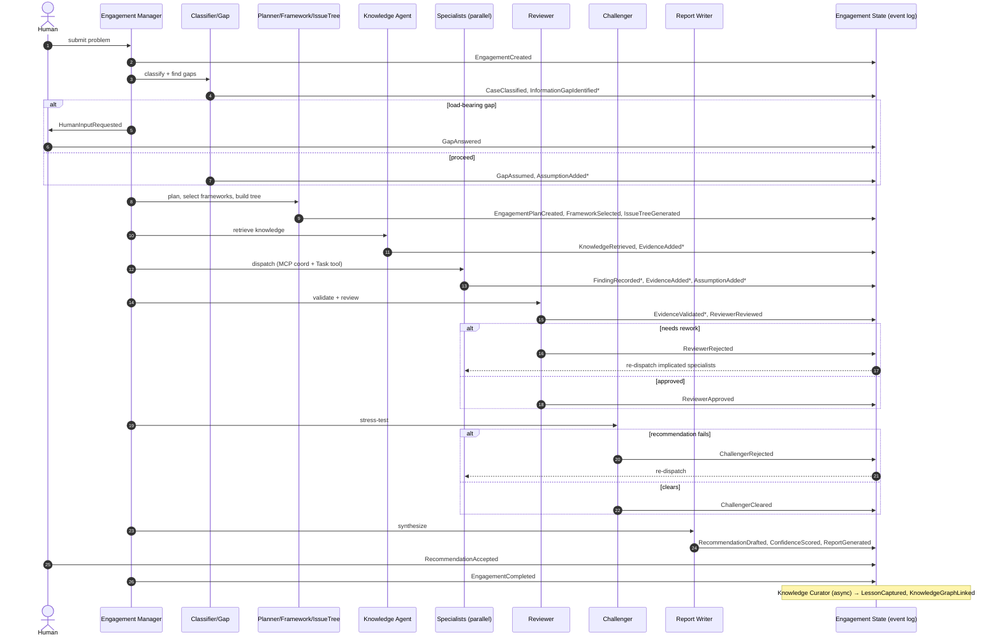

# ADR-002 — Engagement State Specification

> **Status:** Proposed (authoritative spec; supersedes the summary schema in ADR-001 §4)
> **Scope:** The complete, authoritative specification of the Engagement State —
> the single most critical data structure in StratAgent. Every agent reads from
> and writes to it. No agent communicates with another except through it.

---

# Executive Summary

## Why the Engagement State exists
A consulting engagement is a long, multi-agent process: a dozen specialists each
produce findings that must remain consistent, traceable, and resumable hours or
days later. If each agent kept its own context, the engagement would drift —
findings would contradict, assumptions would be silently re-invented, and no one
could explain *why* the final recommendation says what it says. The Engagement
State is the **one shared, durable, authoritative record** of everything known,
assumed, decided, and produced during an engagement. It is the consulting
equivalent of a case team's shared workspace — but typed, validated, and audited.

## Why event sourcing was chosen
The state is not stored as a mutable blob that agents overwrite. It is the
**projection of an append-only log of immutable events**. We chose this because:
- **Auditability is a product requirement.** In consulting, "how did you reach
  this?" must be answerable. An event log *is* the answer — it replays the exact
  sequence of facts, assumptions, analyses, and decisions.
- **Concurrency without corruption.** Many specialists run in parallel. Appending
  events (each with a monotonic sequence number) is conflict-free in a way that
  read-modify-write on a shared object is not.
- **Resumability.** An engagement can crash or pause for human input and resume
  by replaying events — no lost work.
- **Time travel & learning.** The Knowledge Curator and the (future) eval harness
  can replay any past engagement exactly, which is impossible with last-write-wins
  mutation.

## Why it replaces agent-to-agent communication
Direct agent-to-agent messaging creates an unobservable, untestable web of
dependencies and is a primary source of multi-agent drift. By forcing **all**
coordination through the Engagement State, we get: a single observable channel,
deterministic replay, mechanical validation at every write, and the ability to
add/remove/reorder agents without rewiring conversations. An agent's contract is
simply *"read this slice, write that slice"* — nothing else.

---

# Design Principles

**1. Single Source of Truth.** There is exactly one Engagement State per
engagement, addressed by `engagement_id`. No agent holds authoritative data
privately; anything that matters is written to the state. If it isn't in the
state, it didn't happen.

**2. Event Sourcing.** The current state is `fold(events)` — the left-fold of the
ordered event log into a materialized view. The log is the system of record; the
materialized view (and the `state.json` snapshot) is a cache that can always be
rebuilt from the log.

**3. Immutable Events.** Events are never edited or deleted. A mistake is
corrected by appending a *compensating* event (e.g., `AssumptionInvalidated`,
`EvidenceRejected`, `CaseReclassified`), preserving the full history of what was
believed and when.

**4. Versioning.** Every event carries a `schema_version`. The state carries a
`state_version` (monotonic, = highest applied `seq`). Schema evolution is additive
(new optional fields, new event types); old events always remain replayable.
Snapshots record the `state_version` they were built from.

**5. Concurrency.** Writes are **owner-exclusive per section** and expressed as
event appends with a monotonic `seq`. Parallel agents writing *different* sections
never conflict. The Engagement Manager is the only writer of lifecycle
transitions, which serializes phase changes. Optimistic concurrency: an append
that assumes a stale `state_version` for a contended section is rejected and retried.

**6. Auditability.** The `events[]` log + `Audit Trail` give a complete, ordered,
attributed history: who (actor) did what (event type + payload) when (timestamp),
and why (causation_id). Every figure in the final report is reachable back to the
event that introduced it.

---

# Notation

Schema below uses a type notation (spec, not code):
`id` opaque identifier · `ts` ISO-8601 timestamp · `int` · `bool` · `text` free
text · `enum{...}` fixed set · `float 0–1` confidence · `money{amount,currency}` ·
`ref<X>` reference to an id of object X · `list<X>` ordered collection ·
`object{...}` nested record.

The full state is: **metadata + lifecycle + 23 domain sections + the event log**.
Domain sections are projections; the event log is the source of record.

---

# Complete State Schema

## 1. Engagement Metadata
| Field | Type | Why it exists |
|---|---|---|
| `engagement_id` | id | Primary key; binds state, namespace, artifacts |
| `tenant_id` | id | Multi-tenant isolation (knowledge + audit scoping) |
| `slug` | text | Human-readable folder name (`engagements/<slug>/`) |
| `created_at` / `updated_at` | ts | Creation + last-projection time |
| `created_by` | enum{human,system} | Provenance of the engagement |
| `state_version` | int | = highest applied event `seq`; optimistic-concurrency token |
| `schema_version` | int | Schema generation for migration |
| `memory_namespace` | text | AgentDB key `stratagent:eng:<id>` |

## 2. Lifecycle Status
| Field | Type | Why it exists |
|---|---|---|
| `status` | enum{intake, classifying, gap_analysis, planning, framing, issue_tree, knowledge, analysis, evidence_validation, review, challenge, reporting, completed, failed, aborted} | Current state-machine position; gates routing |
| `phase_history` | list<object{phase, entered_at, exited_at, result}> | Audit + resumability |
| `quality_gates` | list<object{gate, result:enum{pass,fail,loop}, by, ts}> | Proves mandatory gates ran; blocks skipping |
| `blocked_on` | enum{none, human_input} + ref | HITL pause marker |

## 3. Problem Definition
| Field | Type | Why it exists |
|---|---|---|
| `raw_input` | text | Verbatim client problem; never overwritten (provenance) |
| `documents` | list<object{path, kind, ingested_at, screened:bool}> | Attached client material (PII-screened by aidefence) |
| `real_question` | text | The decision being made (vs the stated symptom) |
| `restated_at` | ts | When the question was last refined (e.g., via HITL) |

## 4. Objectives
| Field | Type | Why it exists |
|---|---|---|
| `objectives` | list<object{statement, metric?, target?, priority}> | What the client wants; defines "good" |
| `success_criteria` | list<text> | Explicit bar the recommendation must clear |
| `source` | enum{client_stated, inferred} | Distinguishes given goals from inferred ones |

## 5. Constraints
| Field | Type | Why it exists |
|---|---|---|
| `constraints` | list<object{statement, type:enum{budget,time,legal,political,scope,explicit_no}, hard:bool}> | Bounds the solution space (e.g., "no layoffs") |

## 6. Stakeholders
| Field | Type | Why it exists |
|---|---|---|
| `stakeholders` | list<object{name_or_role, relationship:enum{client,affected,decision_maker,blocker}, interest}> | Who decides / is affected; shapes recommendation framing |

## 7. Case Classification
| Field | Type | Why it exists |
|---|---|---|
| `primary_archetype` | enum{profitability, growth, cost_reduction, market_entry, m_and_a, pricing, new_product, turnaround, digital_transformation, supply_chain, org_design, ai_strategy, generic} | Routes frameworks + agent selection |
| `secondary_archetype` | enum?(as above) | Hybrid cases (e.g., acquire-to-enter) |
| `classification_confidence` | float 0–1 | Drives whether to confirm with human |
| `rationale` | text | Why this archetype (auditable) |

## 8. Information Gaps
| Field | Type | Why it exists |
|---|---|---|
| `gaps` | list<Gap> | The ask-vs-assume control point |
| `Gap.id` | id | Reference key |
| `Gap.question` | text | The missing information |
| `Gap.criticality` | enum{load_bearing, useful, minor} | Only load-bearing gaps block analysis |
| `Gap.status` | enum{open, asked, answered, assumed} | Lifecycle of the gap |
| `Gap.resolution` | text? | The answer (if answered) |
| `Gap.assumption_ref` | ref<Assumption>? | Link to the assumption made if not answered |

## 9. Assumption Ledger
The discipline core. Every non-given number used anywhere lives here.
| Field | Type | Why it exists |
|---|---|---|
| `Assumption.id` | id | Referenced by findings/evidence |
| `Assumption.statement` | text | What is being assumed |
| `Assumption.value` | text/money/number | The assumed value |
| `Assumption.rationale` | text | Basis for the assumption |
| `Assumption.owner` | enum(agent) | Who introduced it (accountability) |
| `Assumption.confidence` | float 0–1 | How shaky it is |
| `Assumption.load_bearing` | bool | Does the recommendation hinge on it? |
| `Assumption.breakeven` | text? | Value at which the recommendation flips (required if load_bearing) |
| `Assumption.status` | enum{active, invalidated, confirmed} | Compensating-event lifecycle |

## 10. Engagement Plan
| Field | Type | Why it exists |
|---|---|---|
| `plan.steps` | list<object{id, description, agent, depends_on:list<ref>, status}> | Executable GOAP plan (from Planner) |
| `plan.parallel_groups` | list<list<ref>> | What may run concurrently |
| `plan.replans` | int | Count of adaptive replans (drift signal) |

## 11. Framework Selection
| Field | Type | Why it exists |
|---|---|---|
| `frameworks` | list<object{id, name, archetype, rationale, adaptation, source_ref}> | Which frameworks, and *how adapted* (not recited) |

## 12. Issue Tree
| Field | Type | Why it exists |
|---|---|---|
| `tree` | list<Node> | The MECE analysis contract |
| `Node.id` / `Node.parent` | id / ref | Tree structure |
| `Node.question` | text | A question to answer (not a topic label) |
| `Node.owner` | enum(agent) | Which specialist owns this branch |
| `Node.status` | enum{open, in_progress, answered, blocked} | Progress tracking |
| `Node.answer` | text? | The branch conclusion |
| `Node.confidence` | float 0–1 | Per-branch confidence |
| `Node.evidence_refs` | list<ref<Evidence>> | Traceability to support |

## 13. Knowledge References
What the Knowledge Agent *pulled in* during the engagement (inbound).
| Field | Type | Why it exists |
|---|---|---|
| `references` | list<object{id, kind:enum{framework,playbook,company_profile,prior_case,benchmark}, vault_path?, graph_node?, query, relevance:float, retrieved_at}> | Records what firm knowledge informed the analysis + provenance |

## 14. Evidence Ledger
Every claim used in analysis. The Reviewer validates this ledger.
| Field | Type | Why it exists |
|---|---|---|
| `Evidence.id` | id | Referenced by findings/recommendation |
| `Evidence.claim` | text | The asserted fact |
| `Evidence.type` | enum{client_fact, external_source, computed, assumption} | The four legal origins of any claim |
| `Evidence.source` | text/ref | Citation (external), input refs (computed), or ref<Assumption> |
| `Evidence.method` | text? | Required when type=computed (formula + inputs) |
| `Evidence.as_of` | ts? | Recency of an external fact (staleness control) |
| `Evidence.confidence` | float 0–1 | Strength |
| `Evidence.validated` | bool | Set true only by Reviewer |
| `Evidence.validator` | enum(agent)? | Who validated |

## 15–19. Analysis Sections (Financial · Market · Operations · Strategy · Risk)
All five share a common **AnalysisBlock** shape; the differences are in *method*
and *tools*, not structure.

**Common AnalysisBlock**
| Field | Type | Why it exists |
|---|---|---|
| `owner` | enum(agent) | The specialist who owns this block |
| `node_refs` | list<ref<Node>> | Issue-tree branches answered |
| `findings` | list<object{question, answer, method, evidence_refs, assumption_refs, confidence}> | Quantified, traceable results |
| `sensitivity` | list<object{driver, base, stress, effect_on_answer}> | How the answer moves under stress |
| `status` | enum{pending, in_progress, complete, reworking} | Gate tracking |

**Per-section specifics**
| Section | Owner | Characteristic content |
|---|---|---|
| **Financial Analysis** | Financial Analyst | P&L bridge, unit economics, NPV/IRR, breakeven, valuation, synergy |
| **Market Analysis** | Market Analyst | TAM/SAM/SOM, competitive intensity, segments, willingness-to-pay |
| **Operations Analysis** | Operations Analyst | Cost-to-serve, capacity, process, one-time vs run-rate, 2nd-order effects |
| **Strategy Analysis** | Strategy Analyst | Options + trade-offs, entry mode, build/buy/partner, vs next-best alternative |
| **Risk Analysis** | Risk Analyst | Risk register: likelihood × impact, mitigations, competitive response |

## 20. Reviewer Notes
| Field | Type | Why it exists |
|---|---|---|
| `checks` | list<object{name:enum{mece, evidence_traceable, consistency, calibration, gap_closure}, result:enum{pass,fail}, detail}> | Mechanical QA of the analysis gate |
| `verdict` | enum{approved, needs_rework} | Gate result |
| `issues` | list<object{section_ref, problem, required_fix}> | Actionable rework items |

## 21. Challenge Notes
| Field | Type | Why it exists |
|---|---|---|
| `loadbearing_test` | object{assumption_ref, plausible:bool, detail} | Does the deciding assumption hold? |
| `counter_case` | text | The strongest argument against the recommendation |
| `what_would_change` | list<text> | Info that would most move the answer |
| `verdict` | enum{stands, stands_with_caveats, needs_rework} | Gate result |

## 22. Recommendations
| Field | Type | Why it exists |
|---|---|---|
| `decision` | text | The unambiguous answer |
| `rationale` | text | Why, referencing strongest evidence |
| `next_steps` | list<object{step, sequence, depends_on}> | How to act |
| `risks` | list<ref> + text | Pulled from Risk + Challenge |
| `alternatives_rejected` | list<object{option, why_not}> | Shows the decision was a choice |
| `status` | enum{draft, gated, accepted, rejected} | Approval lifecycle |

## 23. Confidence Scores
| Field | Type | Why it exists |
|---|---|---|
| `by_section` | map<section → float 0–1> | Per-section confidence rollup |
| `overall` | float 0–1 | = min/weighted of supporting evidence + gate results |
| `method` | text | How `overall` is derived (auditable, not a vibe) |
| `drivers` | list<text> | What most limits confidence |

## 24. Deliverables
| Field | Type | Why it exists |
|---|---|---|
| `deliverables` | list<object{kind:enum{report,deck,model}, path, format, status, generated_at}> | The actual outputs + their state |

## 25. Knowledge Links
What this engagement *contributes back* to firm knowledge (outbound) — written by
the Curator at close. (Distinct from §13, which is inbound retrieval.)
| Field | Type | Why it exists |
|---|---|---|
| `links` | list<object{graph_node, relationship, vault_note?, tenant_id}> | Places this case in the knowledge graph |
| `lessons` | list<object{lesson, framework_ref?, applies_to}> | Reusable learning for future engagements |

## 26. Audit Trail (the event log)
| Field | Type | Why it exists |
|---|---|---|
| `events` | list<Event> (append-only) | The system of record; everything else is a projection |

**Event envelope (every event):**
| Field | Type | Why it exists |
|---|---|---|
| `event_id` | id | Unique event key |
| `engagement_id` | id | Scope |
| `seq` | int (monotonic) | Total order + optimistic concurrency |
| `type` | enum(event types) | What happened |
| `actor` | enum{agent_name, human, system} | Attribution |
| `timestamp` | ts | When |
| `payload` | object | Type-specific data |
| `causation_id` | ref<Event>? | The event/command that caused this |
| `correlation_id` | id? | Groups events of one phase |
| `schema_version` | int | Migration safety |

*Illustrative event (not code):*
```yaml
event_id: ev_0f2a
seq: 47
type: EvidenceAdded
actor: financial-analyst
timestamp: 2026-06-30T14:22:08Z
payload:
  evidence_id: ev_fin_12
  claim: "Gross margin fell 4.0pts, 70% driven by COGS inflation"
  type: computed
  method: "P&L bridge; inputs: known_fact f3, assumption a7"
  confidence: 0.72
causation_id: ev_0e91   # SpecialistAnalysisStarted
```

---

# Event Model

Events are grouped by lifecycle stage. "Effect" = the projected section(s).

| Event | Emitted when | By | Effect |
|---|---|---|---|
| `EngagementCreated` | Intake begins | Engagement Manager | Metadata, Lifecycle |
| `ProblemDefined` | Classifier extracts the real question | Classifier | Problem Definition |
| `ProblemUpdated` | Human/agent refines the question | Classifier/Human | Problem Definition |
| `ObjectivesRecorded` / `ConstraintsRecorded` / `StakeholdersRecorded` | Classifier captures context | Classifier | §4/§5/§6 |
| `CaseClassified` | Archetype determined | Classifier | Case Classification |
| `CaseReclassified` | Correction after new info (compensating) | Classifier/Manager | Case Classification |
| `InformationGapIdentified` | A load-bearing unknown found | Gap Agent | Information Gaps |
| `GapAnswered` | Human/data resolves a gap | Human/Knowledge | Information Gaps |
| `GapAssumed` | Gap resolved by assumption | Gap Agent/analyst | Gaps + Assumption Ledger |
| `AssumptionAdded` | Any assumed value introduced | any analyst | Assumption Ledger |
| `AssumptionUpdated` | Value/rationale refined | owner | Assumption Ledger |
| `AssumptionInvalidated` | Shown false (compensating) | Reviewer/Challenger | Assumption Ledger |
| `EngagementPlanCreated` | Planner produces plan | Planner | Engagement Plan |
| `EngagementReplanned` | Adaptive replan | Planner | Engagement Plan |
| `FrameworkSelected` | Framework chosen + adapted | Framework Selector | Framework Selection |
| `FrameworkDeselected` | Framework dropped (compensating) | Framework Selector/Reviewer | Framework Selection |
| `IssueTreeGenerated` | MECE tree built | Issue Tree Generator | Issue Tree |
| `IssueTreeNodeUpdated` | Node status/answer changes | Issue Tree Gen/analyst | Issue Tree |
| `KnowledgeRetrieved` | Knowledge Agent returns refs | Knowledge Agent | Knowledge References |
| `EvidenceAdded` | A claim is introduced | analyst/Knowledge | Evidence Ledger |
| `EvidenceValidated` | Reviewer verifies a claim | Reviewer | Evidence Ledger |
| `EvidenceRejected` | Reviewer rejects a claim (compensating) | Reviewer | Evidence Ledger |
| `EvidenceMarkedStale` | `as_of` exceeds freshness threshold | Reviewer/system | Evidence Ledger |
| `SpecialistAnalysisStarted` | A specialist begins its node(s) | analyst | Analysis section |
| `FindingRecorded` | A specialist records a finding | analyst | Analysis section |
| `SpecialistAnalysisCompleted` | A specialist finishes | analyst | Analysis section |
| `ReviewerReviewed` | Reviewer runs checks | Reviewer | Reviewer Notes |
| `ReviewerApproved` | Analysis gate passes | Reviewer | Reviewer Notes, Lifecycle |
| `ReviewerRejected` | Analysis gate fails → rework | Reviewer | Reviewer Notes, Lifecycle |
| `ChallengeRecorded` | Challenger runs stress-test | Challenger | Challenge Notes |
| `ChallengerCleared` | Recommendation survives | Challenger | Challenge Notes, Lifecycle |
| `ChallengerRejected` | Recommendation fails → rework | Challenger | Challenge Notes, Lifecycle |
| `RecommendationDrafted` | Report Writer drafts the decision | Report Writer | Recommendations |
| `ConfidenceScored` | Confidence rollup computed | Report Writer/Manager | Confidence Scores |
| `RecommendationAccepted` | Final acceptance (post-gates) | Human/Manager | Recommendations |
| `ReportGenerated` / `DeckGenerated` / `ModelGenerated` | A deliverable is produced | Report Writer | Deliverables |
| `HumanInputRequested` / `HumanInputProvided` | HITL pause / resume | Manager / Human | Lifecycle, target section |
| `PhaseTransitioned` | Any gate transition | Engagement Manager | Lifecycle |
| `EngagementCompleted` | Final report accepted | Manager | Lifecycle |
| `EngagementFailed` / `EngagementAborted` | Unrecoverable error / user abort | system/Human | Lifecycle |
| `LessonCaptured` / `KnowledgeGraphLinked` / `ProfileUpdated` | Post-engagement (async) | Knowledge Curator | Knowledge Links (+ vault/graph) |

**Rule:** corrections are always new events (`*Invalidated`, `*Rejected`,
`*Reclassified`, `*Deselected`), never edits or deletes of prior events.

---

# Agent Read/Write Matrix

**Permission model.** *Read* — by default **all** agents may read the whole state
(it is the single source of truth); restrictions are tenant-scoping only.
*Write/Create* — **owner-exclusive**: only the owning agent first populates its
section. *Update* — owner (+ Manager for lifecycle). *Approve/Reject* — reserved
for **gatekeepers**: Reviewer (analysis gate), Challenger (recommendation gate),
Human/Manager (intake + final). The event log (§26) is append-only by all,
mutable by none.

| State Section | Read | Write (create) | Update | Approve | Reject |
|---|---|---|---|---|---|
| Engagement Metadata | All | Manager | Manager | — | — |
| Lifecycle Status | All | Manager | Manager | — | — |
| Problem Definition | All | Classifier | Classifier, Human | Human | Human |
| Objectives | All | Classifier | Classifier, Human | Human | Human |
| Constraints | All | Classifier | Classifier, Human | Human | Human |
| Stakeholders | All | Classifier | Classifier | — | — |
| Case Classification | All | Classifier | Classifier, Manager | Manager, Human | Human |
| Information Gaps | All | Gap Agent | Gap Agent, analysts, Human | Human | Human |
| Assumption Ledger | All | analysts, Gap Agent | owner | Reviewer | Reviewer, Challenger |
| Engagement Plan | All | Planner | Planner, Manager | — | — |
| Framework Selection | All | Framework Selector | Framework Selector | Reviewer | Reviewer, Challenger |
| Issue Tree | All | Issue Tree Gen | Issue Tree Gen, analysts | Reviewer | Reviewer |
| Knowledge References | All | Knowledge Agent | Knowledge Agent | — | — |
| Evidence Ledger | All | analysts, Knowledge | owner | Reviewer | Reviewer |
| Financial Analysis | All | Financial Analyst | Financial Analyst | Reviewer | Reviewer, Challenger |
| Market Analysis | All | Market Analyst | Market Analyst | Reviewer | Reviewer, Challenger |
| Operations Analysis | All | Operations Analyst | Operations Analyst | Reviewer | Reviewer, Challenger |
| Strategy Analysis | All | Strategy Analyst | Strategy Analyst | Reviewer | Reviewer, Challenger |
| Risk Analysis | All | Risk Analyst | Risk Analyst | Reviewer | Reviewer, Challenger |
| Reviewer Notes | All | Reviewer | Reviewer | Reviewer | Reviewer |
| Challenge Notes | All | Challenger | Challenger | Challenger | Challenger |
| Recommendations | All | Report Writer | Report Writer | Human, Manager | Challenger, Reviewer, Human |
| Confidence Scores | All | owners (per section) | Report Writer, Manager | — | — |
| Deliverables | All | Report Writer | Report Writer | Human | — |
| Knowledge Links | All (tenant-scoped) | Knowledge Curator | Knowledge Curator | — | — |
| Audit Trail (events) | All | All (append) | **none (immutable)** | — | — |

---

# State Lifecycle

The state begins as a near-empty shell at Intake and is progressively filled,
validated, and gated until a final report is accepted. Reviewer and Challenger
gates can loop the engagement back to Specialist Analysis. Knowledge curation runs
after completion.



---

# Validation Rules

### Required fields (gate preconditions)
- **Enter Planning:** `case_type.primary_archetype` + `real_question` present; all `load_bearing` gaps are `answered` or `assumed`.
- **Enter Specialist Analysis:** non-empty `issue_tree` (every leaf has an `owner`) + an `engagement_plan`.
- **Enter Reviewer:** every issue-tree leaf `status=answered`; every finding has ≥1 `evidence_ref`.
- **Enter Challenger:** `review.verdict=approved`.
- **Generate Report:** `review.verdict=approved` **AND** `challenge.verdict ∈ {stands, stands_with_caveats}`.
- **Complete:** a `report` deliverable exists **AND** `recommendation.status=accepted`.

### Forbidden transitions
- Reaching `reporting` without both gate approvals (Reviewer + Challenger).
- Skipping `review` or `challenge` (they are mandatory, not on-request).
- Mutating any section after `status=completed` (append `EngagementReopened` to a new engagement version instead).
- Editing or deleting any event (corrections are new events only).
- A specialist writing another specialist's section.

### State invariants (must always hold)
- Every `Evidence` has a `type`; if `external_source` → `source` (citation) required; if `computed` → `method` + input refs required; if `assumption` → valid `ref<Assumption>`.
- Every `load_bearing` assumption has a `breakeven`.
- Every issue-tree leaf has exactly one `owner`.
- `recommendation.confidence ≤ min(confidence of its supporting validated evidence)`.
- No `recommendation` without ≥1 `validated=true` evidence.
- Every `assumption_ref`/`evidence_ref` resolves to an existing ledger entry.
- `state_version` == max(`events.seq`).

### Concurrency rules
- Writes are event appends with a monotonic `seq`; the log is the arbiter.
- Section ownership is exclusive; parallel specialists touch disjoint sections.
- Lifecycle transitions are serialized through the Engagement Manager.
- Optimistic concurrency: an append targeting a contended section with a stale `state_version` is rejected and retried after re-projection.

### Approval rules
- The analysis gate is approved **only** by the Reviewer; the recommendation gate **only** by the Challenger; final acceptance by **Human** (or Manager under an auto-accept policy).
- No agent may approve its own output (the Manager records gates but does not self-approve them).
- A rejection must carry an actionable `required_fix`; a bare "rejected" is invalid.

---

# Risks & Mitigations

| Risk | How it arises | Mitigation |
|---|---|---|
| **Race conditions** | Parallel specialists writing concurrently | Append-only event log + monotonic `seq`; owner-exclusive sections; optimistic concurrency with retry; Manager-serialized transitions |
| **Contradictory recommendations** | Two specialists' findings conflict; or parallel drafts | Single `Recommendations` object owned by Report Writer; Reviewer's `consistency` check must reconcile conflicting findings (resolve, don't average) before the recommendation is drafted; Challenger gate as backstop |
| **Stale evidence** | External facts age during a long/resumed engagement | `Evidence.as_of` + freshness threshold; `EvidenceMarkedStale` event; Reviewer flags stale; stale evidence cannot support a recommendation until re-validated |
| **Hallucinated facts** | An agent asserts a number with no basis | Every claim must declare a `type` ∈ {client_fact, external_source, computed, assumption}; `guidance` policy rejects evidence lacking required provenance; Reviewer validates; Challenger probes load-bearing ones; `aidefence` screens ingested docs |
| **Missing citations** | `external_source` evidence without a source, or `computed` without a method | Invariant enforced at write time: external→citation required, computed→method+inputs required; report generation is blocked if any supporting evidence violates the invariant |
| **Silent assumption drift** | Assumptions re-invented or quietly changed | Central Assumption Ledger; changes are `AssumptionUpdated`/`AssumptionInvalidated` events (never silent edits); load-bearing ones require a breakeven and are re-checked by the Challenger |
| **Gate bypass** | Pressure to "just write the report" | `quality_gates` + required-field preconditions make `reporting` unreachable without both approvals; enforced by the state machine, not agent goodwill |
| **Cross-tenant leakage** | Knowledge retrieval/links span clients | `tenant_id` on engagement, evidence, and knowledge nodes; `guidance` policy denies cross-tenant reads/links |

---

# Relationship to other ADRs
- **Refines** ADR-001 §4 (Engagement State summary) into the authoritative spec.
- **Feeds** ADR-003 (vault↔graph sync — Knowledge References/Links provenance),
  ADR-004 (model routing — `routing_log`/confidence), ADR-005 (eval — replay of
  the event log against a rubric).
- **Implementation note (out of scope here):** physical encoding in Ruflo AgentDB
  namespaces, snapshot cadence, and the projection function are implementation
  details to be specified at build time, constrained by this spec.

---

*End of ADR-002. This is the authoritative specification for the Engagement State.
Implementation must conform to it; deviations require a superseding ADR.*
