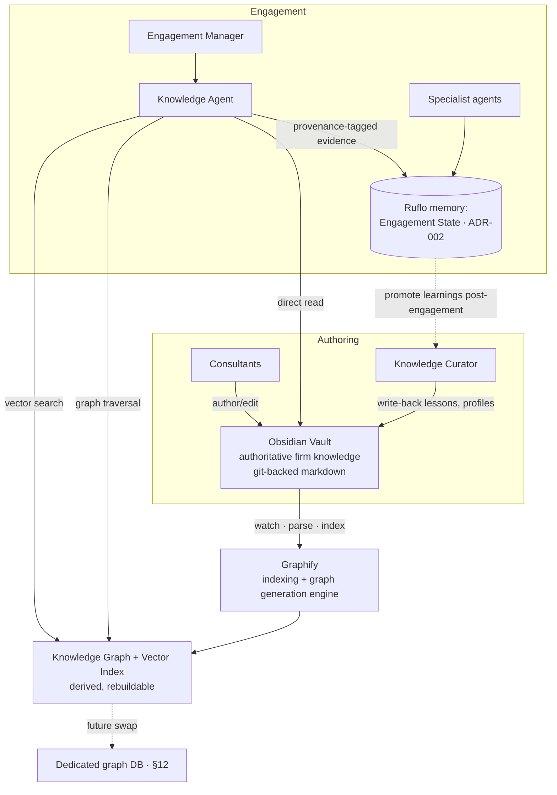
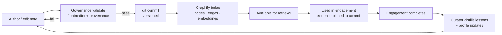
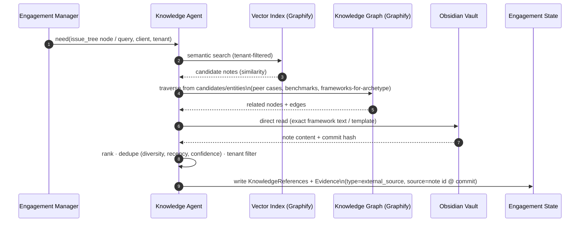

# ADR-003 — Knowledge Architecture

> **Status:** Proposed
> **Scope:** The complete consulting knowledge system: how firm knowledge is
> authored, indexed, retrieved, used in engagements, and curated back — across
> Obsidian, Graphify, and Ruflo memory.

> ⚠️ **Verification note (Graphify).** Obsidian (markdown vault + YAML frontmatter +
> `[[wikilinks]]`) and Ruflo memory (AgentDB/HNSW/RVF, verified in ADR-000) are
> known quantities. **Graphify's internals have not been inspected.** This ADR
> therefore specifies Graphify by a minimal **integration contract** (what it
> consumes, what it produces, how StratAgent talks to it) and labels capability
> assumptions as `[GRAPHIFY-ASSUMPTION]`. The architecture depends only on that
> contract, so it survives if Graphify's specifics differ. Share a repo/URL and I
> can verify Graphify the same way I verified Ruflo.

---

# 1. Overall Knowledge Architecture

StratAgent separates knowledge into **three tiers with distinct lifetimes and
owners**. Conflating them is the classic mistake; keeping them separate is the
core decision of this ADR.

| Tier | Store | Lifetime | Owner | Authoritative? |
|---|---|---|---|---|
| **Firm knowledge** | Obsidian vault | Long-lived, cross-engagement | Consultants + Knowledge Curator | **Yes — source of truth** |
| **Knowledge index/graph** | Graphify output (graph + vectors) | Derived; rebuildable | Graphify (automated) | No — a projection of the vault |
| **Engagement + runtime memory** | Ruflo memory (AgentDB) | Per-engagement + learned patterns | Agents (per ADR-002) | Yes for *that engagement's* state |



**The defining flow:** the vault is the only authoritative firm-knowledge store;
Graphify *derives* a queryable graph+index from it; the Knowledge Agent *reads*
that derived layer (plus the vault directly) to serve engagements; the Knowledge
Curator is the **only** path by which engagement learnings are *promoted* back
into the authoritative vault — which then re-triggers Graphify. Ruflo memory holds
engagement state and runtime/learning memory, **not** firm knowledge.

---

# 2. Component Responsibilities

| Component | Responsibilities | Must NOT |
|---|---|---|
| **Obsidian Vault** | Hold all firm knowledge as human-readable, git-versioned markdown with typed frontmatter + wikilinks; be the single source of truth | Be edited by automated indexers; hold per-engagement runtime state |
| **Graphify** | Watch the vault; parse frontmatter + wikilinks + content; generate the knowledge graph (typed nodes/edges) and the vector index; keep them incrementally in sync | Be hand-edited (it is derived, always rebuildable from the vault) |
| **Ruflo Memory** | Store the event-sourced Engagement State (ADR-002), runtime/working memory, and cross-engagement learned patterns (ReasoningBank) | Be the firm-knowledge store; be authoritative for reusable consulting knowledge |
| **Knowledge Agent** | Translate an analytical need into hybrid retrieval (vector + graph + file); rank, tenant-filter, and return **provenance-tagged** results into the Engagement State | Write to the vault; assert un-sourced claims |
| **Knowledge Curator** | Post-engagement: distill lessons, update company profiles, create sanitized prior-case notes, enforce governance, trigger reindex | Write during an active engagement; leak cross-tenant data |

---

# 3. Knowledge Lifecycle



1. **Author** — a consultant (or the Curator) writes/edits a note.
2. **Validate** — governance checks frontmatter completeness + provenance (§10).
3. **Commit** — change is committed to git (versioned, reviewable).
4. **Index** — Graphify incrementally re-indexes the changed note(s).
5. **Available** — the note's nodes/edges/embeddings are queryable.
6. **Use** — the Knowledge Agent retrieves it; evidence is *pinned* to the note's
   commit hash (§11) so the engagement is reproducible.
7. **Curate** — after the engagement, the Curator promotes durable learnings back
   into the vault, restarting the cycle. Knowledge compounds over time.

---

# 4. Obsidian Vault Structure

```
knowledge-vault/
├── frameworks/            # one note per consulting framework
├── playbooks/             # industry playbooks (e.g. playbooks/retail/)
├── industries/            # industry reference notes (structure, economics)
├── companies/             # company profiles (TENANT-SCOPED)
├── kpis/                  # KPI definitions + benchmarks
├── engagements/           # sanitized prior cases (TENANT-SCOPED)
├── lessons/               # lessons learned
├── templates/             # deliverable templates (report/deck/model)
├── _attachments/          # exhibits, images
├── _meta/                 # tag taxonomy, note-type schemas, governance policy
└── .obsidian/             # Obsidian app config (graph view, Graphify plugin)
```

**Ownership:** consultants + Curator author `frameworks/`, `playbooks/`,
`industries/`, `kpis/`, `templates/`; the Curator owns `companies/`,
`engagements/`, `lessons/` (written from completed engagements). Graphify reads
everything; engagement agents read only via the Knowledge Agent.

**Relations** are expressed two ways, both consumed by Graphify: **typed**
(frontmatter fields like `industry:` or `frameworks:`) and **associative**
(`[[wikilinks]]` in body text).

---

# 5. Note Metadata Schema

Every note carries a **common frontmatter header**; each note type adds typed
fields. Graphify uses `type` to label the node and the typed fields to create
typed edges.

**Common (all notes)**
| Field | Type | Purpose |
|---|---|---|
| `id` | id | Stable node identity (survives renames) |
| `type` | enum{framework, playbook, industry, company, kpi, prior_case, lesson, template} | Node label for the graph |
| `title` | text | Display name |
| `tags` | list<text> | Faceted retrieval |
| `created` / `updated` | date | Authoring history |
| `last_verified` | date | Freshness control (§10) |
| `source` | text/url | Provenance — **required** (§10) |
| `confidence` | float 0–1 | Trust weight in ranking |
| `visibility` | enum{global, tenant} | Tenant isolation |
| `tenant` | id? | Required when `visibility=tenant` |
| `aliases` | list<text> | Entity resolution / linking |

**Per-type additions**
| Type | Added fields |
|---|---|
| `framework` | `archetype`, `when_to_use`, `steps`, `related_frameworks` (refs), `pitfalls` |
| `playbook` | `industry` (ref), `applies_to_archetypes`, `kpis` (refs), `plays` |
| `industry` | `structure`, `typical_margins`, `growth_rate`, `key_kpis` (refs) |
| `company` | `industry` (ref), `size`, `geo`, `segments`, `kpis` (refs), `last_verified` |
| `kpi` | `formula`, `unit`, `benchmark`, `industry` (ref) |
| `prior_case` | `archetype`, `client_anon`, `frameworks` (refs), `recommendation`, `outcome`, `date` |
| `lesson` | `applies_to` (archetype/industry), `framework_ref`, `source_engagement` |
| `template` | `deliverable_kind` enum{report, deck, model} |

*Illustrative frontmatter (a company profile — illustrative, not code):*
```yaml
id: co_meridian_grocery
type: company
title: Meridian Regional Grocery
visibility: tenant
tenant: t_meridian
industry: "[[industries/grocery-retail]]"
size: "$600M revenue, 40 stores"
segments: [fresh, packaged, private-label]
kpis: ["[[kpis/operating-margin]]", "[[kpis/cost-to-serve]]"]
source: "Client data room, 2026-06"
last_verified: 2026-06-28
confidence: 0.9
```

---

# 6. Graphify Indexing Workflow

> Integration contract — `[GRAPHIFY-ASSUMPTION]` marks unverified capability claims.

**Trigger** `[GRAPHIFY-ASSUMPTION]`: a file watcher on the vault (or a git
post-commit hook, or scheduled/manual reindex) detects changed notes.

**Parse** (per changed note):
1. **Frontmatter** → node label (`type`), node properties, and **typed edges**
   (each ref field, e.g. `industry:` → `(:Company)-[:IN_INDUSTRY]->(:Industry)`).
2. **`[[wikilinks]]`** → **associative edges** (`:RELATED_TO`), refined to typed
   edges when frontmatter context allows.
3. **Body content** → chunked + embedded for the **vector index**; optional
   entity extraction for additional nodes (KPIs, companies mentioned).

**Build / update:**
- **Incremental:** only changed notes are re-parsed; their edges are reconciled
  (added/removed); orphaned nodes flagged.
- **Outputs:** (a) a **knowledge graph** (typed nodes + edges + properties),
  (b) a **vector index** over note chunks, both tagged with `visibility`/`tenant`.
- **Validation hook:** notes failing governance (missing `source`, malformed
  frontmatter) are flagged/quarantined, not indexed (§10).
- **Index build id:** each reindex produces a version stamp (§11).

**Exposure contract** `[GRAPHIFY-ASSUMPTION]`: Graphify exposes its graph + index
to the Knowledge Agent through **one of** — a query API, an MCP tool, or by
writing into Ruflo's `knowledge-graph`/AgentDB store. The Knowledge Agent depends
on a thin retrieval interface (§7), not on which of these Graphify uses — so the
backend is swappable (§12).

---

# 7. Knowledge Retrieval Workflow



**Hybrid by design:** vector search answers *"what's relevant,"* graph traversal
answers *"what's related"* (the consulting value — peer-company benchmarks,
which frameworks worked on similar archetypes, prior recommendations), and direct
file read provides *exact* text/templates. Every returned item carries
provenance: vault note `id` + git **commit hash** (so the engagement is
reproducible, §11). Results land in the Engagement State per ADR-002 §13/§14.

---

# 8. Knowledge Agent — Responsibilities

(Per ADR-001/§6 and ADR-002 matrix; this ADR specifies its knowledge behavior.)
- **Purpose:** the only component that reads firm knowledge on behalf of an engagement.
- **Inputs:** an analytical need (issue-tree node or explicit query), `client`, `tenant_id`.
- **Does:** hybrid retrieval (§7); ranking (relevance × recency × confidence, with diversity); strict tenant filtering; provenance tagging.
- **Writes (Engagement State):** `Knowledge References` (§13) and `Evidence` of `type=external_source` (§14), each pinned to a vault commit.
- **Reads:** Graphify graph + index, Obsidian vault (read-only).
- **Success:** retrieved items are relevant, tenant-legal, and fully sourced; no result lacks provenance.
- **Fails if:** returns cross-tenant data, un-sourced items, or stale evidence without flagging it; writes to the vault (forbidden).
- **Does NOT:** curate, write firm knowledge, or perform analysis.

---

# 9. Knowledge Curator — Responsibilities

(The bridge that promotes engagement learnings into firm knowledge.)
- **Purpose:** keep firm knowledge growing, accurate, and governed — runs **after** an engagement completes (async).
- **Inputs:** the completed Engagement State (findings, recommendation, validated evidence, outcome if known).
- **Does:** distill `lessons/`; create a **sanitized** `prior_case` note; update `companies/` profiles with newly *verified* facts; propose `playbooks/`/`frameworks/` edits; enforce governance + tenant sanitization; commit to git (human-reviewable); trigger Graphify reindex.
- **Writes:** the Obsidian vault (+ `Knowledge Links` in the Engagement State, ADR-002 §25); **not** the Engagement State analysis sections.
- **Success:** a reusable, sourced lesson captured; the case is correctly placed in the graph; zero cross-tenant leakage.
- **Fails if:** writes un-sourced knowledge, leaks confidential/tenant data into `global` notes, or edits Graphify output directly.

---

# 10. Governance

- **Single source of truth:** Obsidian is authoritative; Graphify output is
  derived and **never hand-edited** (always rebuildable from the vault).
- **Provenance required:** every note must have a `source`; the `guidance` control
  plane (Ruflo) rejects/quarantines notes lacking it at index time. This is the
  same discipline as the Evidence Ledger (ADR-002) — no un-sourced knowledge.
- **Freshness:** notes carry `last_verified`; stale notes (past a per-type
  threshold) are down-ranked in retrieval and emit `EvidenceMarkedStale` (ADR-002)
  when used; the Curator re-verifies on a schedule.
- **Tenant isolation:** `visibility`/`tenant` on every note; retrieval filters by
  `tenant_id`; a `guidance` policy denies cross-tenant reads and blocks the Curator
  from promoting tenant facts into `global` notes without sanitization.
- **Quality gate on ingestion:** malformed frontmatter or missing required fields
  → quarantined, not indexed.
- **Conflict resolution:** contradictory notes are **flagged for the Curator**, not
  silently overwritten; resolution prefers higher `confidence` + newer
  `last_verified`, but always via an explicit, committed edit.
- **Change review:** vault changes flow through git (diff + review), giving human
  oversight of what enters firm knowledge.

---

# 11. Versioning

- **Vault = git.** Every note change is a commit: full history, blame, diff,
  rollback, branchable review. This is the primary versioning mechanism.
- **Evidence pinning (critical).** When the Knowledge Agent cites a note, it
  records the note `id` **+ git commit hash**. A replayed engagement (ADR-002 event
  log) therefore resolves the *exact* knowledge state used originally, even after
  the vault evolves — knowledge versioning is bound to the engagement audit trail.
- **Index versioning.** Each Graphify reindex stamps a build id; the active build
  id is recorded so retrieval results are attributable to an index version.
- **Graph schema versioning.** Node/edge types evolve **additively** (new types,
  new optional properties); old notes remain indexable. Schema version is recorded
  in `_meta/`.
- **Snapshots.** For SaaS/tenant export and disaster recovery, the vault (git) +
  the index build are snapshot-able as a unit.

---

# 12. Future Graph Database Integration

Today the queryable graph is Graphify's output (possibly backed by Ruflo's
`knowledge-graph`/AgentDB store). A dedicated graph DB becomes warranted when
scale or query complexity grows.

**When to migrate (triggers):** multi-hop reasoning needs (Cypher/Gremlin-style
queries), large multi-tenant graphs, retrieval latency at scale, or analytics
across thousands of prior cases.

**Targets:** Neo4j / Memgraph / a managed graph service, or a hardened Ruflo
knowledge-graph backend.

**What keeps it swappable:** agents query **only** through the Knowledge Agent's
retrieval interface (§7) — never the store directly. The store behind that
interface can change with **zero agent changes**. Obsidian remains the source of
truth throughout; the graph DB is just a more powerful derived projection.

**Migration path:** (1) Graphify exports its graph; (2) load/backfill into the
graph DB; (3) dual-read during validation; (4) cut the Knowledge Agent's traversal
calls over to the graph DB; (5) Graphify (or a successor indexer) writes directly
to it going forward. The vector index can move to the same backend or stay in
Ruflo/AgentDB.

---

# Relationship to other ADRs
- **Refines** ADR-001 §5 (knowledge layer).
- **Implements** the provenance/tenant rules of ADR-002 and feeds its `Knowledge
  References` (§13), `Evidence` (§14), and `Knowledge Links` (§25).
- **Open follow-ups:** ADR-004 (model routing) and ADR-005 (eval) are unaffected;
  a future ADR will specify the chosen graph DB (§12) once Graphify is verified and
  scale triggers are hit.

**Decision dependency:** the `[GRAPHIFY-ASSUMPTION]` items (trigger mechanism and
exposure contract, §6) should be confirmed against the real Graphify before
implementation. They do not change the architecture — only the adapter that
connects Graphify to the Knowledge Agent.

---

*End of ADR-003. Obsidian is the source of truth; Graphify derives the queryable
layer; Ruflo memory runs engagements; the Knowledge Agent reads and the Knowledge
Curator writes-back. Implementation begins only on ratification.*
