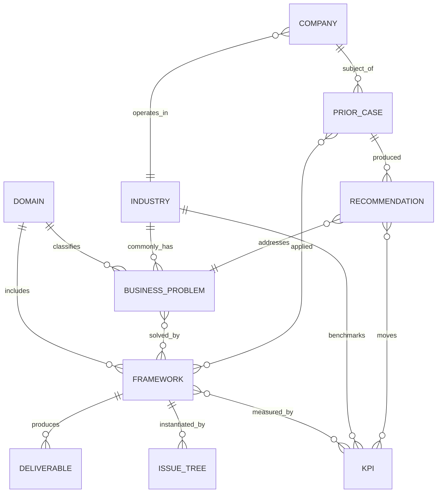

# ADR-004 — Consulting Knowledge Library

> **Status:** Proposed
> **Scope:** The complete consulting **knowledge model** — domains, frameworks,
> issue trees, KPIs, industries, deliverables, and how they relate. This is
> StratAgent's institutional consulting IP.
> **Out of scope (by instruction):** agents, orchestration, retrieval, runtime.
> Those consume this knowledge; they are specified elsewhere. Nothing here
> describes how the knowledge is *executed* — only what it *is*.

This ADR populates the note types defined in ADR-003 §5 and the graph defined in
ADR-003 §8. It adds the knowledge note types `domain`, `issue_tree`,
`deliverable`, `business_problem`, and `recommendation` to that schema.

---

# 1. Executive Summary

**Why consulting knowledge is separated from agent logic.** A framework is not a
behavior; it is an asset. If "how to run a profitability analysis" lives inside an
agent's prompt, it can't be reviewed by a consulting lead, versioned, reused
across agents, audited, or improved without touching code. Separating knowledge
from logic lets the *consulting* organization own the *consulting* content and the
*engineering* organization own the *behavior* — each evolving independently.

**Why knowledge must be reusable, structured, and versioned.** The same
profitability tree serves a retail margin case and a SaaS one; the same CAC
definition is referenced by ten frameworks. Structuring knowledge as typed,
linked assets (per ADR-003) means it is written once, referenced everywhere,
and improved in one place. Versioning means a recommendation can be traced to the
*exact* version of the framework that produced it — the same audit discipline as
the Evidence Ledger (ADR-002).

**Why frameworks are knowledge assets, not prompts.** A prompt is opaque,
unversioned, untestable, and duplicated across agents. A framework asset is a
reviewed, sourced, versioned note with explicit inputs, outputs, diagnostic
questions, and failure modes — including *when not to use it*. Treating frameworks
as assets is what makes StratAgent a consulting firm with institutional memory
rather than a chatbot with clever instructions.

---

# 2. Knowledge Domains

StratAgent supports 15 consulting domains. Each is a `domain` knowledge note.

**Profitability** — *Purpose:* explain and reverse a margin/profit change.
*Questions:* "Why is profit down?" "Which segment bleeds?" *Objectives:* restore
margin; protect the core. *Deliverables:* profit bridge, segment P&L, lever list.

**Revenue Growth** — *Purpose:* find and prioritize growth levers. *Questions:*
"How do we grow X%?" "Why did growth stall?" *Objectives:* reaccelerate growth.
*Deliverables:* growth driver tree, prioritized initiative set.

**Cost Reduction** — *Purpose:* reduce cost base without breaking the business.
*Questions:* "Where is cost out of line?" "How to hit −X%?" *Objectives:* durable
savings. *Deliverables:* cost decomposition, benchmarked lever list.

**Pricing** — *Purpose:* capture more value via price level/structure. *Questions:*
"Are we leaving money on the table?" *Objectives:* margin/share per objective.
*Deliverables:* price waterfall, value-based price range, structure options.

**Market Entry** — *Purpose:* decide whether/how to enter a market. *Questions:*
"Should we enter? How?" *Objectives:* profitable entry or a disciplined no-go.
*Deliverables:* attractiveness × right-to-win, entry-mode recommendation.

**M&A** — *Purpose:* decide and price an acquisition/divestiture. *Questions:*
"Should we buy? At what price?" *Objectives:* value-creating deal. *Deliverables:*
synergy model, max-price, integration risk view.

**New Product Launch** — *Purpose:* decide and plan a product launch. *Questions:*
"Should we launch? How?" *Objectives:* viable launch economics. *Deliverables:*
demand + unit economics, GTM plan.

**Digital Transformation** — *Purpose:* modernize operating model/value chain.
*Questions:* "Where does digital create value?" *Objectives:* prioritized digital
value. *Deliverables:* maturity assessment, value × feasibility use-case portfolio.

**Supply Chain** — *Purpose:* optimize cost, service, and resilience. *Questions:*
"How to cut cost-to-serve / improve service?" *Objectives:* efficient, resilient
network. *Deliverables:* network/inventory analysis, S&OP design.

**Organizational Design** — *Purpose:* align structure to strategy. *Questions:*
"Is the org fit for purpose?" *Objectives:* effective operating model.
*Deliverables:* operating-model design, spans-and-layers, decision rights.

**AI Strategy** — *Purpose:* turn AI into prioritized value. *Questions:* "Where
should we apply AI?" *Objectives:* value-led, feasible AI portfolio.
*Deliverables:* use-case portfolio (value × feasibility), data-readiness view.

**Corporate Strategy** — *Purpose:* set where-to-play / how-to-win at the
portfolio level. *Questions:* "Where do we compete and win?" *Objectives:*
coherent portfolio + capital allocation. *Deliverables:* portfolio map, strategy
choices, capital-allocation view.

**Customer Strategy** — *Purpose:* maximize value of customer relationships.
*Questions:* "Which customers, and how do we keep them?" *Objectives:* higher CLV,
lower churn. *Deliverables:* segmentation, CLV model, journey + retention plan.

**Sales & Marketing** — *Purpose:* improve commercial engine efficiency.
*Questions:* "Where does the funnel leak? Best channel mix?" *Objectives:* better
CAC/LTV and conversion. *Deliverables:* funnel analysis, GTM/channel economics.

**Private Equity Due Diligence** — *Purpose:* test a deal thesis and value-creation
potential. *Questions:* "Is the thesis real? What's the upside/risk?"
*Objectives:* go/no-go + value-creation plan. *Deliverables:* commercial DD,
value-creation plan, risk register.

---

# 3. Consulting Framework Library

**Framework asset schema** (extends ADR-003 §5 `framework` note):
`id · name · domain(s) · tier{primary|supporting} · purpose · when_to_use ·
when_not_to_use · steps · required_inputs · typical_outputs ·
diagnostic_questions · success_metrics (KPI refs) · common_risks ·
common_mistakes · related_frameworks · source · confidence · version · status`.

Below, each domain lists its frameworks and the 11 required attributes (tight by
design; each is a knowledge note with the full schema above).

**Profitability** · *Primary:* Profit tree (P = R − C), price/volume/mix bridge · *Supporting:* contribution margin, segment P&L, cost decomposition
- *Issue-tree template:* Δprofit → revenue (price·volume·mix) vs cost (fixed·variable, which line) · *Decision logic:* isolate delta → segment → attack dominant driver
- *Diagnostic Qs:* Sudden or gradual? Uniform or concentrated? Price, volume, or cost? · *Success metrics:* operating margin, gross margin, contribution margin
- *Inputs:* P&L (≥2 periods), volumes, price/mix, cost breakdown, segments · *Outputs:* profit bridge, segment profitability, prioritized levers
- *Risks:* one-time vs structural confusion · *Mistakes:* cutting cost before confirming a cost problem · *When NOT to use:* greenfield/no existing P&L

**Revenue Growth** · *Primary:* growth driver tree, Ansoff matrix · *Supporting:* cohort/retention, share-of-wallet, BCG growth-share
- *Tree:* new vs existing customers × volume × price/mix; new markets/products · *Decision logic:* diagnose where growth stalled before adding levers
- *Diagnostic Qs:* Acquisition, retention, or expansion? Market vs share? · *Success metrics:* revenue growth %, net revenue retention, share
- *Inputs:* revenue by segment/cohort, funnel, churn, market size · *Outputs:* sized + prioritized growth initiatives
- *Risks:* chasing new markets to mask churn · *Mistakes:* un-sized lever lists · *When NOT to use:* the real problem is cost/margin

**Cost Reduction** · *Primary:* cost decomposition + benchmarking · *Supporting:* ZBB, activity-based costing, lever prioritization (quick-win/structural/strategic)
- *Tree:* fixed/variable, direct/overhead, controllable/structural · *Decision logic:* decompose → benchmark → prioritize by savings × feasibility × risk
- *Diagnostic Qs:* Which buckets are out of line? Controllable? · *Success metrics:* cost-to-serve, SG&A %, run-rate savings
- *Inputs:* cost base detail, peer benchmarks, headcount, spend cube · *Outputs:* prioritized levers with savings + cost-to-implement + risk
- *Risks:* cutting capability needed for growth · *Mistakes:* across-the-board cuts; savings without implementation cost · *When NOT to use:* revenue-driven margin problems

**Pricing** · *Primary:* value-based pricing + price waterfall (pocket price) · *Supporting:* elasticity, segmentation, conjoint, Van Westendorp
- *Tree:* objective → value ceiling → cost floor → competitive context → structure · *Decision logic:* set bounds, then choose level **and** structure
- *Diagnostic Qs:* Cost-plus by default? Leakage in the waterfall? Elasticity? · *Success metrics:* pocket margin, price realization, attach rate
- *Inputs:* price waterfall data, WTP, competitor prices, volumes · *Outputs:* price range, structure options, leakage fixes
- *Risks:* ignoring competitive response · *Mistakes:* cost-plus without value ceiling · *When NOT to use:* commodity with no pricing power

**Market Entry** · *Primary:* market attractiveness × right-to-win + entry-mode decision · *Supporting:* Porter's Five Forces, TAM/SAM/SOM, beachhead
- *Tree:* attractiveness (size·growth·intensity) → right-to-win → mode (build/buy/ally) → economics · *Decision logic:* attractive AND winnable AND affordable
- *Diagnostic Qs:* Big vs attractive? Do we have a right to win? Retaliation? · *Success metrics:* SOM, payback period, IRR
- *Inputs:* market size/growth, competitor set, capability fit, entry cost · *Outputs:* go/no-go, mode, investment + payback
- *Risks:* straight-line ramp assumptions · *Mistakes:* "big market" ≠ winnable · *When NOT to use:* core-business fix-first situations

**M&A** · *Primary:* synergy valuation + deal rationale · *Supporting:* DCF, comparable multiples, PMI (integration), accretion/dilution
- *Tree:* rationale → standalone value → synergies (rev + cost − dis-synergies − integration cost) → price vs max → integration risk → alternatives · *Decision logic:* pay ≤ standalone + risk-adjusted synergies
- *Diagnostic Qs:* Why this target now? Synergies real and risk-adjusted? · *Success metrics:* synergy capture %, ROIC vs WACC, accretion
- *Inputs:* target financials, comps, synergy estimates, integration cost · *Outputs:* valuation range, max price, integration risk view
- *Risks:* wishful synergies; ignored integration cost · *Mistakes:* "strategic fit" with no number · *When NOT to use:* organic/partnership clearly dominates

**New Product Launch** · *Primary:* launch economics + GTM · *Supporting:* jobs-to-be-done, stage-gate, cannibalization-adjusted NPV
- *Tree:* demand (JTBD·WTP·size) → competition/substitutes → unit economics + cannibalization → GTM (channel·price·sequence) · *Decision logic:* validate demand before feasibility
- *Diagnostic Qs:* Real demand + WTP? Net incremental after cannibalization? · *Success metrics:* contribution margin/unit, breakeven volume, adoption ramp
- *Inputs:* target segment, WTP, cost, channel, cannibalization estimate · *Outputs:* launch go/no-go, GTM plan, breakeven
- *Risks:* straight-line adoption · *Mistakes:* "buildable" ≠ "wanted"; ignoring cannibalization · *When NOT to use:* no demand signal yet

**Digital Transformation** · *Primary:* digital maturity + use-case value/feasibility matrix · *Supporting:* operating model, value-chain digitization, product/agile operating model
- *Tree:* maturity baseline → value pools by value-chain step → use-case prioritization → capability/operating-model gaps · *Decision logic:* sequence by value × feasibility
- *Diagnostic Qs:* Where do value pools sit? Data/capability ready? · *Success metrics:* digitization ROI, cycle-time, adoption
- *Inputs:* process/value-chain map, tech/data state, capability audit · *Outputs:* prioritized use-case roadmap, operating-model gaps
- *Risks:* tech-led not value-led · *Mistakes:* boiling the ocean · *When NOT to use:* a point automation problem, not transformation

**Supply Chain** · *Primary:* SCOR model + network optimization · *Supporting:* inventory optimization (safety stock/EOQ), cost-to-serve, resilience mapping, S&OP
- *Tree:* plan-source-make-deliver-return → cost vs service vs resilience trade-offs · *Decision logic:* optimize total cost-to-serve at a target service level
- *Diagnostic Qs:* Where is cost-to-serve highest? Single points of failure? · *Success metrics:* inventory turnover, OTIF, cash conversion cycle
- *Inputs:* network nodes/flows, demand variability, lead times, costs · *Outputs:* network/inventory recommendation, S&OP design
- *Risks:* optimizing cost while breaking service/resilience · *Mistakes:* ignoring demand variability · *When NOT to use:* pure demand-side problems

**Organizational Design** · *Primary:* operating-model design + spans-and-layers · *Supporting:* McKinsey 7S, RACI/decision rights, capability/talent model
- *Tree:* strategy → structure → process → decision rights → people/capability · *Decision logic:* structure follows strategy and decisions
- *Diagnostic Qs:* Too many layers? Unclear decision rights? · *Success metrics:* span of control, layers, decision cycle time
- *Inputs:* org chart, headcount, process map, decision inventory · *Outputs:* target operating model, spans/layers, decision-rights map
- *Risks:* reorg theater without decision-rights change · *Mistakes:* boxes-and-lines before strategy · *When NOT to use:* the issue is strategy/capability, not structure

**AI Strategy** · *Primary:* AI use-case portfolio (value × feasibility) + data readiness · *Supporting:* build/buy/partner, AI operating model, responsible-AI risk
- *Tree:* value mapping → use-case prioritization (value × feasibility × data-readiness) → build/buy → operating model + governance · *Decision logic:* value-led, data-feasible, governed
- *Diagnostic Qs:* Where is the value? Is data ready? Build or buy? · *Success metrics:* use-case ROI, time-to-value, adoption
- *Inputs:* process/value map, data inventory, capability, risk appetite · *Outputs:* prioritized AI portfolio, data-readiness gaps, governance model
- *Risks:* tech-for-tech's-sake; ungoverned risk · *Mistakes:* ignoring data readiness · *When NOT to use:* no data foundation or value hypothesis

**Corporate Strategy** · *Primary:* Playing-to-Win (where-to-play/how-to-win) + portfolio strategy · *Supporting:* 3 Horizons, BCG matrix, capital allocation, core/adjacency
- *Tree:* winning aspiration → where to play → how to win → capabilities → management systems · *Decision logic:* coherent choices + capital backing the winners
- *Diagnostic Qs:* Where do we have advantage? Portfolio balanced? · *Success metrics:* ROIC by unit, growth-horizon balance, TSR
- *Inputs:* portfolio economics, market positions, capability map · *Outputs:* portfolio choices, capital-allocation view, strategy statement
- *Risks:* strategy as aspiration without choices · *Mistakes:* funding everything equally · *When NOT to use:* single-business operational issues

**Customer Strategy** · *Primary:* segmentation + CLV · *Supporting:* journey mapping, jobs-to-be-done, NPS/loyalty, retention economics
- *Tree:* segments → value (CLV) per segment → journey/experience gaps → retention/expansion levers · *Decision logic:* invest by segment value
- *Diagnostic Qs:* Which segments create value? Where does the journey break? · *Success metrics:* CLV, churn, NPS, net revenue retention
- *Inputs:* customer data, transactions, churn, journey/experience data · *Outputs:* segmentation, CLV model, retention/experience plan
- *Risks:* treating all customers equally · *Mistakes:* segmentation with no action · *When NOT to use:* product/market problems upstream of customers

**Sales & Marketing** · *Primary:* funnel/conversion + GTM economics · *Supporting:* channel mix, CAC/LTV, sales-force effectiveness, marketing mix (4Ps/7Ps)
- *Tree:* funnel stages × conversion × CAC/LTV by channel · *Decision logic:* fix the biggest leak; fund channels with best LTV:CAC
- *Diagnostic Qs:* Where does the funnel leak? Channel economics? · *Success metrics:* CAC, LTV:CAC, conversion, sales productivity
- *Inputs:* funnel data, channel spend/returns, CAC/LTV, quota attainment · *Outputs:* funnel fixes, channel-mix + GTM economics
- *Risks:* optimizing top-of-funnel while bottom leaks · *Mistakes:* CAC without LTV · *When NOT to use:* product or pricing is the true constraint

**Private Equity Due Diligence** · *Primary:* commercial DD + value-creation plan · *Supporting:* quality-of-earnings, market/competitive analysis, 100-day plan, exit analysis
- *Tree:* market attractiveness → competitive position → growth thesis validity → value-creation levers → risks → exit · *Decision logic:* test the thesis, size the upside, price the risk
- *Diagnostic Qs:* Is the thesis real? Earnings quality? Upside levers? · *Success metrics:* entry/exit multiple, EBITDA growth, IRR/MOIC
- *Inputs:* target financials, market data, management plan, customer refs · *Outputs:* go/no-go, value-creation plan, risk register, exit view
- *Risks:* taking management's plan at face value · *Mistakes:* skipping downside/QoE · *When NOT to use:* not a transaction context

---

# 4. Issue Tree Library

Reusable MECE issue trees are `issue_tree` knowledge notes that instantiate one or
more frameworks.

**Node types:** `root` (the decision/question), `branch` (a MECE sub-question),
`leaf` (a falsifiable hypothesis), `evidence-requirement` (what would confirm/
refute the hypothesis, typed per ADR-002: client_fact | external_source |
computed, with the KPI(s) that test it).

**Branching rules:** every node is a *question*, not a topic; branches are MECE
(complete, non-overlapping); branch by *driver*, not by data availability; 2–4
branches per node; stop branching when a node is directly testable.

**Hypothesis generation:** each leaf states a falsifiable hypothesis (e.g.,
"margin decline is driven primarily by COGS inflation, not price erosion");
hypotheses are prioritized by *impact × likelihood* (hypothesis-driven approach)
so the most decisive branch is tested first.

**Evidence linkage:** each hypothesis links to required evidence (type + source)
and to the KPI(s) (§5) that quantify it — the same provenance discipline as the
Evidence Ledger (ADR-002). A hypothesis with no testable evidence is invalid.

**Validation rules:** MECE check (complete + non-overlapping); every leaf is
testable; the root is answerable purely from its leaves; no orphan branches; each
leaf carries at least one evidence-requirement.

**Per-domain root question → top-level MECE branches**

| Domain | Root question | Top-level branches |
|---|---|---|
| Profitability | Why did profit move, and what do we do? | Revenue (price/volume/mix) · Cost (fixed/variable) |
| Revenue Growth | How do we grow profitably? | Acquire · Retain · Expand · New market/product |
| Cost Reduction | Where can we cut without harm? | Quick wins · Structural · Strategic (exit) |
| Pricing | Are we capturing the right price? | Value ceiling · Cost floor · Competitive · Structure |
| Market Entry | Should we enter, and how? | Attractiveness · Right-to-win · Mode · Economics |
| M&A | Should we buy, at what price? | Rationale · Standalone value · Synergies · Integration |
| New Product | Should we launch, how? | Demand · Competition · Economics · GTM |
| Digital Transformation | Where does digital create value? | Value pools · Feasibility · Capability/operating model |
| Supply Chain | How to cut cost / lift service? | Plan · Source · Make · Deliver · Resilience |
| Org Design | Is the org fit for purpose? | Structure · Process · Decision rights · People |
| AI Strategy | Where do we apply AI? | Value · Feasibility · Data readiness · Governance |
| Corporate Strategy | Where do we play and win? | Where-to-play · How-to-win · Portfolio · Capital |
| Customer Strategy | Which customers, how to keep them? | Segments · CLV · Journey · Retention |
| Sales & Marketing | Where does the engine leak? | Funnel stages · Channel economics · Productivity |
| PE Due Diligence | Is the thesis real and valuable? | Market · Position · Thesis · Value-creation · Risk |

**Worked exemplar — Profitability**
```
ROOT: Why did operating margin fall from 4% to 1.5%, and what do we do?
├─ BRANCH Revenue side?  (MECE with cost side)
│  ├─ LEAF H: price erosion (discounting/mix down)      → evidence: price realization, mix [computed]
│  └─ LEAF H: volume decline (share vs market)          → evidence: volume, market share [client_fact]
└─ BRANCH Cost side?
   ├─ LEAF H: COGS inflation (input prices)             → evidence: unit cost trend [computed]
   └─ LEAF H: operating deleverage (fixed cost, ↓vol)  → evidence: fixed-cost ratio [computed]
```

**Worked exemplar — Market Entry**
```
ROOT: Should we enter Market X, and how?
├─ BRANCH Is it attractive?      → size, growth, Five-Forces intensity [external_source]
├─ BRANCH Can we win?            → capability fit, cost position, brand [client_fact]
├─ BRANCH Best entry mode?       → build vs buy vs ally (cost/speed/control)
└─ BRANCH Do the economics work? → investment, payback, IRR [computed]
```

---

# 5. KPI Library

KPI assets are `kpi` notes. Standardized so a framework references *one* canonical
definition.

| KPI | Formula | Interpretation | Lead/Lag | Data needs | Industry differences |
|---|---|---|---|---|---|
| Revenue | Σ price × volume | Top-line scale | Lagging | Transactions | Recognition rules (SaaS vs retail) |
| Gross Margin | (Revenue − COGS) / Revenue | Pricing + production efficiency | Lagging | Revenue, COGS | COGS scope varies (services vs goods) |
| EBITDA | Operating income + D&A | Operating cash profitability proxy | Lagging | P&L | Capital intensity skews comparability |
| Operating Margin | Operating income / Revenue | Core operating efficiency | Lagging | P&L | Overhead allocation differs |
| CAC | S&M spend / new customers | Acquisition efficiency | Leading | Marketing/sales spend, new logos | B2B ≫ B2C; long vs short cycles |
| LTV | ARPU × gross margin ÷ churn | Customer lifetime value | Leading | ARPU, margin, churn | Subscription vs transactional |
| LTV:CAC | LTV ÷ CAC | Unit-economics health (≥3 healthy) | Leading | LTV, CAC | Benchmarks vary by model |
| Market Share | Company rev ÷ market rev | Competitive position | Lagging | Market sizing | Market definition sensitivity |
| Customer Churn | Customers lost ÷ total (period) | Retention / revenue risk | Leading | Customer counts by period | Logo vs revenue churn |
| NPS | %Promoters − %Detractors | Loyalty / advocacy | Leading | Survey | Scale norms differ by sector |
| Inventory Turnover | COGS ÷ avg inventory | Inventory efficiency | Lagging | COGS, inventory | N/A for pure services |
| Cash Conversion Cycle | DSO + DIO − DPO | Working-capital efficiency (days) | Lagging | AR, inventory, AP | Retail short; manufacturing long |
| Working Capital | Current assets − current liabilities | Liquidity / operating funding | Lagging | Balance sheet | Seasonality matters |
| ROIC | NOPAT ÷ invested capital | Value creation vs WACC | Lagging | NOPAT, capital | Asset-light ≫ asset-heavy |

---

# 6. Industry Knowledge Model

Industry assets are `industry` notes — reusable context that tunes frameworks and
KPI benchmarks.

| Industry | Key drivers | Common challenges | Typical KPIs | Regulatory | Typical engagements |
|---|---|---|---|---|---|
| Retail | Foot traffic, basket, omnichannel | Thin margins, e-comm shift | Same-store sales, GM, inventory turns | Consumer protection, labor | Profitability, pricing, supply chain |
| Healthcare | Demographics, reimbursement, outcomes | Cost inflation, access | Cost/episode, utilization, outcomes | Heavy (HIPAA, payers, FDA) | Cost reduction, ops, digital |
| Manufacturing | Capacity, input costs, automation | Cyclicality, supply risk | OEE, unit cost, inventory turns | Safety, environmental | Cost, supply chain, footprint |
| Banking | Net interest margin, risk, trust | Rate cycles, fintech, compliance | NIM, cost-income, NPL, ROE | Very heavy (capital, AML) | Digital, cost, customer strategy |
| Insurance | Underwriting, claims, float | Loss ratios, disruption | Combined ratio, loss ratio | Heavy (solvency, conduct) | Pricing, digital, cost |
| Energy | Commodity prices, capex, transition | Volatility, decarbonization | LCOE, capacity factor, ROIC | Heavy (environmental, grid) | Corporate strategy, transition |
| Technology | Product velocity, network effects | Retention, scaling, talent | ARR, NRR, CAC/LTV, churn | Data/privacy, antitrust | Growth, pricing, AI, GTM |
| Telecommunications | Network capex, ARPU, churn | Saturation, capex intensity | ARPU, churn, capex/sales | Heavy (spectrum, consumer) | Cost, customer, pricing |
| Consumer Goods | Brand, distribution, trade spend | Private label, channel power | GM, trade spend, share | Labeling, safety | Pricing, growth, supply chain |
| Automotive | Volume, capex, electrification | Cyclicality, EV transition | Units, contribution/unit, capex | Emissions, safety | Cost, supply chain, strategy |

---

# 7. Deliverable Library

Deliverable assets are `deliverable` notes (linked to `template` notes from
ADR-003).

| Deliverable | Purpose | Inputs | Outputs | Audience | Quality criteria |
|---|---|---|---|---|---|
| Executive Summary | Decision in 1 page | Recommendation, evidence | 1-page synthesis | C-suite/board | Answer-first; ≤1 page; assumptions visible |
| Situation Assessment | Frame the problem | Facts, context | Problem statement + baseline | Sponsor | Real question (not symptom) stated |
| Issue Tree | Structure the analysis | Real question, framework | MECE tree | Case team/sponsor | MECE; questions not topics |
| SWOT | Position snapshot | Internal/external scan | 2×2 of S/W/O/T | Sponsor | Specific, evidenced, non-generic |
| Porter's Five Forces | Industry attractiveness | Industry data | Forces rating + implication | Strategy team | Each force evidenced |
| PESTLE | Macro scan | External data | Macro factor map | Strategy team | Material factors only |
| Financial Analysis | Quantify the case | P&L, model inputs | Bridges, model, sensitivity | CFO/sponsor | Math traceable; assumptions labeled |
| Scenario Analysis | Test under uncertainty | Drivers, ranges | Base/up/down cases | Decision-makers | Drivers explicit; breakevens shown |
| Strategic Options | Compare paths | Analysis, criteria | Ranked options + trade-offs | Decision-makers | Real alternatives; vs next-best |
| Recommendation | State the decision | Validated analysis | Decision + rationale | Decision-makers | Unambiguous; tied to evidence |
| Implementation Roadmap | Sequence the action | Recommendation | Phased plan + owners + timing | Execution leads | Sequenced; dependency-aware |
| Risk Register | Surface downside | Risks, challenge memo | Likelihood × impact + mitigation | Sponsor/PMO | Quantified; mitigations named |
| Executive Presentation | Persuade + decide | All of the above | Pyramid-principle deck | Board/C-suite | Top-down; one message/slide |

---

# 8. Knowledge Relationships

How the assets connect inside the Knowledge Graph (ADR-003 §8). Node types:
`Domain · Framework · IssueTree · KPI · Industry · Deliverable · Company ·
BusinessProblem · Recommendation · PriorCase`.



**Reading the graph:** a `BusinessProblem` is `classified` into a `Domain`, which
`includes` `Frameworks`, each `instantiated_by` an `IssueTree`, `measured_by`
`KPIs`, and `produces` `Deliverables`. `Industry` notes `benchmark` the same
`KPIs` and flag `commonly_has` problems. `Companies` `operate_in` an `Industry`
and are `subject_of` `PriorCases`, which link applied `Frameworks` to the
`Recommendations` they produced — closing the loop so past work informs future
work. This is the structural backbone; population and querying are out of scope
here (ADR-003).

---

# 9. Governance

- **Versioning.** Every asset note carries a `version` (semver) and is git-tracked
  (ADR-003 §11). A breaking change to a framework's logic bumps the major version;
  a recommendation records the framework version it used.
- **Approval.** Assets move through `status`: `draft → reviewed → approved →
  deprecated`. Only `approved` assets are considered authoritative consulting IP.
- **Deprecation.** A deprecated asset sets `superseded_by` and is retained (never
  deleted) so historical engagements remain reproducible.
- **Knowledge ownership.** Each `Domain` has a named **knowledge steward** (the
  consulting owner) accountable for its frameworks, issue trees, and KPI choices.
- **Quality review.** Peer review by a second steward before `approved`; the
  review checks MECE integrity, correctness, and non-duplication.
- **Evidence requirements.** Every asset must carry a `source` and `last_verified`
  (ADR-003 §10). Claims, benchmarks, and formulas are sourced — the same discipline
  the assets impose on engagements.
- **Review cycle.** Periodic re-verification (default annual; KPI benchmarks and
  industry notes more often). Stale assets are down-ranked and queued for the
  steward.

---

# 10. Future Evolution

The library grows by **adding typed notes that conform to the schemas** — never by
redesigning the architecture. Because every asset is a note (ADR-003) linked in the
graph (§8):

- **New frameworks** — add a `framework` note in an existing domain; link it; review
  to `approved`. No code, no schema change.
- **New industries** — add an `industry` note with drivers/KPIs/regulatory context;
  existing frameworks immediately gain that industry's benchmarks.
- **New methodologies** — a new approach is either a new `framework` note or, if it
  spans a coherent new problem class, a new `domain` note plus its frameworks.
- **Custom client playbooks** — `playbook`/`framework` notes scoped
  `visibility: tenant` (ADR-003 §10); they extend the global library for one client
  without polluting it and without cross-tenant leakage.
- **Internal best practices** — captured as `lesson` notes linked to the frameworks
  and prior cases they refine, compounding institutional memory over time.

The invariant: **knowledge scales by accretion of conforming, reviewed, linked
notes** — the schemas and the graph absorb growth without architectural change.

---

# Relationship to other ADRs
- **Populates** ADR-003 §5 (note types) and ADR-003 §8 (graph) with the consulting
  asset catalog and adds the `domain`/`issue_tree`/`deliverable`/`business_problem`/
  `recommendation` note types.
- **Feeds** ADR-002: frameworks reference canonical KPIs and define the evidence a
  hypothesis requires, reinforcing the Evidence/Assumption Ledgers.
- **Consumed by** (out of scope here) the agents and workflows specified in
  ADR-001/§6 and later ADRs.

---

*End of ADR-004. This is StratAgent's consulting IP — reusable, structured,
versioned knowledge. It defines what the platform knows, not how it acts.*
