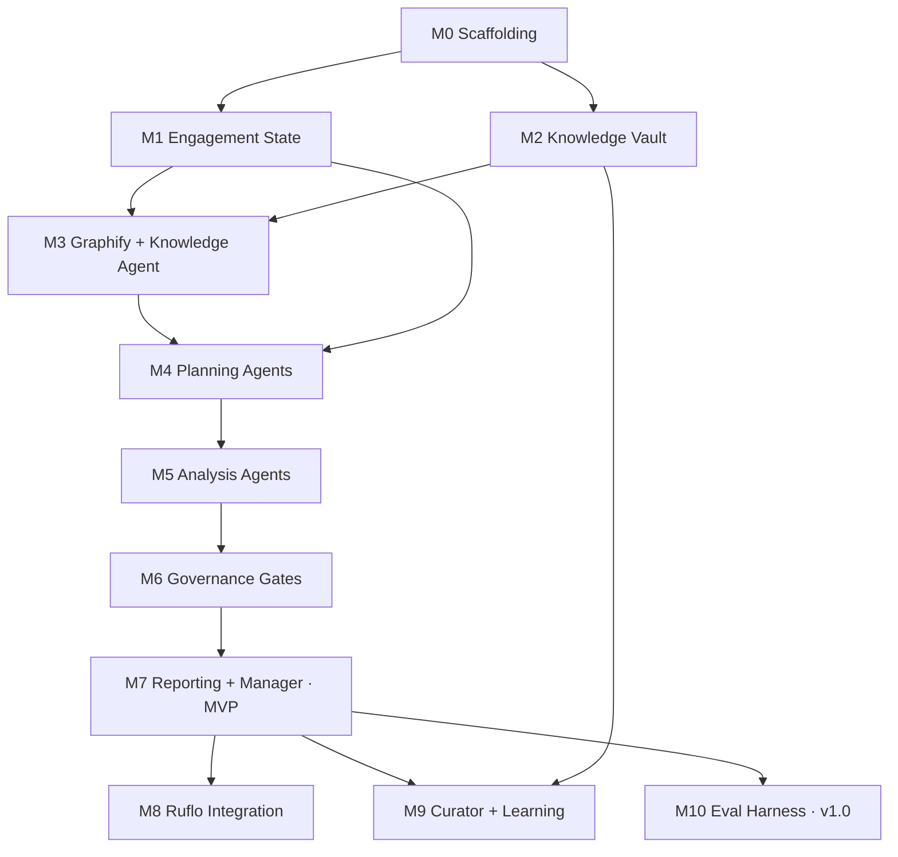

# StratAgent — Implementation Roadmap

> **Architecture baseline:** v1.0 — ADR-001 (system), ADR-002 (engagement state),
> ADR-003 (knowledge architecture), ADR-004 (knowledge library), ADR-005 (agent
> specifications). **Frozen.** This roadmap translates them into an executable plan.
> No new ADRs; no implementation code in this document.
>
> **Substrate (from the architecture):** agents/skills/knowledge are **markdown
> assets** (executed by the host per ADR-001's Ruflo binding); glue — Engagement
> State validation, adapters, and the eval harness — is **Python** (aligns with the
> Graphify toolchain; Ruflo reached via MCP). The existing `ruflo-stratagent`
> plugin (v0.1 prototype: 7 agents + `solve-case`) is the **seed**, evolved to the
> ADR-005 contracts.

---

# 1. Development Principles

1. **Architecture is law.** ADRs v1.0 are the contract. Implementation conforms; it
   does not reinterpret. A needed change to architecture stops work and requires a
   superseding ADR.
2. **Contract-first.** Build to the ADR-005 agent contracts and the ADR-002 state
   schema before writing behavior. Interfaces are frozen before internals.
3. **Walking skeleton, then thicken.** Reach a thin end-to-end engagement (MVP) as
   early as possible (M7), then add depth — never build a layer fully in isolation.
4. **Continuous validation.** Every milestone ships with tests that run in CI;
   nothing merges without green. The Engagement State invariants and agent
   contract-conformance tests are the backbone.
5. **File-based before Ruflo.** The Engagement State is file-backed (`state.json` +
   event log) first; the Ruflo AgentDB binding (M8) is an enhancement with parity,
   not a prerequisite. The system must always degrade gracefully to files.
6. **Single source of truth; no side channels.** All inter-agent coordination goes
   through the Engagement State; all firm-knowledge access through the Knowledge
   Agent/Curator. Any side channel is a defect.
7. **Knowledge is data, not code.** Frameworks/KPIs/industries are vault notes
   (ADR-004), versioned in git, changed without code edits.
8. **Mechanical enforcement of rigor.** Evidence typing, assumption breakevens, MECE
   validity, and the mandatory gates are enforced by validators/tests — not by
   trusting the model.
9. **Additive & reversible.** Each milestone is additive and behind a capability
   flag where it changes runtime; every milestone is a git tag and a rollback point.

---

# 2. Repository Milestones

Eleven milestones. **M7 is the MVP** (first full engagement); **M10 is v1.0**. Each
milestone is independently testable.

> **Milestone adjustments (post-approval):**
> - **Graphify is not a standalone milestone.** It is a component of the
>   **Knowledge Layer** milestone: vault content + Graphify indexing + Knowledge
>   Agent ship together (formerly M2 + M3, now consolidated). Downstream milestone
>   numbers shift up by one accordingly.
> - **CI/CD is deferred.** M0 initializes a **local** git repository and a local
>   `make check` gate only — no remote and no GitHub Actions until the repo is
>   pushed.

### M0 — Project & test scaffolding
- **Objective:** an implementation skeleton with CI and a test harness; no behavior.
- **Components:** repo layout (per ADR-001 §9), test runner + linters, CI pipeline, machine-readable Engagement State JSON Schema (encoding ADR-002), empty validator/adapter stubs.
- **Dependencies:** none (architecture frozen).
- **Files affected:** `schema/engagement-state.schema.json`, `tests/`, `eval/` (scaffold), `apps/`/`packages/` skeleton, CI config, `plugins/ruflo-stratagent/` (existing).
- **Test plan:** schema lints; a hand-written sample state validates against it; CI is green on the empty suite.
- **Exit criteria:** CI runs end-to-end; schema + sample validate; contributors can run tests locally.

### M1 — Engagement State (file-based) + invariants  ⟵ keystone
- **Objective:** the event-sourced single source of truth, file-backed, with ADR-002 invariants enforced.
- **Components:** final state schema; event envelope + event catalog; projection (`fold(events) → state`); invariant validator; `engagements/<slug>/` layout (state.json + events log).
- **Dependencies:** M0.
- **Files affected:** `schema/`, `packages/state/**` (projection + validator, Python), `engagements/` convention, `tests/state/**`.
- **Test plan:** projection unit tests (events → state); one test per ADR-002 invariant (reject un-sourced evidence, missing breakeven on load-bearing assumption, untestable issue-tree leaf, etc.); forbidden-transition tests; replay-determinism test; corrections-as-events test.
- **Exit criteria:** a synthetic event log replays to a valid state; every ADR-002 invariant has a passing (and a failing-input) test; no mutation/delete path exists.

### M2 — Knowledge library content (Obsidian vault)
- **Objective:** ADR-004 knowledge as vault notes conforming to ADR-003 §5 frontmatter.
- **Components:** `knowledge-vault/` populated — 15 domain notes, framework notes (primary/supporting), issue-tree templates, KPI notes, industry notes, deliverable templates; frontmatter validator; governance metadata (`source`, `last_verified`, `status`).
- **Dependencies:** M0 (frontmatter schema).
- **Files affected:** `knowledge-vault/**`, `packages/knowledge/frontmatter_validator.py`, `tests/knowledge/**`.
- **Test plan:** frontmatter validator passes on all notes; no dangling `[[wikilinks]]`; coverage checks (15 domains each with ≥1 primary framework; the ADR-004 KPI/industry/deliverable catalogs complete); governance fields present.
- **Exit criteria:** vault validates; ADR-004 coverage assertion passes; all notes `status: approved` or explicitly `draft`.

### M3 — Knowledge indexing & retrieval (Graphify + Knowledge Agent)
- **Objective:** index the vault and retrieve from it with provenance, via the Knowledge Agent only.
- **Components:** Graphify configured to index `knowledge-vault/` → graph + `graphify-mcp`; Knowledge Agent definition (ADR-005) + retrieval contract; evidence pinning (note id + git commit); tenant filtering.
- **Dependencies:** M1 (write evidence to state), M2 (vault), Graphify CLI (installed).
- **Files affected:** `graphify` config, `plugins/ruflo-stratagent/agents/knowledge-agent.md`, `packages/knowledge/retrieval_adapter.py`, `tests/knowledge/**`.
- **Test plan:** index the vault; a sample query returns relevant, sourced, commit-pinned references written to state; tenant-filter test; cross-tenant denial (negative) test; "no relevant knowledge → escalate, never fabricate" test.
- **Exit criteria:** Knowledge Agent answers a golden query with pinned provenance; no direct vault/graph access by any other component; cross-tenant leakage blocked.

### M4 — Planning agents
- **Objective:** raw problem → validated Case Classification, Information Gaps, Engagement Plan, Framework Selection, MECE Issue Tree.
- **Components:** 5 agent definitions per ADR-005 — Case Classifier + Information Gap (split from the prototype classifier), Planner (new), Framework Selector + Issue Tree Generator (split from the prototype strategist).
- **Dependencies:** M1 (state), M3 (knowledge via Knowledge Agent).
- **Files affected:** `plugins/ruflo-stratagent/agents/{case-classifier,information-gap,planner,framework-selector,issue-tree-generator}.md`, `tests/agents/planning/**`.
- **Test plan:** on golden cases, archetype matches expected; load-bearing gaps captured; plan is dependency-valid; frameworks fit; issue tree passes the ADR-004 §4 MECE/validation rules; contract-conformance (each writes only its owned sections).
- **Exit criteria:** a raw problem yields a state-valid Classification + Gaps + Plan + Frameworks + MECE tree on the golden set.

### M5 — Analysis agents
- **Objective:** owned issue-tree nodes answered with evidence, labeled assumptions, sensitivity, confidence.
- **Components:** 5 analyst definitions — Financial, Market, Operations (refactored from prototype), Strategy, Risk (new) — per ADR-005.
- **Dependencies:** M1, M3, M4.
- **Files affected:** `plugins/ruflo-stratagent/agents/{financial,market,operations,strategy,risk}-analyst.md`, `tests/agents/analysis/**`.
- **Test plan:** per analyst on a golden node — typed evidence, ≥1 labeled assumption (breakeven where load-bearing), a sensitivity, confidence ≤ min supporting evidence; **parallel-write test** (disjoint sections, no clobber); "missing input → escalate" test.
- **Exit criteria:** all golden-tree nodes answered with valid evidence; concurrent dispatch produces zero state conflicts.

### M6 — Governance gates (Reviewer + Challenger)
- **Objective:** the two mandatory gates that make a report reachable.
- **Components:** Reviewer (MECE/traceability/consistency/calibration + evidence validation) and Challenger (load-bearing test, counter-case, what-would-change); gate records; rework loop.
- **Dependencies:** M1, M4, M5.
- **Files affected:** `plugins/ruflo-stratagent/agents/{reviewer,challenger}.md`, `tests/agents/governance/**`.
- **Test plan:** Reviewer rejects unsupported-claim / contradiction states (negative tests) and approves clean ones; Challenger flags a planted load-bearing assumption; rework loop re-dispatches the correct analyst; **report-unreachable-without-both-gates** (forbidden-transition) test.
- **Exit criteria:** gates enforce ADR-002 preconditions; rework loop verified; gate bypass is impossible.

### M7 — Reporting + Engagement Manager  ⟵ MVP
- **Objective:** end-to-end engagement — orchestrator runs the lifecycle; Report Writer produces the deliverable.
- **Components:** Engagement Manager skill (lifecycle controller, evolving `solve-case`); Executive Report Writer (refactored); deliverable generation (`report.md` from templates; deck/xlsx optional).
- **Dependencies:** M1–M6.
- **Files affected:** `plugins/ruflo-stratagent/skills/solve-case/` (→ engagement-manager), `plugins/ruflo-stratagent/agents/executive-report-writer.md`, deliverable templates, `tests/integration/**`.
- **Test plan:** full golden engagement runs end-to-end; report is answer-first with assumptions preserved; both gates appear in the audit trail; close-out summary correct; no phase/gate skipped.
- **Exit criteria:** raw problem → final report with the complete phase + gate audit trail on the golden set. **Walking skeleton complete.**

### M8 — Ruflo integration (memory + optional swarm)
- **Objective:** move state to Ruflo AgentDB namespaces (full init) with parity; enable optional swarm dispatch + cost/observability.
- **Components:** controlled `ruflo init`; memory adapter (state ↔ AgentDB namespaces); optional swarm dispatch; cost-tracker/observability wiring.
- **Dependencies:** M7.
- **Files affected:** Ruflo config, `packages/state/ruflo_memory_adapter.py`, integration notes, `tests/integration/ruflo/**`.
- **Test plan:** state round-trips through AgentDB; **parity test** (engagement identical with Ruflo-on vs file-only); cost recorded; **fallback test** (MCP absent → file mode).
- **Exit criteria:** full Ruflo loop runs an engagement at parity with file mode; graceful degradation verified.

### M9 — Knowledge Curator + learning loop
- **Objective:** post-engagement write-back to the vault; close the knowledge lifecycle.
- **Components:** Curator definition; sanitization + tenant governance; Knowledge Links; reindex trigger.
- **Dependencies:** M2, M3, M7.
- **Files affected:** `plugins/ruflo-stratagent/agents/knowledge-curator.md`, `packages/knowledge/curation_governance.py`, `tests/knowledge/curation/**`.
- **Test plan:** Curator creates a sanitized `prior_case` note (**cross-tenant-leakage negative test**), writes Knowledge Links, triggers reindex; the captured lesson is retrievable in a subsequent engagement.
- **Exit criteria:** a completed engagement yields a reviewed, sourced knowledge contribution; leakage blocked; lesson re-retrievable.

### M10 — Evaluation harness  ⟵ v1.0
- **Objective:** case-bank + rubric + scoring as the continuous-validation/regression gate.
- **Components:** golden case bank (across domains); rubric (ADR-005 §8); scorer (deterministic checks + LLM-as-judge), with event-log replay; CI gate.
- **Dependencies:** M7.
- **Files affected:** `eval/**`, CI integration, `tests/eval/**`.
- **Test plan:** a known-good engagement scores above threshold; an injected regression (e.g., dropped challenge gate, un-sourced claim) scores below and **blocks CI**.
- **Exit criteria:** eval runs in CI; regressions are reliably caught. **Declare v1.0.**

---

# 3. Dependency Graph

**Critical path:** M0 → M1 → M3 → M4 → M5 → M6 → M7. M2 parallels M1. M8/M9/M10
parallelize after the MVP.

---

# 4. Build Order

1. **Foundations first (M0–M1).** The Engagement State is the keystone every agent
   depends on; build and harden it before any behavior.
2. **Knowledge in parallel (M2), then retrieval (M3).** Content can be authored
   while the state is built; retrieval needs both.
3. **Agents in lifecycle-dependency order (M4 → M5 → M6).** Planning structures the
   work, analysis fills it, governance gates it — each consumes the prior's outputs.
4. **Close the loop to MVP (M7).** Orchestrator + reporting turn the parts into a
   first full engagement — the earliest point of real end-to-end validation.
5. **Harden & enrich after MVP (M8–M10), in parallel.** Ruflo memory, the learning
   loop, and the eval gate each build on a working engagement and don't block one
   another.

Rationale: this front-loads the highest-dependency, highest-risk component (state),
reaches end-to-end validation fast, and defers framework-coupled work (Ruflo init)
until after a file-based system is proven.

---

# 5. Deliverables per Milestone

| Milestone | Key deliverables |
|---|---|
| M0 | Repo skeleton, CI, state JSON Schema, test harness |
| M1 | State projection + invariant validator; event catalog; `engagements/` layout |
| M2 | Populated `knowledge-vault/` + frontmatter validator |
| M3 | Graphify index config; Knowledge Agent; retrieval adapter w/ provenance pinning |
| M4 | 5 planning agent definitions; MECE validator wired |
| M5 | 5 analysis agent definitions; parallel-safe findings |
| M6 | Reviewer + Challenger definitions; gate + rework machinery |
| M7 | Engagement Manager skill; Report Writer; **end-to-end engagement + report** |
| M8 | Ruflo memory adapter; init config; parity + fallback |
| M9 | Knowledge Curator; write-back governance; learning loop |
| M10 | Case bank; rubric; scorer; CI regression gate |

---

# 6. Testing Strategy

Five layers, all in CI:

- **Schema & invariant tests (deterministic).** The Engagement State validates
  against its schema; every ADR-002 invariant has a positive and a negative test.
  This is the non-negotiable backbone.
- **Contract-conformance tests (deterministic).** Per agent (ADR-005): preconditions
  gate execution; postconditions hold; the agent writes **only** its owned sections;
  failures are typed, not crashes.
- **Integration / golden-engagement tests.** Curated input cases run through the
  lifecycle; assert phase + gate audit trail, MECE validity, evidence traceability,
  and assumption preservation.
- **Negative & safety tests.** Gate bypass impossible; un-sourced evidence rejected;
  cross-tenant retrieval/curation denied; contradiction caught by the Reviewer.
- **Evaluation (judgment, M10).** Rubric scoring (deterministic checks + LLM-as-
  judge) over the case bank, via event-log replay — the regression gate for any
  prompt/agent/knowledge change.

**On LLM nondeterminism:** correctness is asserted on the **state** (deterministic:
validity, owned-section writes, invariants, gate presence), not on exact prose.
Judgment quality is measured statistically by the eval harness, not asserted per
run. Retries are idempotent (statelessness + event sourcing) and bounded.

---

# 7. Acceptance Criteria

- **Per milestone:** its Exit Criteria (§2) are met, tests are green in CI, and no
  ADR invariant is violated.
- **MVP (end of M7):** a raw business problem produces a final executive report with
  a complete phase + mandatory-gate audit trail, evidence traceable, assumptions
  preserved — file-based, on the golden case set.
- **v1.0 (end of M10):** all milestones complete; the eval harness runs in CI and
  catches injected regressions; Ruflo integration runs at parity with graceful
  fallback; the knowledge learning loop is closed.

---

# 8. Risks

| Risk | Mitigation |
|---|---|
| LLM nondeterminism makes tests flaky | Assert on deterministic state (invariants, owned-writes, gates); measure judgment via the eval harness; bounded idempotent retries |
| Ruflo is alpha / may break | Isolate behind the memory adapter; **file-based mode is the always-available baseline**; defer `ruflo init` to M8 |
| Graphify prose-graph quality on a consulting vault is unproven | Validate on a vault sample early (M3); enable the optional LLM backend only if needed; structural (wikilink/frontmatter) graph works regardless |
| Hallucinated / un-sourced facts | Evidence typing + provenance enforced by invariants (M1) and the Reviewer (M6); blocked at report generation |
| Gate bypass under pressure | Report is unreachable without both gate postconditions (forbidden-transition test, M6) |
| Scope creep | Architecture frozen v1.0; changes require a superseding ADR, not a roadmap edit |
| Knowledge quality drift | ADR-004 governance: steward approval, `source`/`last_verified`, review cycle (validated in M2/M9) |
| Long-engagement context limits | State externalized (M1); scoped per-agent dispatch (ADR-005); no full-history passing |
| Cost | Model tiering (ADR-001/004), cost-tracker (M8), eval budget caps |

---

# 9. Rollback Strategy

- **Per-milestone git tags** are rollback points; each milestone is additive and, where
  it changes runtime, **behind a capability flag**.
- **File-based state is the safe baseline.** Disabling the Ruflo binding (M8) reverts
  to file mode with no loss of capability — the parity test guarantees equivalence.
- **Agents are versioned contracts (ADR-005 §8).** Revert a misbehaving agent to its
  prior contract version without touching others (owner-exclusive writes guarantee
  isolation).
- **Knowledge is git-versioned.** Revert a vault commit to roll back a framework/KPI
  change; **evidence pinning** (ADR-003 §11) means past engagements still reproduce
  against the version they used.
- **Plugin install is reversible** (`/plugin uninstall`; `graphify`/`uv tool`
  uninstall) — no destructive footprint.
- **Event-sourced state** means no rollback ever loses history; a bad engagement is
  abandoned by status, not by deletion.

---

# 10. Definition of Done

**A milestone is Done when:**
- [ ] Exit Criteria (§2) met and demonstrated.
- [ ] All five test layers (as applicable) pass in CI.
- [ ] No ADR v1.0 invariant violated (state, contracts, knowledge boundaries).
- [ ] Agents/knowledge touched are versioned; docs updated; a git tag cut.
- [ ] Reversible (flag/baseline/version) per §9.

**The project is Done (v1.0) when:**
- [ ] M0–M10 each Done.
- [ ] MVP and v1.0 acceptance criteria (§7) met.
- [ ] The eval harness runs in CI and blocks regressions.
- [ ] An engagement runs end-to-end in both file mode and full-Ruflo mode at parity.
- [ ] The knowledge learning loop is closed (a captured lesson is re-retrievable).

---

*This is the final planning document. On approval, implementation begins at M0.
Architecture v1.0 governs; this roadmap sequences the build but does not alter it.*
