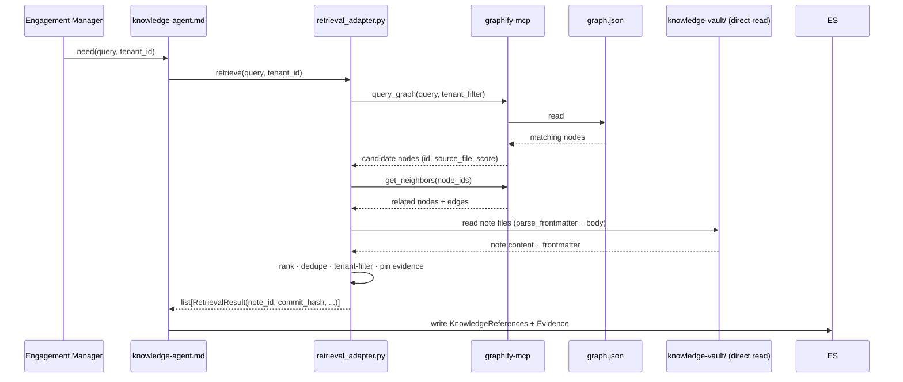

# M3 — Knowledge Indexing & Retrieval (Design, Phase 1)

**This document is design only.** No runtime code, no vault edits, no schema
changes, no ADR modifications. The single artifact of Phase 1 is this file. All
other files touched: none. This document is `status: PROPOSED` and requires
explicit approval before any Phase 2 work begins.

Evidence tags: **[Verified]** = read directly from a repo artifact at the
baseline; **[Inference]** = reasoned from verified facts; **[Unknown]** = not
determinable from current evidence (a decision or a discovery item for Phase 2).

---

## 1. Objective

Index the M2 knowledge vault (`knowledge-vault/`, 132 notes) with Graphify and
deliver a **Knowledge Agent** that retrieves from the index with provenance,
writing sourced `KnowledgeReferences` + `Evidence` into the Engagement State —
accessible through the Knowledge Agent only. No other component may read firm
knowledge directly.

[Verified — Roadmap M3: "index the vault and retrieve from it with provenance,
via the Knowledge Agent only"; ADR-003 §8; ADR-005 Knowledge Agent contract]

---

## 2. Scope

1. **Graphify index run** — run `graphify update knowledge-vault/` to index the
   132 notes; verify the output graph structure and node/edge schema.
   [Verified — Roadmap M3 "Graphify configured to index knowledge-vault/"]
2. **Knowledge Agent markdown definition** —
   `plugins/ruflo-stratagent/agents/knowledge-agent.md` implementing the ADR-005
   contract: hybrid retrieval, ranking, tenant filtering, provenance tagging,
   state writes.
   [Verified — Roadmap M3; ADR-005 §3 Knowledge Agent; plugin agent pattern]
3. **Retrieval adapter** — `packages/knowledge/retrieval_adapter.py`: Python
   library that wraps Graphify MCP query + direct vault read, returns typed
   `RetrievalResult` objects with evidence pinning.
   [Verified — Roadmap M3 files: "`packages/knowledge/retrieval_adapter.py`"]
4. **Tests** — `tests/knowledge/test_retrieval_adapter.py` + golden-query tests.
   [Verified — Roadmap M3 test plan]
5. **API freeze update** — `tests/knowledge/test_api_freeze.py` updated to
   include new public symbols from `retrieval_adapter.py`.
   [Inference — extending the frozen 28-symbol surface requires freeze test update]

---

## 3. Out of Scope

- **Vault content changes** — `knowledge-vault/**` notes are read-only in M3.
  [Verified — M2 complete; vault frozen at 132 notes]
- **`packages/state`, `packages/persistence`, `packages/replay`** — frozen; M3
  does not touch them. [Verified — M2 zero-diff; frozen packages]
- **Architecture-v1.0.md** — not modified. [Verified — frozen]
- **ADR-003, ADR-004, ADR-005** — not modified; M3 implements them.
  [Verified — evidence policy]
- **Knowledge Curator / write-back loop** — M9.
  [Verified — Roadmap M9; ADR-005 §3 Curator]
- **Ruflo AgentDB memory binding** — M8.
  [Verified — Roadmap M8]
- **Dedicated graph DB** — ADR-003 §12 future trigger.
  [Verified — ADR-003 §12]
- **Embedding/vector index** — see D-11; may be partial M3, may be deferred.
  [Unknown — see §19]

---

## 4. Evidence Summary

### Repository state at baseline (HEAD 95cf79b)

**Graphify:**
- CLI `graphify 0.9.3` installed at `/Users/darpan/.local/bin/graphify`.
  [Verified — `which graphify && graphify --version`]
- MCP server `graphify-mcp` installed at `/Users/darpan/.local/bin/graphify-mcp`.
  [Verified — `which graphify-mcp`]
- `.mcp.json` already configured for graphify-mcp:
  `command: graphify-mcp, args: ["--graph", "knowledge-vault/graphify-out/graph.json"],
  autoStart: false`. [Verified — `.mcp.json` read]
- `knowledge-vault/graphify-out/` exists with known structure (see §6).
  [Verified — `ls graphify-out/`]
- Current `graph.json` is **stale**: built from commit `642696ff`, 1 node
  (`.obsidian/app.json`), 0 edges — **none of the 132 vault notes are indexed**.
  [Verified — `graph.json` read; `GRAPH_REPORT.md` read]
- `stat-index.json` uses **absolute paths** (portability concern).
  [Verified — `stat-index.json` read]

**Knowledge vault:**
- 132 notes validated by `validate_vault` (is_valid=True, 0 errors, 3 advisory
  warnings). [Verified — M2-S5 gate; `GRAPH_REPORT.md` in completion report]
- Notes structured with ADR-003 §5 frontmatter: `id`, `type`, `title`, `source`,
  `last_verified`, `status`, `visibility`, plus per-type fields.
  [Verified — M2 frontmatter validator; `FrameworkNote` 11 required attrs]
- All 132 notes `status: draft`. [Verified — M2 D-6 hybrid policy]
- Wikilinks: 0 broken. [Verified — `validate_vault` M2-S5]

**`packages/knowledge` (frozen M2 API):**
- 28-symbol `__all__`: `validate_vault`, `validate_note`, `parse_frontmatter`,
  all models, all enums, `REQUIRED_DOMAINS`, `EXPECTED_CATEGORY_DIRS`.
  [Verified — `__init__.py`; `test_api_freeze.py`]
- `retrieval_adapter.py` does NOT exist. [Verified — `ls packages/knowledge/`]

**Plugin agents:**
- `plugins/ruflo-stratagent/agents/knowledge-agent.md` does NOT exist.
  [Verified — `ls plugins/ruflo-stratagent/agents/`]
- Existing agents: case-classifier, challenger, financial-analyst,
  framework-strategist, market-analyst, operations-analyst, report-writer.
  [Verified — directory listing]

**Graphify MCP tools (deferred, available in `mcp__graphify__*`):**
- `get_community`, `get_neighbors`, `get_node`, `get_pr_impact`, `god_nodes`,
  `graph_stats`, `list_prs`, `query_graph`, `shortest_path`, `triage_prs`.
  [Verified — system-reminder deferred tools list]

**ADR-003 §6 explicit caveat:**
> "Graphify's internals have not been inspected. This ADR therefore specifies
> Graphify by a minimal integration contract … and labels capability assumptions
> as `[GRAPHIFY-ASSUMPTION]`."
[Verified — ADR-003 §6 verbatim]

---

## 5. Verified / Inference / Unknown Table

| # | Statement | Classification | Source |
|---|---|---|---|
| V1 | Graphify CLI v0.9.3 installed | Verified | `which graphify; graphify --version` |
| V2 | graphify-mcp installed as separate binary | Verified | `which graphify-mcp` |
| V3 | `.mcp.json` configures graphify-mcp pointing to `graphify-out/graph.json` | Verified | `.mcp.json` read |
| V4 | `graphify-out/` is inside `knowledge-vault/` | Verified | `ls knowledge-vault/` |
| V5 | `graph.json` format: networkx JSON — `{directed, multigraph, nodes[], links[], hyperedges[], built_at_commit}` | Verified | `graph.json` read |
| V6 | Node schema: `{id, label, file_type, source_file, source_location, _origin, community, norm_label}` | Verified | `graph.json` nodes[0] |
| V7 | Current graph has 1 node, 0 edges; 132 vault notes are NOT indexed | Verified | `graph.json` + `GRAPH_REPORT.md` |
| V8 | `graphify update <path>` rebuilds without LLM | Verified | `graphify --help` |
| V9 | `validate_vault` excludes `graphify-out/` from note scanning | Verified | `vault_validator.py` scoping rules |
| V10 | `knowledge-agent.md` does not exist | Verified | `ls agents/` |
| V11 | `retrieval_adapter.py` does not exist | Verified | `ls packages/knowledge/` |
| V12 | ADR-003 §7 specifies hybrid retrieval: vector + graph + direct file | Verified | ADR-003 §7 |
| V13 | ADR-003 §6 flags Graphify trigger + exposure contract as unverified | Verified | ADR-003 §6 `[GRAPHIFY-ASSUMPTION]` |
| V14 | Knowledge Agent writes: Knowledge References + Evidence type=external_source | Verified | ADR-005 §3 + ADR-003 §8 |
| V15 | `stat-index.json` uses absolute paths | Verified | `stat-index.json` |
| V16 | Graphify JSON AST parse returns `"skipped": "data json"` for `.json` files | Verified | AST cache file read |
| I1 | `graphify update knowledge-vault/` will produce nodes for 132 markdown notes | Inference | CLI behavior on code files; vault is all `.md` |
| I2 | Each vault note's `id` frontmatter field should become the node `id` in the graph | Inference | ADR-003 §5 + §6 integration contract |
| I3 | Frontmatter `[[wikilinks]]` become edges in the graph | Inference | ADR-003 §6 `[GRAPHIFY-ASSUMPTION]` pattern |
| I4 | `retrieval_adapter.py` will add new symbols to `packages/knowledge` requiring freeze test update | Inference | M2 freeze test pins `__all__`; additive symbols need test update |
| I5 | The knowledge-agent.md markdown agent will orchestrate retrieval using the Python adapter | Inference | Plugin agent pattern (other agent `.md` files); Ruflo binding |
| U1 | How Graphify processes `.md` files: frontmatter parsing, wikilink edge extraction, body chunking | Unknown | ADR-003 `[GRAPHIFY-ASSUMPTION]`; no `.md` in current index |
| U2 | Whether Graphify 0.9.3 produces vector embeddings for markdown content | Unknown | `update` says "no LLM needed"; no embedding file in `graphify-out/` |
| U3 | What node labels/edge types Graphify assigns to vault notes | Unknown | Only `.json` in current graph; no markdown nodes |
| U4 | Whether frontmatter typed fields become typed edges | Unknown | ADR-003 §6 assumption; unverified |
| U5 | Whether Graphify propagates `visibility`/`tenant` to graph node properties | Unknown | Not in current node schema |
| U6 | `query_graph` MCP tool parameters and result format | Unknown | Tool schema not loaded |
| U7 | Which git commit hash to pin for evidence (vault HEAD vs. note-specific commit) | Unknown | ADR-003 §11 says "note id + git commit hash" — ambiguous |
| U8 | Public API of `retrieval_adapter.py` — class names, function signatures | Unknown | Not yet designed |
| U9 | New error hierarchy for retrieval failures (`KnowledgeRetrievalError`?) | Unknown | Not in current `packages/knowledge` |
| U10 | Whether `graphify-out/` should stay inside `knowledge-vault/` or move outside | Unknown | Current location established by M2-era experimentation |
| U11 | Whether Graphify supports incremental rebuild (re-index only changed notes) | Unknown | `manifest.json` tracks file hashes suggesting yes; unconfirmed for `.md` |

---

## 6. Existing Architecture

### Graphify output structure (Verified)

```
knowledge-vault/graphify-out/
├── graph.json          # networkx JSON: nodes + links + hyperedges + built_at_commit
├── manifest.json       # per-file mtime + ast_hash + semantic_hash
├── GRAPH_REPORT.md     # human-readable summary (nodes, edges, communities, god nodes)
├── .graphify_labels.json # community id → label map
├── .graphify_root      # marks the root (content: ".")
└── cache/
    ├── stat-index.json         # absolute-path → {size, mtime_ns, hash}
    └── ast/v0.9.3/<hash>.json  # per-file AST parse result (cached by content hash)
```

### `graph.json` node schema (Verified, from current index)

```json
{
  "id": "obsidian_app",
  "label": "app.json",
  "file_type": "code",
  "source_file": ".obsidian/app.json",
  "source_location": "L1",
  "_origin": "ast",
  "community": 0,
  "norm_label": "app.json"
}
```

### `.mcp.json` graphify-mcp config (Verified)

```json
"graphify": {
  "command": "graphify-mcp",
  "args": ["--graph", "knowledge-vault/graphify-out/graph.json"],
  "autoStart": false
}
```

### Relevant Graphify CLI commands (Verified)

```
graphify update <path>           # re-extract + update graph (no LLM)
graphify watch <path>            # file-watcher continuous rebuild
graphify cluster-only <path>     # re-cluster without re-extraction
graphify path "A" "B"            # shortest path query
graphify explain "X"             # explain a node and neighbors
```

### Available MCP tools (Verified — deferred)

`get_community`, `get_neighbors`, `get_node`, `get_pr_impact`, `god_nodes`,
`graph_stats`, `list_prs`, `query_graph`, `shortest_path`, `triage_prs`

### `packages/knowledge` frozen API (Verified)

28 symbols: `validate_vault`, `validate_note`, `parse_frontmatter`, 13 typed
models, 5 enums, `VaultReport`, `ValidationIssue`, `REQUIRED_DOMAINS`,
`EXPECTED_CATEGORY_DIRS`.

`retrieval_adapter.py` — does not exist.

### Plugin agents (Verified)

`knowledge-agent.md` — does not exist.

---

## 7. Proposed Architecture

### Layer diagram

```
┌──────────────────────────────────────────────────────────────────┐
│  Engagement Manager (skill) / Planning agents                    │
│  [request: "find frameworks for profitability / retail"]         │
└─────────────────────────────┬────────────────────────────────────┘
                              │ dispatch
                              ▼
┌──────────────────────────────────────────────────────────────────┐
│  knowledge-agent.md  (plugins/ruflo-stratagent/agents/)          │
│  ADR-005 Knowledge Agent contract                                │
│  — hybrid retrieval orchestration                                │
│  — ranking · tenant filter · provenance tagging                  │
│  — writes: Knowledge References + Evidence (type=external_source)│
└──────┬───────────────────────────────────────────────────────────┘
       │ calls Python adapter (via Ruflo bash/python tool)
       ▼
┌──────────────────────────────────────────────────────────────────┐
│  packages/knowledge/retrieval_adapter.py  (NEW — M3)             │
│  RetrievalQuery → list[RetrievalResult]                          │
│  — graph query via graphify-mcp MCP / graph.json direct read     │
│  — direct vault read (Path + parse_frontmatter)                  │
│  — evidence pinning: note id + git commit hash                   │
│  — tenant filtering                                              │
└──────┬────────────────────────────┬────────────────────────────  ┘
       │                            │
       ▼                            ▼
┌───────────────────┐   ┌───────────────────────────────────────── ┐
│  graphify-mcp     │   │  knowledge-vault/  (read-only)            │
│  (MCP server)     │   │  132 notes: .md + frontmatter             │
│  ↓ graph.json     │   │  parse_frontmatter / validate_note        │
│  query_graph      │   └───────────────────────────────────────────┘
│  get_neighbors    │
│  shortest_path    │
└───────────────────┘
       ↑ reads
┌───────────────────────────────────────────────────────────────── ┐
│  knowledge-vault/graphify-out/graph.json                          │
│  built by: graphify update knowledge-vault/                       │
│  trigger:  pre-engagement gate (manual / git post-commit hook)   │
└───────────────────────────────────────────────────────────────── ┘
```

### Data flow (retrieval)



---

## 8. Component Responsibilities

### `graphify update knowledge-vault/` (index build)

- **Input:** `knowledge-vault/` tree (excluding `graphify-out/`, `_attachments/`,
  `.obsidian/`, `_meta/`)
- **Output:** `graphify-out/graph.json` (updated nodes + edges), `manifest.json`
  (updated file hashes), `GRAPH_REPORT.md`, community labels
- **Precondition:** `validate_vault(Path("knowledge-vault"))` returns
  `is_valid=True` — indexer must not run on an invalid vault
- **Must NOT:** modify any vault note; index `graphify-out/` recursively;
  be hand-edited
- **Owner:** CLI run at index time; Knowledge Curator triggers reindex post-M9

### `knowledge-agent.md` (ADR-005 contract)

- **Inputs:** issue-tree node or explicit query, `client`, `tenant_id`
- **Reads State:** Issue Tree, client (per ADR-005)
- **Writes State:** Knowledge References (ADR-002 §13) + Evidence
  (type=external_source, pinned to `note_id@commit_hash`)
- **Calls:** `retrieval_adapter.retrieve(query, tenant_id)` via Python tool
- **Success:** relevant, tenant-legal, fully sourced results; no un-sourced item
- **Fails if:** returns cross-tenant data; returns un-sourced items; writes to vault
- **Escalates if:** no relevant knowledge found → escalate to manager, never fabricate

### `packages/knowledge/retrieval_adapter.py` (Python library)

- **Public API (proposed — see D-12):**
  ```python
  @dataclass(frozen=True)
  class RetrievalQuery:
      text: str
      tenant_id: str | None
      limit: int = 10

  @dataclass(frozen=True)
  class RetrievalResult:
      note_id: str        # vault note frontmatter id
      note_path: Path     # relative path within knowledge-vault/
      commit_hash: str    # git HEAD at retrieval time (evidence pin)
      title: str
      note_type: NoteType
      source: str         # note's source field (provenance)
      score: float        # relevance score [0.0, 1.0]
      excerpt: str        # relevant body excerpt (for state write)
      visibility: Visibility
      tenant: str | None

  def retrieve(
      query: RetrievalQuery,
      vault_dir: Path = Path("knowledge-vault"),
      graph_path: Path = Path("knowledge-vault/graphify-out/graph.json"),
  ) -> list[RetrievalResult]: ...
  ```
- **Guarantees:**
  - Pure: same query + same graph → same results (deterministic graph traversal)
  - Read-only: never modifies vault or graph
  - Tenant-safe: filters by `tenant_id`; never returns cross-tenant notes
  - Provenance: every result carries `note_id` + `commit_hash`
- **Does NOT import:** `packages/state` (avoids creating a dependency inversion)
- **Imports:** `packages/knowledge` (validator), `packages/common` (value objects),
  standard library only; optionally `mcp__graphify__*` when MCP is available,
  falls back to direct `graph.json` read when MCP is absent

---

## 9. Public API Proposal

### New symbols in `packages/knowledge.__all__`

The following symbols are proposed additions to the currently-frozen 28-symbol surface.
The freeze test (`tests/knowledge/test_api_freeze.py`) must be updated to cover them.
Exact names subject to approval (D-12).

| Symbol | Type | Purpose |
|---|---|---|
| `RetrievalQuery` | frozen dataclass | Input to `retrieve()` — query text + tenant |
| `RetrievalResult` | frozen dataclass | One retrieved note with provenance |
| `retrieve` | function | `(RetrievalQuery, ...) → list[RetrievalResult]` |
| `KnowledgeRetrievalError` | exception | Raised when retrieval fails (not found is NOT an error) |

**Proposed new `__all__` count:** 32 (28 + 4).

**ADR required:** no — additive extension of the package; the freeze test update
is sufficient. [Inference — consistent with M2 pattern where new symbols were
added to `__all__` without a new ADR]

### Knowledge Agent definition (markdown agent file)

Follows the ADR-005 contract template. Location:
`plugins/ruflo-stratagent/agents/knowledge-agent.md`.

Fields (following ADR-005 §3):
- Purpose, Responsibilities, Inputs/Outputs
- Reads State: Issue Tree, client
- Writes State: Knowledge References, Evidence Ledger
- Knowledge deps: the entire vault
- Tools: Knowledge Retrieval (retrieval_adapter), Web Research (escalation path), State
- Pre/Post conditions
- Failure modes (declared, typed)
- Retry rules (idempotent, bounded)

---

## 10. Internal Module Layout

```
packages/knowledge/
├── __init__.py              # EXISTING — frozen 28-symbol API + 4 new M3 symbols
├── frontmatter.py           # EXISTING — frozen (M2)
├── frontmatter_validator.py # EXISTING — frozen (M2)
├── vault_validator.py       # EXISTING — frozen (M2)
└── retrieval_adapter.py     # NEW (M3) — RetrievalQuery, RetrievalResult, retrieve()

plugins/ruflo-stratagent/agents/
├── case-classifier.md       # EXISTING
├── challenger.md            # EXISTING
├── financial-analyst.md     # EXISTING
├── framework-strategist.md  # EXISTING
├── market-analyst.md        # EXISTING
├── operations-analyst.md    # EXISTING
├── report-writer.md         # EXISTING
└── knowledge-agent.md       # NEW (M3) — ADR-005 Knowledge Agent contract

tests/knowledge/
├── test_frontmatter.py      # EXISTING — frozen
├── test_vault_validator.py  # EXISTING — frozen
├── test_vault_content.py    # EXISTING — frozen
├── test_api_freeze.py       # EXISTING — update to include 4 new symbols
└── test_retrieval_adapter.py # NEW (M3)

knowledge-vault/graphify-out/
├── graph.json               # REBUILT by M3 (graphify update knowledge-vault/)
├── manifest.json            # REBUILT
├── GRAPH_REPORT.md          # REBUILT
└── ...                      # all other graphify-out/* rebuilt
```

---

## 11. Dependency Diagram

```
packages/core   ←   packages/common   ←   packages/knowledge (M2, frozen API + M3 retrieval_adapter)
                                               ↑ imports
                                     graphify-out/graph.json  (read-only at retrieval time)
                                     knowledge-vault/ notes   (read-only at retrieval time)

packages/state  ←   packages/persistence (M1.8) ←  packages/replay (M1.9)
                                               (no dependency on packages/knowledge)

plugins/.../knowledge-agent.md
  → calls retrieval_adapter via Python tool
  → writes to Engagement State via packages/state Engagement API

knowledge-vault/  →  (indexed by) graphify update →  graphify-out/graph.json
                  →  (read by) vault_validator (validate_vault)
                  →  (read by) retrieval_adapter (direct file read + parse_frontmatter)
```

**Allowed new dependency:** `retrieval_adapter.py → packages/common`
(value objects) — this is a downward dependency, consistent with the layer model.

**Forbidden (must not be introduced):**
- `packages/knowledge` importing `packages/state` — would invert the layer
  hierarchy and create a circular dependency risk for M4+
- Any analyst agent reading vault/graph directly — ADR-005 §7 invariant
- `retrieval_adapter.py` writing to vault or graph

**What depends on M3:**
- M4 (planning agents) — all 5 planning agents use Knowledge Agent for
  framework/domain/issue-tree retrieval
- M5 (analysis agents) — analysts read Knowledge References already in state
  (written by M3 Knowledge Agent); do not re-invoke Knowledge Agent
- M9 (curator) — reads completed engagement state; triggers re-index via
  `graphify update` or MCP

---

## 12. Runtime Flow

### Index build (offline, pre-engagement)

```
1. Validate vault:
     validate_vault(Path("knowledge-vault"))  →  is_valid=True  [GATE]
     If is_valid=False: STOP, fix errors first

2. Run Graphify:
     graphify update knowledge-vault/
     Output: graphify-out/graph.json (132 nodes + edges)
             graphify-out/manifest.json (per-file hash + mtime)
             graphify-out/GRAPH_REPORT.md

3. Verify graph:
     graph.json contains ≥ 132 nodes (one per vault note)
     GRAPH_REPORT.md reports 0 import cycles

4. Start graphify-mcp (optional, for MCP-based retrieval):
     graphify-mcp --graph knowledge-vault/graphify-out/graph.json
     (or autoStart in .mcp.json; currently autoStart: false)
```

### Retrieval (per-engagement, per-query)

```
1. Knowledge Agent receives need(query, tenant_id) from Engagement Manager
2. Calls: retrieve(RetrievalQuery(text=query, tenant_id=tenant_id))
3. retrieval_adapter:
     a. query_graph(query)  →  candidate node ids
     b. get_neighbors(ids)  →  related nodes (domain ↔ framework ↔ KPI edges)
     c. Direct vault read: parse_frontmatter(note_text) + body excerpt
     d. tenant-filter: retain only notes where
          visibility=global OR (visibility=tenant AND tenant=tenant_id)
     e. rank by: score × note.confidence × recency(last_verified)
     f. pin evidence: note.id + git_head_commit_hash
     g. return list[RetrievalResult]
4. Knowledge Agent writes to Engagement State:
     KnowledgeReferences: note_id, commit_hash, title, source, score, excerpt
     Evidence: type=external_source, source="{note_id}@{commit_hash}"
```

---

## 13. Index Lifecycle

| Event | Trigger | Action |
|---|---|---|
| Initial index build | Manual (M3 implementation phase) | `graphify update knowledge-vault/` after `validate_vault` passes |
| Note added/edited (M2+ vaults) | Git commit to vault | [D-16: git post-commit hook vs. manual `graphify update`] |
| Note deleted | Git commit removing file | `graphify update knowledge-vault/ --force` |
| Vault is invalid | `validate_vault` returns errors | Block indexer; fix vault first |
| Curator adds note (M9) | Post-engagement curator action | Curator triggers `graphify update` |
| Graph stale check | Pre-engagement gate (optional) | Compare `graph.json built_at_commit` vs. `git rev-parse HEAD` |
| Full rebuild | Schema change / corruption | `graphify update knowledge-vault/ --force` |

**Index version tracking:** `graph.json.built_at_commit` carries the vault HEAD at
index time. A stale check: if `built_at_commit ≠ git rev-parse HEAD`, the graph
may not reflect recent vault edits. [Verified — `GRAPH_REPORT.md` "Run git
rev-parse HEAD and compare to check if the graph is stale."]

---

## 14. Failure Modes

| Failure | Detection | Handling |
|---|---|---|
| `validate_vault` errors on current vault | Pre-index gate | Block index; surface errors; never index invalid vault |
| `graphify update` fails | Non-zero exit code | Surface error; retain previous graph.json; never corrupt index |
| `graph.json` is stale (built_at_commit ≠ HEAD) | Stale check at retrieval time | Advisory warning; use stale graph with staleness flag in result |
| `graphify-mcp` not running | MCP tool call fails | Fall back to direct `graph.json` read; no error |
| Note not found in graph (after index) | `retrieve()` returns 0 results | Not an error — escalate path in Knowledge Agent; "nothing relevant → do not fabricate" |
| Cross-tenant result would be returned | tenant-filter in `retrieval_adapter` | Drop the result; never surface to Knowledge Agent |
| Evidence pinning fails (git unavailable) | `git rev-parse HEAD` fails | Use `"unknown"` as commit hash; flag the result; [D-18] |
| `retrieve()` raises `KnowledgeRetrievalError` | Unexpected exception | Knowledge Agent records typed failure; escalates to manager |
| Graph corrupted | `graph.json` invalid JSON | Fall back to "no knowledge available"; never crash engagement |

---

## 15. Invariants (Proposed)

| ID | Invariant | Enforced by |
|---|---|---|
| KR-001 | `validate_vault` returns `is_valid=True` before any `graphify update` | Pre-index gate; CI gate |
| KR-002 | `graphify-out/` is never indexed as vault notes | `vault_validator.py` scoping (already excludes `graphify-out/`) |
| KR-003 | `retrieval_adapter.retrieve()` never returns a note where `visibility=tenant AND tenant ≠ tenant_id` | tenant-filter in `retrieval_adapter`; dedicated test |
| KR-004 | Every `RetrievalResult` carries a non-empty `note_id` and `commit_hash` | `RetrievalResult` frozen dataclass; required fields; test |
| KR-005 | `retrieval_adapter.py` is pure and read-only (no vault writes, no graph writes) | No IO writes in module; source scan test |
| KR-006 | The Knowledge Agent is the **only** path by which Engagement State `Knowledge References` are written | ADR-005 §7 ownership matrix; ownership data |
| KR-007 | `graph.json` is derived and rebuildable; never hand-edited | No editor opens it; `graphify update` is the sole write path |
| KR-008 | Retrieval is deterministic: same `graph.json` + same query → same ranked results | Pure function contract; determinism test |
| KR-009 | `packages/knowledge` does not import `packages/state` | Source scan; forbidden-import test |
| KR-010 | No analyst agent reads vault or graph directly; all firm knowledge access via Knowledge Agent / Knowledge References in state | ADR-005 §7; ownership data; enforcement deferred to M6 (same pattern as state ownership) |
| KR-011 | Index build is preceded by `validate_vault` gate; a failing vault is never indexed | Pre-index gate; CI gate |

---

## 16. Performance Expectations

| Operation | Expected | Basis | Classification |
|---|---|---|---|
| `graphify update knowledge-vault/` on 132 notes | < 30 s | [Unknown — must measure in S1] | Unknown |
| Cold graph.json read | < 100 ms | 132 nodes; networkx JSON ≈ tens of KB | Inference |
| `retrieve()` per query (graph + direct read) | < 2 s | 132 nodes; no vector computation; graph traversal is O(neighbors) | Inference |
| graphify-mcp MCP round-trip | < 500 ms | Local stdio; no network | Inference |
| Full vault reindex post-note-edit (incremental) | < 10 s | manifest.json tracks hashes; only changed files re-parsed | Inference (U11) |

**Performance tests:** `tests/knowledge/test_retrieval_perf.py` — baseline
`retrieve()` latency for a golden query (mirrors M1.7.7 perf baseline pattern).

---

## 17. Testing Strategy

| Test file | What it covers |
|---|---|
| `tests/knowledge/test_retrieval_adapter.py` | Unit tests: `retrieve()` with a real or fixture graph.json — tenant filter, pinning, ranking, cross-tenant denial, no-result escalation path, error paths |
| `tests/knowledge/test_api_freeze.py` (updated) | Freeze test extended to 32 symbols (+ `RetrievalQuery`, `RetrievalResult`, `retrieve`, `KnowledgeRetrievalError`) |
| `tests/knowledge/test_vault_content.py` (extended) | S3 golden-query test: after `graphify update`, a known query returns the expected framework note |
| `tests/knowledge/test_retrieval_perf.py` (new) | Baseline `retrieve()` latency on the 132-note graph |

**Existing test files remain frozen** (no changes to `test_frontmatter.py`,
`test_vault_validator.py`).

**Key negative tests:**
- Cross-tenant denial: `retrieve(query, tenant_id="t_a")` does not return notes
  with `visibility=tenant, tenant="t_b"`
- No-fabrication path: 0-result retrieval does not raise, returns `[]`; Knowledge
  Agent escalates instead of fabricating
- Forbidden import: `packages/knowledge` does not import `packages/state`

---

## 18. Technical Debt

| TD | Description | Target |
|---|---|---|
| TD-G1 | `stat-index.json` uses absolute paths — portability issue if vault is moved or cloned | Graphify limitation; document, do not fix |
| TD-G2 | `autoStart: false` for graphify-mcp means MCP tools require manual start | Acceptable for M3; revisit for M4+ if always-on is needed |
| TD-G3 | `retrieval_adapter.py` falls back to direct `graph.json` read if MCP unavailable — dual code paths | Acceptable M3 fallback; consolidate when MCP is stable |
| TD-G4 | `knowledge-agent.md` uses the prototype agent pattern; needs upgrade to ADR-005 strict contract in M4 | By design — same pattern as other prototype agents |
| TD-G5 | Vector embedding retrieval not implemented in M3 if Graphify 0.9.3 does not produce embeddings (see D-11) | Deferred to M3-S2 or standalone if embeddings are needed |

---

## 19. Decisions Requiring Approval

All decisions below are **unresolved at Phase 1 close.** Do not implement until
each is explicitly approved.

| ID | Decision | Options | Impact |
|---|---|---|---|
| **D-10** | **[CRITICAL] Verify Graphify markdown behavior** — what does `graphify update knowledge-vault/` produce for `.md` files: node labels, edge types, frontmatter field edges, wikilink edges? | Run `graphify update knowledge-vault/` and read the resulting `graph.json` before committing to retrieval design | Determines whether the ADR-003 integration contract holds; may require simplifying the retrieval model if frontmatter edges are not produced |
| **D-11** | **[CRITICAL] Vector embedding availability** — does Graphify 0.9.3 produce embeddings for markdown content? | (a) Yes — use for semantic search; (b) No — graph-only retrieval; (c) No but add a separate embedding step (e.g. via a model call) | Determines the "hybrid" in "hybrid retrieval"; embedding step has LLM cost and latency implications |
| **D-12** | **Public API of `retrieval_adapter.py`** — exact class names, function signatures, error hierarchy | Proposed in §9; subject to approval | Freeze test pinning; downstream agent integration |
| **D-13** | **Knowledge Agent implementation form** — pure markdown definition file (per existing agent pattern) or Python-backed? | (a) Markdown only — orchestrates retrieval tool calls; (b) Markdown + Python wrapper | Complexity; testability; ADR-005 contract compliance |
| **D-14** | **`packages/knowledge.__all__` freeze extension** — add 4 new symbols; update freeze test | Approved by this design (additive extension); freeze test must be updated | M3 cannot ship without updating the freeze test |
| **D-15** | **`graphify-out/` location** — keep inside `knowledge-vault/` (current, established) or move to project root? | (a) Keep inside vault (established by pre-M2 experimentation, excluded by validator) | (b) Move outside (architecturally cleaner; no derived artifacts inside authoritative source) | ADR-003 §1 says "graphify output is not authoritative"; being inside vault is slightly awkward but the validator already excludes it |
| **D-16** | **Index rebuild trigger** — how is `graphify update` triggered? | (a) Manual — developer runs it before an engagement; (b) `git post-commit` hook on vault commits; (c) Knowledge Agent checks staleness at retrieval time and triggers rebuild | CI complexity; developer experience; stale-index risk |
| **D-17** | **Direct file read vs. graph-only** — ADR-003 §7 specifies "direct vault read" as the third retrieval leg. Should `retrieve()` always do it? | (a) Yes — always read the full note body for excerpt + exact text; (b) Conditional — read only when graph result is confirmed; (c) Skip — graph node carries enough context | Latency (132 files × I/O) vs. excerpt quality |
| **D-18** | **Evidence pinning commit hash semantics** — which commit? | (a) `git rev-parse HEAD` at retrieval time (vault-level); (b) Per-note last-commit hash (`git log -1 -- <note_path>`); (c) `graph.json.built_at_commit` | Auditability; reproducibility; performance (option b is slow for each result) |
| **D-19** | **Benchmark scope for M3** — which performance targets must pass before M3 closes? | `retrieve()` latency for golden query ≤ 2 s; index build ≤ 30 s; coverage ≥ 100% on `retrieval_adapter.py` | Exit criteria precision |

---

## 20. Definition of Done (Phase 1)

Phase 1 is done when:

- [x] This document exists and is committed as `docs/implementation/M3-Design.md`
      with `status: PROPOSED`.
- [x] Task #14 is `in_progress`; no code has been written.
- [ ] Decisions D-10 and D-11 are resolved (they require running
      `graphify update knowledge-vault/` and inspecting the output — may be done
      as a Phase 1.5 discovery step before full Phase 2 approval).
- [ ] All other decisions (D-12 through D-19) are resolved by the approver.
- [ ] Approver explicitly approves Phase 2 (implementation).

Phase 2 (implementation) will proceed slice-by-slice, each with its own gate.

---

## Appendix A — M3 Roadmap Specification (Verbatim, Verified)

> **M3 — Knowledge indexing & retrieval (Graphify + Knowledge Agent)**
> - *Objective:* index the vault and retrieve from it with provenance, via the
>   Knowledge Agent only.
> - *Components:* Graphify configured to index `knowledge-vault/` → graph +
>   `graphify-mcp`; Knowledge Agent definition (ADR-005) + retrieval contract;
>   evidence pinning (note id + git commit); tenant filtering.
> - *Dependencies:* M1 (write evidence to state), M2 (vault), Graphify CLI
>   (installed).
> - *Files affected:* `graphify` config, `plugins/ruflo-stratagent/agents/
>   knowledge-agent.md`, `packages/knowledge/retrieval_adapter.py`,
>   `tests/knowledge/**`.
> - *Test plan:* index the vault; a sample query returns relevant, sourced,
>   commit-pinned references written to state; tenant-filter test; cross-tenant
>   denial (negative) test; "no relevant knowledge → escalate, never fabricate"
>   test.
> - *Exit criteria:* Knowledge Agent answers a golden query with pinned provenance;
>   no direct vault/graph access by any other component; cross-tenant leakage
>   blocked.

[Verified — Implementation-Roadmap.md M3]

---

## Appendix B — ADR-003 §6 `[GRAPHIFY-ASSUMPTION]` Items

These are the items ADR-003 explicitly flagged as unverified at architecture time.
D-10 and D-11 directly resolve them.

1. **Trigger mechanism** — file watcher, git post-commit hook, or
   scheduled/manual reindex. [→ D-16]
2. **Parse behavior** — frontmatter → typed edges; wikilinks → associative edges;
   body → chunked + embedded for vector index. [→ D-10, D-11]
3. **Exposure contract** — Graphify exposes graph + index via query API, MCP
   tool, or by writing into Ruflo's AgentDB. [Partially Verified: MCP tool exists;
   graphify-mcp confirmed; `query_graph` MCP tool available]

[Verified — ADR-003 §6 verbatim]
