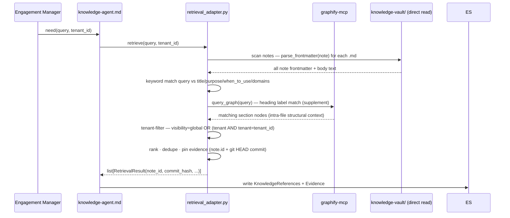

# M3 — Knowledge Indexing & Retrieval (Design, Phase 1)

**This document is design only.** No runtime code, no vault edits, no schema
changes, no ADR modifications. The single artifact of Phase 1 is this file. All
other files touched: none. This document is `status: PROPOSED` and requires
explicit approval before any Phase 2 work begins.

Evidence tags: **[Verified]** = read directly from a repo artifact at the
baseline; **[Inference]** = reasoned from verified facts; **[Unknown]** = not
determinable from current evidence (a decision or a discovery item for Phase 2).

---

## 1. Objective

Index the M2 knowledge vault (`knowledge-vault/`, 132 notes) with Graphify and
deliver a **Knowledge Agent** that retrieves from the index with provenance,
writing sourced `KnowledgeReferences` + `Evidence` into the Engagement State —
accessible through the Knowledge Agent only. No other component may read firm
knowledge directly.

[Verified — Roadmap M3: "index the vault and retrieve from it with provenance,
via the Knowledge Agent only"; ADR-003 §8; ADR-005 Knowledge Agent contract]

---

## 2. Scope

1. **Graphify index run** — run `graphify update knowledge-vault/` to index the
   132 notes; verify the output graph structure and node/edge schema.
   [Verified — Roadmap M3 "Graphify configured to index knowledge-vault/"]
2. **Knowledge Agent markdown definition** —
   `plugins/ruflo-stratagent/agents/knowledge-agent.md` implementing the ADR-005
   contract: hybrid retrieval, ranking, tenant filtering, provenance tagging,
   state writes.
   [Verified — Roadmap M3; ADR-005 §3 Knowledge Agent; plugin agent pattern]
3. **Retrieval adapter** — `packages/knowledge/retrieval_adapter.py`: Python
   library that wraps Graphify MCP query + direct vault read, returns typed
   `RetrievalResult` objects with evidence pinning.
   [Verified — Roadmap M3 files: "`packages/knowledge/retrieval_adapter.py`"]
4. **Tests** — `tests/knowledge/test_retrieval_adapter.py` + golden-query tests.
   [Verified — Roadmap M3 test plan]
5. **API freeze update** — `tests/knowledge/test_api_freeze.py` updated to
   include new public symbols from `retrieval_adapter.py`.
   [Inference — extending the frozen 28-symbol surface requires freeze test update]

---

## 3. Out of Scope

- **Vault content changes** — `knowledge-vault/**` notes are read-only in M3.
  [Verified — M2 complete; vault frozen at 132 notes]
- **`packages/state`, `packages/persistence`, `packages/replay`** — frozen; M3
  does not touch them. [Verified — M2 zero-diff; frozen packages]
- **Architecture-v1.0.md** — not modified. [Verified — frozen]
- **ADR-003, ADR-004, ADR-005** — not modified; M3 implements them.
  [Verified — evidence policy]
- **Knowledge Curator / write-back loop** — M9.
  [Verified — Roadmap M9; ADR-005 §3 Curator]
- **Ruflo AgentDB memory binding** — M8.
  [Verified — Roadmap M8]
- **Dedicated graph DB** — ADR-003 §12 future trigger.
  [Verified — ADR-003 §12]
- **Embedding/vector index** — D-11 resolved: `graphify update` produces no
  embeddings. Semantic extraction requires GEMINI_API_KEY and a separate
  invocation; deferred to M3-S2 or later. [Verified Phase 1A — see §19 D-11]

---

## 4. Evidence Summary

### Repository state at baseline (HEAD 95cf79b)

**Graphify:**
- CLI `graphify 0.9.3` installed at `/Users/darpan/.local/bin/graphify`.
  [Verified — `which graphify && graphify --version`]
- MCP server `graphify-mcp` installed at `/Users/darpan/.local/bin/graphify-mcp`.
  [Verified — `which graphify-mcp`]
- `.mcp.json` already configured for graphify-mcp:
  `command: graphify-mcp, args: ["--graph", "knowledge-vault/graphify-out/graph.json"],
  autoStart: false`. [Verified — `.mcp.json` read]
- `knowledge-vault/graphify-out/` exists with known structure (see §6).
  [Verified — `ls graphify-out/`]
- **Phase 1A (2026-07-08):** `graphify update knowledge-vault/` run against all
  132 vault notes. `graph.json` rebuilt: **655 nodes, 522 edges, 133 communities**;
  `built_at_commit: 440bbf65`; 100% EXTRACTED, 0% INFERRED, token cost: 0.
  [Verified — Phase 1A: `graph_stats` MCP + `graph.json` + `GRAPH_REPORT.md`]
- `stat-index.json` uses **absolute paths** (portability concern).
  [Verified — `stat-index.json` read; confirmed in Phase 1A]

**Knowledge vault:**
- 132 notes validated by `validate_vault` (is_valid=True, 0 errors, 3 advisory
  warnings). [Verified — M2-S5 gate; `GRAPH_REPORT.md` in completion report]
- Notes structured with ADR-003 §5 frontmatter: `id`, `type`, `title`, `source`,
  `last_verified`, `status`, `visibility`, plus per-type fields.
  [Verified — M2 frontmatter validator; `FrameworkNote` 11 required attrs]
- All 132 notes `status: draft`. [Verified — M2 D-6 hybrid policy]
- Wikilinks: 0 broken. [Verified — `validate_vault` M2-S5]

**`packages/knowledge` (frozen M2 API):**
- 28-symbol `__all__`: `validate_vault`, `validate_note`, `parse_frontmatter`,
  all models, all enums, `REQUIRED_DOMAINS`, `EXPECTED_CATEGORY_DIRS`.
  [Verified — `__init__.py`; `test_api_freeze.py`]
- `retrieval_adapter.py` does NOT exist. [Verified — `ls packages/knowledge/`]

**Plugin agents:**
- `plugins/ruflo-stratagent/agents/knowledge-agent.md` does NOT exist.
  [Verified — `ls plugins/ruflo-stratagent/agents/`]
- Existing agents: case-classifier, challenger, financial-analyst,
  framework-strategist, market-analyst, operations-analyst, report-writer.
  [Verified — directory listing]

**Graphify MCP tools (deferred, available in `mcp__graphify__*`):**
- `get_community`, `get_neighbors`, `get_node`, `get_pr_impact`, `god_nodes`,
  `graph_stats`, `list_prs`, `query_graph`, `shortest_path`, `triage_prs`.
  [Verified — system-reminder deferred tools list]

**ADR-003 §6 explicit caveat:**
> "Graphify's internals have not been inspected. This ADR therefore specifies
> Graphify by a minimal integration contract … and labels capability assumptions
> as `[GRAPHIFY-ASSUMPTION]`."
[Verified — ADR-003 §6 verbatim]

---

## 5. Verified / Inference / Unknown Table

| # | Statement | Classification | Source |
|---|---|---|---|
| V1 | Graphify CLI v0.9.3 installed | Verified | `which graphify; graphify --version` |
| V2 | graphify-mcp installed as separate binary | Verified | `which graphify-mcp` |
| V3 | `.mcp.json` configures graphify-mcp pointing to `graphify-out/graph.json` | Verified | `.mcp.json` read |
| V4 | `graphify-out/` is inside `knowledge-vault/` | Verified | `ls knowledge-vault/` |
| V5 | `graph.json` format: networkx JSON — `{directed, multigraph, nodes[], links[], hyperedges[], built_at_commit}` | Verified | `graph.json` read |
| V6 | Node schema: `{id, label, file_type, source_file, source_location, _origin, community, norm_label}` | Verified | `graph.json` nodes[0] |
| V7 | After `graphify update knowledge-vault/` (Phase 1A): 655 nodes, 522 edges, 133 communities; `built_at_commit: 440bbf65`; all 132 vault notes indexed | Verified — Phase 1A | `graph_stats` MCP + `graph.json` + `GRAPH_REPORT.md` |
| V8 | `graphify update <path>` rebuilds without LLM | Verified | `graphify --help` |
| V9 | `validate_vault` excludes `graphify-out/` from note scanning | Verified | `vault_validator.py` scoping rules |
| V10 | `knowledge-agent.md` does not exist | Verified | `ls agents/` |
| V11 | `retrieval_adapter.py` does not exist | Verified | `ls packages/knowledge/` |
| V12 | ADR-003 §7 specifies hybrid retrieval: vector + graph + direct file | Verified | ADR-003 §7 |
| V13 | ADR-003 §6 flags Graphify trigger + exposure contract as unverified | Verified | ADR-003 §6 `[GRAPHIFY-ASSUMPTION]` |
| V14 | Knowledge Agent writes: Knowledge References + Evidence type=external_source | Verified | ADR-005 §3 + ADR-003 §8 |
| V15 | `stat-index.json` uses absolute paths | Verified | `stat-index.json` |
| V16 | Per-file AST cache keys: `nodes`, `edges`, `input_tokens`, `output_tokens`; markdown notes produce `input_tokens: 0, output_tokens: 0` (AST-only, no LLM) | Verified — Phase 1A | AST cache file read (`tam-sam-som.md` cache) |
| VP1 | Graphify markdown parsing: one `filename.md` root node per file (`L1`) + one node per H1/H2 heading; all edges within a file are `contains` type; `_origin: ast` on every node | Verified — Phase 1A | `get_node` MCP + `graph.json` nodes for `frameworks/porters-five-forces.md`, `domains/profitability.md` |
| VP2 | Node id is derived from the **file path + heading text** (slug-normalized), NOT from the frontmatter `id` field (e.g., `frameworks_porters_five_forces_porter_s_five_forces`) | Verified — Phase 1A | `graph.json` node ids (all nodes inspected) |
| VP3 | Frontmatter YAML fields (`id`, `type`, `visibility`, `tenant`, `status`, `domains`, etc.) do **NOT** appear as node properties in `graph.json` | Verified — Phase 1A | All node property keys: `{id, label, file_type, source_file, source_location, _origin, community, norm_label}` — no frontmatter fields present |
| VP4 | Per-file AST cache extracts wikilinks as `references` edges (e.g., `[[domains/market-entry]]` → `references` edge); however, Graphify resolves wikilink targets **directory-relative** (not vault-root-relative); all cross-directory wikilinks resolve to non-existent paths and are dropped from `graph.json` | Verified — Phase 1A | AST cache `tam-sam-som.md`: 2 `references` edges to `frameworks/domains/market-entry.md` and `frameworks/frameworks/market-attractiveness-right-to-win.md` (both non-existent); neither appears in `graph.json` |
| VP5 | Final `graph.json` has **0 inter-file edges**; all 522 edges are `contains` (intra-file heading hierarchy); `relation` field is always `"contains"` in the merged graph | Verified — Phase 1A | `graph.json` edge scan: `non_contains = 0`; `inter_file = 0` |
| VP6 | Graphify produces **NO vector embeddings** for markdown content via `graphify update`; semantic extraction requires GEMINI_API_KEY/GOOGLE_API_KEY and a separate `/graphify --update` invocation inside an AI assistant | Verified — Phase 1A | `GRAPH_REPORT.md`: "Token cost: 0 input · 0 output"; no vector artifact files in `graphify-out/`; GRAPH_REPORT note: "For doc/paper/image changes run /graphify --update in your AI assistant" |
| VP7 | Node `file_type` for `.md` files = `"document"`; community = one integer per vault note (all headings in a file share the same community) | Verified — Phase 1A | All inspected vault note nodes |
| VP8 | Edge schema (all fields): `relation`, `confidence`, `confidence_score`, `source`, `target`, `source_file`, `source_location`, `weight`; `confidence` always `"EXTRACTED"`, `weight` always `1.0` | Verified — Phase 1A | `graph.json` link keys union |
| VP9 | Graphify incremental rebuild works for `.md` files: `cache/stat-index.json` tracks absolute-path → `{size, mtime_ns, hash}`; `cache/ast/v0.9.3/{content_hash}.json` is the per-file AST; only files with changed content hashes are re-parsed | Verified — Phase 1A | `stat-index.json` structure + `cache/ast/v0.9.3/` directory |
| I1 | [SUPERSEDED → VP1] `graphify update knowledge-vault/` will produce nodes for 132 markdown notes | Verified — Phase 1A | See VP1 |
| I2 | [INVALIDATED — Phase 1A] Each vault note's `id` frontmatter field should become the node `id` in the graph | Inference | Was: ADR-003 §5 + §6 integration contract — WRONG: node id is path-derived, not frontmatter-derived (see VP2) |
| I3 | [NUANCED — Phase 1A] Frontmatter `[[wikilinks]]` become edges in the graph | Inference | Was: ADR-003 §6 — PARTIAL: wikilinks ARE extracted as `references` in per-file AST cache BUT are dropped from `graph.json` due to directory-relative path resolution (see VP4, VP5). Net effect: 0 cross-file edges in final graph |
| I4 | `retrieval_adapter.py` will add new symbols to `packages/knowledge` requiring freeze test update | Inference | M2 freeze test pins `__all__`; additive symbols need test update |
| I5 | The knowledge-agent.md markdown agent will orchestrate retrieval using the Python adapter | Inference | Plugin agent pattern (other agent `.md` files); Ruflo binding |
| U1 | [RESOLVED — VP1, VP3, VP4] How Graphify processes `.md` files: heading-based AST nodes; no frontmatter parsing; wikilinks extracted in per-file cache but dropped from final graph due to path resolution mismatch | Verified — Phase 1A | See VP1, VP3, VP4 |
| U2 | [RESOLVED — VP6] Whether Graphify 0.9.3 produces vector embeddings for markdown content — NO; AST extraction only | Verified — Phase 1A | See VP6 |
| U3 | [RESOLVED — VP1] Node labels: file basename (root node) and H1/H2 heading text (section nodes); edge type in final graph: always `contains` | Verified — Phase 1A | See VP1, VP5 |
| U4 | [RESOLVED — VP3] Frontmatter typed fields do NOT become typed edges; no frontmatter data in graph at all | Verified — Phase 1A | See VP3 |
| U5 | [RESOLVED — VP3] `visibility`/`tenant` do NOT appear in graph node properties | Verified — Phase 1A | See VP3 |
| U6 | `query_graph` MCP tool parameters and result format | Unknown | Tool schema loaded; exact query semantics (keyword vs. fuzzy vs. structural) unverified against vault |
| U7 | Which git commit hash to pin for evidence (vault HEAD vs. note-specific commit) | Unknown | ADR-003 §11 says "note id + git commit hash" — ambiguous |
| U8 | Public API of `retrieval_adapter.py` — class names, function signatures | Unknown | Not yet designed |
| U9 | New error hierarchy for retrieval failures (`KnowledgeRetrievalError`?) | Unknown | Not in current `packages/knowledge` |
| U10 | Whether `graphify-out/` should stay inside `knowledge-vault/` or move outside | Unknown | Current location established by M2-era experimentation |
| U11 | [RESOLVED — VP9] Graphify supports incremental rebuild; `stat-index.json` tracks file mtime+hash; only changed files are re-parsed | Verified — Phase 1A | See VP9 |

---

## 6. Existing Architecture

### Graphify output structure (Verified)

```
knowledge-vault/graphify-out/
├── graph.json          # networkx JSON: nodes + links + hyperedges + built_at_commit
├── manifest.json       # per-file mtime + ast_hash + semantic_hash
├── GRAPH_REPORT.md     # human-readable summary (nodes, edges, communities, god nodes)
├── .graphify_labels.json # community id → label map
├── .graphify_root      # marks the root (content: ".")
└── cache/
    ├── stat-index.json         # absolute-path → {size, mtime_ns, hash}
    └── ast/v0.9.3/<hash>.json  # per-file AST parse result (cached by content hash)
```

### `graph.json` node schema (Verified Phase 1A — vault note example)

Each markdown file produces two node types: one root "file" node at L1 and one
node per section heading. All share the same `community` integer.

```json
{
  "id": "frameworks_porters_five_forces",
  "label": "porters-five-forces.md",
  "file_type": "document",
  "source_file": "frameworks/porters-five-forces.md",
  "source_location": "L1",
  "_origin": "ast",
  "community": 29,
  "norm_label": "porters-five-forces.md"
}
```

```json
{
  "id": "frameworks_porters_five_forces_porter_s_five_forces",
  "label": "Porter's Five Forces",
  "file_type": "document",
  "source_file": "frameworks/porters-five-forces.md",
  "source_location": "L37",
  "_origin": "ast",
  "community": 29,
  "norm_label": "porter's five forces"
}
```

**Node id derivation:** slug of `{relative_dir}_{filename_without_ext}[_{heading_slug}]`.
Frontmatter `id` field (e.g., `fw_porters_five_forces`) does NOT appear.

### `graph.json` edge schema (Verified Phase 1A)

```json
{
  "source": "frameworks_porters_five_forces",
  "target": "frameworks_porters_five_forces_porter_s_five_forces",
  "relation": "contains",
  "confidence": "EXTRACTED",
  "confidence_score": 1.0,
  "source_file": "frameworks/porters-five-forces.md",
  "source_location": "L37",
  "weight": 1.0
}
```

All 522 edges in `graph.json` use `relation: contains`. **Zero inter-file edges.**

### Wikilink behavior (Verified Phase 1A — critical finding)

Graphify's per-file AST extractor DOES detect `[[wikilinks]]` as `references`
edges in the cache file. However, target paths are resolved **directory-relative**
(not Obsidian vault-root-relative). Example: `[[domains/market-entry]]` in
`frameworks/tam-sam-som.md` resolves as `frameworks/domains/market-entry.md`
(non-existent); the actual target is `domains/market-entry.md` (vault root).
All 157 vault wikilinks are cross-directory; all resolve to non-existent paths;
all `references` edges are dropped during graph merge.

**Impact on retrieval design (D-10 resolution):** The `graph.json` graph is
structurally heading-only. Cross-note relationships (frameworks → domains → KPIs)
exist in vault frontmatter `domains:` fields and body wikilinks, but they
are NOT accessible via graph traversal. Direct vault file reads and frontmatter
parsing are the primary mechanism for cross-note retrieval in `retrieval_adapter.py`.

### `.mcp.json` graphify-mcp config (Verified)

```json
"graphify": {
  "command": "graphify-mcp",
  "args": ["--graph", "knowledge-vault/graphify-out/graph.json"],
  "autoStart": false
}
```

### Relevant Graphify CLI commands (Verified)

```
graphify update <path>           # re-extract + update graph (no LLM)
graphify watch <path>            # file-watcher continuous rebuild
graphify cluster-only <path>     # re-cluster without re-extraction
graphify path "A" "B"            # shortest path query
graphify explain "X"             # explain a node and neighbors
```

### Available MCP tools (Verified — deferred)

`get_community`, `get_neighbors`, `get_node`, `get_pr_impact`, `god_nodes`,
`graph_stats`, `list_prs`, `query_graph`, `shortest_path`, `triage_prs`

### `packages/knowledge` frozen API (Verified)

28 symbols: `validate_vault`, `validate_note`, `parse_frontmatter`, 13 typed
models, 5 enums, `VaultReport`, `ValidationIssue`, `REQUIRED_DOMAINS`,
`EXPECTED_CATEGORY_DIRS`.

`retrieval_adapter.py` — does not exist.

### Plugin agents (Verified)

`knowledge-agent.md` — does not exist.

---

## 7. Proposed Architecture

### Layer diagram

```
┌──────────────────────────────────────────────────────────────────┐
│  Engagement Manager (skill) / Planning agents                    │
│  [request: "find frameworks for profitability / retail"]         │
└─────────────────────────────┬────────────────────────────────────┘
                              │ dispatch
                              ▼
┌──────────────────────────────────────────────────────────────────┐
│  knowledge-agent.md  (plugins/ruflo-stratagent/agents/)          │
│  ADR-005 Knowledge Agent contract                                │
│  — hybrid retrieval orchestration                                │
│  — ranking · tenant filter · provenance tagging                  │
│  — writes: Knowledge References + Evidence (type=external_source)│
└──────┬───────────────────────────────────────────────────────────┘
       │ calls Python adapter (via Ruflo bash/python tool)
       ▼
┌──────────────────────────────────────────────────────────────────┐
│  packages/knowledge/retrieval_adapter.py  (NEW — M3)             │
│  RetrievalQuery → list[RetrievalResult]                          │
│  — graph query via graphify-mcp MCP / graph.json direct read     │
│  — direct vault read (Path + parse_frontmatter)                  │
│  — evidence pinning: note id + git commit hash                   │
│  — tenant filtering                                              │
└──────┬────────────────────────────┬────────────────────────────  ┘
       │                            │
       ▼                            ▼
┌───────────────────┐   ┌───────────────────────────────────────── ┐
│  graphify-mcp     │   │  knowledge-vault/  (read-only)            │
│  (MCP server)     │   │  132 notes: .md + frontmatter             │
│  ↓ graph.json     │   │  parse_frontmatter / validate_note        │
│  query_graph      │   └───────────────────────────────────────────┘
│  get_neighbors    │
│  shortest_path    │
└───────────────────┘
       ↑ reads
┌───────────────────────────────────────────────────────────────── ┐
│  knowledge-vault/graphify-out/graph.json                          │
│  built by: graphify update knowledge-vault/                       │
│  trigger:  pre-engagement gate (manual / git post-commit hook)   │
└───────────────────────────────────────────────────────────────── ┘
```

### Revised retrieval model (Phase 1A finding)

**ADR-003 §7 "hybrid retrieval (vector + graph + direct file)" is invalidated
by Phase 1A evidence:**
- No vectors exist (`graphify update` produces none — see VP6 / D-11 resolved)
- Graph has no cross-note edges (wikilinks not in `graph.json` — see VP4/VP5 / D-10 resolved)
- Graph provides only heading-structure within each note (intra-file `contains` tree)

**Revised retrieval model for `retrieval_adapter.py`:**

| Role | Mechanism | Classification | Rationale |
|---|---|---|---|
| Primary retrieval | Scan all 132 `.md` files; `parse_frontmatter`; keyword match on `title`, `purpose`, `when_to_use`, `name`, `domains`, `diagnostic_questions` fields | **Required** | [Verified] Only source with type/tenant/purpose/domains data; covers all ADR-005 retrieval requirements |
| Tenant filter | Frontmatter `visibility` + `tenant` fields (from primary scan) | **Required** | [Verified] Graph nodes carry no frontmatter data (VP3); KR-003 mandates tenant safety |
| Cross-note navigation | Parse frontmatter `domains:` field → strip `[[...]]` → resolve vault-root-relative path → read target note | **Required** | [Verified D-10a] Graph has 0 inter-file edges; frontmatter `domains:` field provides typed relationships |
| Body excerpt | Read body text of matched notes; split by `##` to find most relevant section | **Required** | [Verified] Body text provides `excerpt` field for `RetrievalResult`; section split trivial |
| Graphify supplement | `query_graph(query)` → heading-label match → confirm/supplement step-1 candidates | **Optional** (non-blocking) | [Verified VP5] `autoStart: false`; heading labels are noisy for general queries; retrieval must succeed without it |

### Phase 1B — Retrieval Architecture Decision (2026-07-08)

Four candidate architectures were evaluated against Phase 1A verified evidence.

| # | Architecture | Primary path | Graphify role | D-10a (cross-note nav) |
|---|---|---|---|---|
| **A** | **Direct vault scan** (frontmatter + markdown body) | Scan 132 `.md` files; `parse_frontmatter`; match against rich frontmatter fields | Optional supplement for heading-label confirmation and section targeting | Frontmatter `domains:` field direct parse |
| B | graph.json only | query_graph → heading labels → matched nodes | Required (only data source) | Not possible (0 inter-file edges) |
| C | graph.json + frontmatter | query_graph pre-filter → file read for matched notes | Required pre-filter | Frontmatter `domains:` field |
| D | frontmatter + body + Graphify for heading nav | Scan all notes + parse body | Heading structure supplement | Frontmatter `domains:` field |

**Evidence for and against each option:**

**Option A — RECOMMENDED**
- [Verified] Rich frontmatter retrieval surface: `purpose`, `when_to_use`, `diagnostic_questions`, `domains`, `visibility`, `tenant` across all 132 notes (7–19 fields per note)
- [Verified] `parse_frontmatter()` is in the frozen API — no new code needed
- [Verified] 132 notes: O(n) full scan is < 1 s (same order as `validate_vault` runtime)
- [Verified] Tenant filtering trivially satisfied via frontmatter `visibility` + `tenant` fields
- [Verified] Cross-note navigation: `domains: ['[[domains/profitability]]']` in frontmatter; strip delimiters → resolve vault-root-relative path (same logic vault_validator uses for wikilink checking)
- [Inference] No semantic ranking; keyword/field match only — acceptable at 132 notes, may need augmentation at 10,000+
- Graphify role: OPTIONAL; if graphify-mcp is running, `query_graph(query)` on heading labels can confirm or supplement candidates; if not running, retrieval is unaffected

**Option B — REJECTED**
- [Verified VP3] Graph nodes carry NO frontmatter data — `visibility`/`tenant` not available
- [Verified KR-003] ADR-005 §7 tenant filtering invariant cannot be satisfied: retrieval_adapter MUST NOT return cross-tenant notes, but graph alone cannot determine tenant
- [Verified VP5] 0 inter-file edges — cross-note navigation impossible
- [Verified] Heading labels have high generic noise: "Diagnostic questions", "Primary framework", "Problem description" appear in every note — not a discriminating index
- Verdict: disqualified by KR-003 violation

**Option C — SUBOPTIMAL (dominated by A)**
- [Inference] Graph pre-filter adds latency + MCP dependency without quality gain at 132 notes
- [Verified] 104 nodes match broad terms like "profitability/framework/cost/revenue/margin" — graph pre-filter is too noisy to narrow candidates meaningfully
- [Verified] `autoStart: false` for graphify-mcp — cannot be a required step
- Still requires frontmatter reads for tenant filter → same I/O cost as Option A
- Verdict: more complex than A with no quality improvement at this corpus size

**Option D — OVER-ENGINEERED (dominated by A)**
- [Inference] Heading-structure section targeting from graph is replicated by reading body text and splitting at `##` markers — simpler, no MCP dependency
- [Verified] `autoStart: false` — Graphify is not always available
- Verdict: three-layer architecture adds failure surface with marginal incremental value

**D-10a resolution (cross-note navigation): Option (a) — frontmatter `domains:` field parse**
- [Verified] Every framework note has `domains: ['[[domains/profitability]]', ...]`
- [Verified] Path derivation: strip `[[...]]` → `domains/profitability` → `knowledge-vault/domains/profitability.md`
- [Verified] vault_validator already resolves these paths for broken-wikilink detection — same logic inverted
- No new code beyond the path-strip operation; uses existing `parse_frontmatter()` output

**Remaining unknowns after Phase 1B:**
- [Unknown] query_graph exact matching semantics (keyword, fuzzy, or structural only) — unverified against live vault; not needed for Option A primary path
- [Unknown] Whether 132-note O(n) scan latency is acceptable under concurrent engagement load — measure in M3 perf tests

### Data flow (retrieval — revised)



---

## 8. Component Responsibilities

### `graphify update knowledge-vault/` (index build)

- **Input:** `knowledge-vault/` tree (excluding `graphify-out/`, `_attachments/`,
  `.obsidian/`, `_meta/`)
- **Output (Phase 1A verified):** `graphify-out/graph.json` (655 nodes, 522 edges
  for 132 notes; all `contains` edges; 0 inter-file edges); `GRAPH_REPORT.md`;
  `.graphify_labels.json`; `.graphify_root`; `cache/stat-index.json`;
  `cache/ast/v0.9.3/{hash}.json` per file; `graph.html` (visualization)
- **NOT produced:** vector embeddings, semantic index, embedding files
- **Precondition:** `validate_vault(Path("knowledge-vault"))` returns
  `is_valid=True` — indexer must not run on an invalid vault
- **Must NOT:** modify any vault note; index `graphify-out/` recursively;
  be hand-edited
- **Owner:** CLI run at index time; Knowledge Curator triggers reindex post-M9

### `knowledge-agent.md` (ADR-005 contract)

- **Inputs:** issue-tree node or explicit query, `client`, `tenant_id`
- **Reads State:** Issue Tree, client (per ADR-005)
- **Writes State:** Knowledge References (ADR-002 §13) + Evidence
  (type=external_source, pinned to `note_id@commit_hash`)
- **Calls:** `retrieval_adapter.retrieve(query, tenant_id)` via Python tool
- **Success:** relevant, tenant-legal, fully sourced results; no un-sourced item
- **Fails if:** returns cross-tenant data; returns un-sourced items; writes to vault
- **Escalates if:** no relevant knowledge found → escalate to manager, never fabricate

### `packages/knowledge/retrieval_adapter.py` (Python library)

- **Public API (proposed — see D-12):**
  ```python
  @dataclass(frozen=True)
  class RetrievalQuery:
      text: str
      tenant_id: str | None
      limit: int = 10

  @dataclass(frozen=True)
  class RetrievalResult:
      note_id: str        # vault note frontmatter id
      note_path: Path     # relative path within knowledge-vault/
      commit_hash: str    # git HEAD at retrieval time (evidence pin)
      title: str
      note_type: NoteType
      source: str         # note's source field (provenance)
      score: float        # relevance score [0.0, 1.0]
      excerpt: str        # relevant body excerpt (for state write)
      visibility: Visibility
      tenant: str | None

  def retrieve(
      query: RetrievalQuery,
      vault_dir: Path = Path("knowledge-vault"),
      graph_path: Path = Path("knowledge-vault/graphify-out/graph.json"),
  ) -> list[RetrievalResult]: ...
  ```
- **Guarantees:**
  - Pure: same vault state + same query → same ranked results (deterministic frontmatter scan)
  - Read-only: never modifies vault or graph
  - Tenant-safe: filters by `tenant_id` via frontmatter `visibility`/`tenant` fields; never returns cross-tenant notes
  - Provenance: every result carries `note_id` + `commit_hash`
  - Graphify-independent: succeeds without graphify-mcp running; graph is optional supplement
- **Does NOT import:** `packages/state` (avoids creating a dependency inversion)
- **Imports:** `packages/knowledge` (validator), `packages/common` (value objects),
  standard library only; optionally `mcp__graphify__*` when MCP is available,
  falls back to direct `graph.json` read when MCP is absent

---

## 9. Public API Proposal

### New symbols in `packages/knowledge.__all__`

The following symbols are proposed additions to the currently-frozen 28-symbol surface.
The freeze test (`tests/knowledge/test_api_freeze.py`) must be updated to cover them.
Exact names subject to approval (D-12).

| Symbol | Type | Purpose |
|---|---|---|
| `RetrievalQuery` | frozen dataclass | Input to `retrieve()` — query text + tenant |
| `RetrievalResult` | frozen dataclass | One retrieved note with provenance |
| `retrieve` | function | `(RetrievalQuery, ...) → list[RetrievalResult]` |
| `KnowledgeRetrievalError` | exception | Raised when retrieval fails (not found is NOT an error) |

**Proposed new `__all__` count:** 32 (28 + 4).

**ADR required:** no — additive extension of the package; the freeze test update
is sufficient. [Inference — consistent with M2 pattern where new symbols were
added to `__all__` without a new ADR]

### Knowledge Agent definition (markdown agent file)

Follows the ADR-005 contract template. Location:
`plugins/ruflo-stratagent/agents/knowledge-agent.md`.

Fields (following ADR-005 §3):
- Purpose, Responsibilities, Inputs/Outputs
- Reads State: Issue Tree, client
- Writes State: Knowledge References, Evidence Ledger
- Knowledge deps: the entire vault
- Tools: Knowledge Retrieval (retrieval_adapter), Web Research (escalation path), State
- Pre/Post conditions
- Failure modes (declared, typed)
- Retry rules (idempotent, bounded)

---

## 10. Internal Module Layout

```
packages/knowledge/
├── __init__.py              # EXISTING — frozen 28-symbol API + 4 new M3 symbols
├── frontmatter.py           # EXISTING — frozen (M2)
├── frontmatter_validator.py # EXISTING — frozen (M2)
├── vault_validator.py       # EXISTING — frozen (M2)
└── retrieval_adapter.py     # NEW (M3) — RetrievalQuery, RetrievalResult, retrieve()

plugins/ruflo-stratagent/agents/
├── case-classifier.md       # EXISTING
├── challenger.md            # EXISTING
├── financial-analyst.md     # EXISTING
├── framework-strategist.md  # EXISTING
├── market-analyst.md        # EXISTING
├── operations-analyst.md    # EXISTING
├── report-writer.md         # EXISTING
└── knowledge-agent.md       # NEW (M3) — ADR-005 Knowledge Agent contract

tests/knowledge/
├── test_frontmatter.py      # EXISTING — frozen
├── test_vault_validator.py  # EXISTING — frozen
├── test_vault_content.py    # EXISTING — frozen
├── test_api_freeze.py       # EXISTING — update to include 4 new symbols
└── test_retrieval_adapter.py # NEW (M3)

knowledge-vault/graphify-out/
├── graph.json               # REBUILT by M3 (graphify update knowledge-vault/)
├── manifest.json            # REBUILT
├── GRAPH_REPORT.md          # REBUILT
└── ...                      # all other graphify-out/* rebuilt
```

---

## 11. Dependency Diagram

```
packages/core   ←   packages/common   ←   packages/knowledge (M2, frozen API + M3 retrieval_adapter)
                                               ↑ imports
                                     graphify-out/graph.json  (read-only at retrieval time)
                                     knowledge-vault/ notes   (read-only at retrieval time)

packages/state  ←   packages/persistence (M1.8) ←  packages/replay (M1.9)
                                               (no dependency on packages/knowledge)

plugins/.../knowledge-agent.md
  → calls retrieval_adapter via Python tool
  → writes to Engagement State via packages/state Engagement API

knowledge-vault/  →  (indexed by) graphify update →  graphify-out/graph.json
                  →  (read by) vault_validator (validate_vault)
                  →  (read by) retrieval_adapter (direct file read + parse_frontmatter)
```

**Allowed new dependency:** `retrieval_adapter.py → packages/common`
(value objects) — this is a downward dependency, consistent with the layer model.

**Forbidden (must not be introduced):**
- `packages/knowledge` importing `packages/state` — would invert the layer
  hierarchy and create a circular dependency risk for M4+
- Any analyst agent reading vault/graph directly — ADR-005 §7 invariant
- `retrieval_adapter.py` writing to vault or graph

**What depends on M3:**
- M4 (planning agents) — all 5 planning agents use Knowledge Agent for
  framework/domain/issue-tree retrieval
- M5 (analysis agents) — analysts read Knowledge References already in state
  (written by M3 Knowledge Agent); do not re-invoke Knowledge Agent
- M9 (curator) — reads completed engagement state; triggers re-index via
  `graphify update` or MCP

---

## 12. Runtime Flow

### Index build (offline, pre-engagement)

```
1. Validate vault:
     validate_vault(Path("knowledge-vault"))  →  is_valid=True  [GATE]
     If is_valid=False: STOP, fix errors first

2. Run Graphify:
     graphify update knowledge-vault/
     Output: graphify-out/graph.json (≥655 nodes; ~5 nodes/note from heading AST)
             graphify-out/GRAPH_REPORT.md
             graphify-out/cache/stat-index.json + cache/ast/v0.9.3/*.json

3. Verify graph:
     graph.json contains ≥ 132 nodes (one file-root node per vault note)
     All nodes have _origin: ast; all edges have relation: contains
     Inter-file edges expected: 0 (wikilinks not resolved by Graphify)
     GRAPH_REPORT.md: "Surprising connections: None detected" is expected/normal

4. Start graphify-mcp (optional, for MCP-based retrieval):
     graphify-mcp --graph knowledge-vault/graphify-out/graph.json
     (or autoStart in .mcp.json; currently autoStart: false)
```

### Retrieval (per-engagement, per-query — revised per Phase 1A)

```
1. Knowledge Agent receives need(query, tenant_id) from Engagement Manager
2. Calls: retrieve(RetrievalQuery(text=query, tenant_id=tenant_id))
3. retrieval_adapter:
     a. Direct vault scan: list all .md files in knowledge-vault/ (excluding graphify-out/)
        → parse_frontmatter(note_text) for each note
        → keyword match query vs. title, purpose, when_to_use, name, domains fields
     b. Graph supplement: query_graph(query) → matching heading-label nodes
        → source_file lookup → supplement/confirm step-a candidates
        → get_neighbors(node_id) → H2 sections for intra-note structural context
        [Note: graph has no cross-file edges; neighbors are intra-file headings only]
     c. tenant-filter: retain only notes where
          visibility=global OR (visibility=tenant AND tenant=tenant_id)
        [Done via frontmatter fields — graph nodes carry no visibility/tenant data]
     d. rank by: keyword relevance score × recency(last_verified)
     e. pin evidence: note.id + git_head_commit_hash
     f. return list[RetrievalResult]
4. Knowledge Agent writes to Engagement State:
     KnowledgeReferences: note_id, commit_hash, title, source, score, excerpt
     Evidence: type=external_source, source="{note_id}@{commit_hash}"
```

---

## 13. Index Lifecycle

| Event | Trigger | Action |
|---|---|---|
| Initial index build | Manual (M3 implementation phase) | `graphify update knowledge-vault/` after `validate_vault` passes |
| Note added/edited (M2+ vaults) | Git commit to vault | [D-16: git post-commit hook vs. manual `graphify update`] |
| Note deleted | Git commit removing file | `graphify update knowledge-vault/ --force` |
| Vault is invalid | `validate_vault` returns errors | Block indexer; fix vault first |
| Curator adds note (M9) | Post-engagement curator action | Curator triggers `graphify update` |
| Graph stale check | Pre-engagement gate (optional) | Compare `graph.json built_at_commit` vs. `git rev-parse HEAD` |
| Full rebuild | Schema change / corruption | `graphify update knowledge-vault/ --force` |

**Index version tracking:** `graph.json.built_at_commit` carries the vault HEAD at
index time. A stale check: if `built_at_commit ≠ git rev-parse HEAD`, the graph
may not reflect recent vault edits. [Verified — `GRAPH_REPORT.md` "Run git
rev-parse HEAD and compare to check if the graph is stale."]

---

## 14. Failure Modes

| Failure | Detection | Handling |
|---|---|---|
| `validate_vault` errors on current vault | Pre-index gate | Block index; surface errors; never index invalid vault |
| `graphify update` fails | Non-zero exit code | Surface error; retain previous graph.json; never corrupt index |
| `graph.json` is stale (built_at_commit ≠ HEAD) | Stale check at retrieval time | Advisory warning; use stale graph with staleness flag in result |
| `graphify-mcp` not running | MCP tool call fails | Fall back to direct `graph.json` read; no error |
| Note not found in graph (after index) | `retrieve()` returns 0 results | Not an error — escalate path in Knowledge Agent; "nothing relevant → do not fabricate" |
| Cross-tenant result would be returned | tenant-filter in `retrieval_adapter` | Drop the result; never surface to Knowledge Agent |
| Evidence pinning fails (git unavailable) | `git rev-parse HEAD` fails | Use `"unknown"` as commit hash; flag the result; [D-18] |
| `retrieve()` raises `KnowledgeRetrievalError` | Unexpected exception | Knowledge Agent records typed failure; escalates to manager |
| Graph corrupted | `graph.json` invalid JSON | Fall back to "no knowledge available"; never crash engagement |

---

## 15. Invariants (Proposed)

| ID | Invariant | Enforced by |
|---|---|---|
| KR-001 | `validate_vault` returns `is_valid=True` before any `graphify update` | Pre-index gate; CI gate |
| KR-002 | `graphify-out/` is never indexed as vault notes | `vault_validator.py` scoping (already excludes `graphify-out/`) |
| KR-003 | `retrieval_adapter.retrieve()` never returns a note where `visibility=tenant AND tenant ≠ tenant_id` | tenant-filter in `retrieval_adapter`; dedicated test |
| KR-004 | Every `RetrievalResult` carries a non-empty `note_id` and `commit_hash` | `RetrievalResult` frozen dataclass; required fields; test |
| KR-005 | `retrieval_adapter.py` is pure and read-only (no vault writes, no graph writes) | No IO writes in module; source scan test |
| KR-006 | The Knowledge Agent is the **only** path by which Engagement State `Knowledge References` are written | ADR-005 §7 ownership matrix; ownership data |
| KR-007 | `graph.json` is derived and rebuildable; never hand-edited | No editor opens it; `graphify update` is the sole write path |
| KR-008 | Retrieval is deterministic: same vault state + same query → same ranked results | Pure function contract on frontmatter scan; determinism test |
| KR-009 | `packages/knowledge` does not import `packages/state` | Source scan; forbidden-import test |
| KR-010 | No analyst agent reads vault or graph directly; all firm knowledge access via Knowledge Agent / Knowledge References in state | ADR-005 §7; ownership data; enforcement deferred to M6 (same pattern as state ownership) |
| KR-011 | Index build is preceded by `validate_vault` gate; a failing vault is never indexed | Pre-index gate; CI gate |

---

## 16. Performance Expectations

| Operation | Expected | Basis | Classification |
|---|---|---|---|
| `graphify update knowledge-vault/` on 132 notes | < 30 s (observed in Phase 1A) | Phase 1A: run completed in seconds; 655 nodes, 522 edges | Verified — Phase 1A |
| Cold graph.json read | < 100 ms | 132 nodes; networkx JSON ≈ tens of KB | Inference |
| `retrieve()` per query (graph + direct read) | < 2 s | 132 nodes; no vector computation; graph traversal is O(neighbors) | Inference |
| graphify-mcp MCP round-trip | < 500 ms | Local stdio; no network | Inference |
| Full vault reindex post-note-edit (incremental) | < 10 s | manifest.json tracks hashes; only changed files re-parsed | Inference (U11) |

**Performance tests:** `tests/knowledge/test_retrieval_perf.py` — baseline
`retrieve()` latency for a golden query (mirrors M1.7.7 perf baseline pattern).

---

## 17. Testing Strategy

| Test file | What it covers |
|---|---|
| `tests/knowledge/test_retrieval_adapter.py` | Unit tests: `retrieve()` with a real or fixture graph.json — tenant filter, pinning, ranking, cross-tenant denial, no-result escalation path, error paths |
| `tests/knowledge/test_api_freeze.py` (updated) | Freeze test extended to 32 symbols (+ `RetrievalQuery`, `RetrievalResult`, `retrieve`, `KnowledgeRetrievalError`) |
| `tests/knowledge/test_vault_content.py` (extended) | S3 golden-query test: after `graphify update`, a known query returns the expected framework note |
| `tests/knowledge/test_retrieval_perf.py` (new) | Baseline `retrieve()` latency on the 132-note graph |

**Existing test files remain frozen** (no changes to `test_frontmatter.py`,
`test_vault_validator.py`).

**Key negative tests:**
- Cross-tenant denial: `retrieve(query, tenant_id="t_a")` does not return notes
  with `visibility=tenant, tenant="t_b"`
- No-fabrication path: 0-result retrieval does not raise, returns `[]`; Knowledge
  Agent escalates instead of fabricating
- Forbidden import: `packages/knowledge` does not import `packages/state`

---

## 18. Technical Debt

| TD | Description | Target |
|---|---|---|
| TD-G1 | `stat-index.json` uses absolute paths — portability issue if vault is moved or cloned | Graphify limitation; document, do not fix |
| TD-G2 | `autoStart: false` for graphify-mcp means MCP tools require manual start | Acceptable for M3; revisit for M4+ if always-on is needed |
| TD-G3 | `retrieval_adapter.py` falls back to direct `graph.json` read if MCP unavailable — dual code paths | Acceptable M3 fallback; consolidate when MCP is stable |
| TD-G4 | `knowledge-agent.md` uses the prototype agent pattern; needs upgrade to ADR-005 strict contract in M4 | By design — same pattern as other prototype agents |
| TD-G5 | Vector embedding retrieval not implemented in M3 if Graphify 0.9.3 does not produce embeddings (see D-11) | Deferred to M3-S2 or standalone if embeddings are needed |

---

## 19. Decisions Requiring Approval

All decisions below are **unresolved at Phase 1 close.** Do not implement until
each is explicitly approved.

| ID | Decision | Options | Impact |
|---|---|---|---|
| **D-10** | **[RESOLVED — Phase 1A]** Graphify markdown behavior: heading-only AST graph. Node labels = file basename (root) + H1/H2 heading text (section). No frontmatter data. Wikilinks extracted in per-file cache as `references` but dropped from `graph.json` because target paths are resolved directory-relative (not vault-root-relative) — all 157 vault wikilinks are cross-directory and resolve to non-existent paths. Final graph: 0 inter-file edges; all 522 edges are `contains` (intra-file). **Consequence: retrieval_adapter.py must use direct vault file reads as the primary retrieval mechanism; the graph supplements with heading-label matching only.** ADR-003 §7 "hybrid retrieval" requires revision. | Resolved by Phase 1A: `graphify update knowledge-vault/` run + full `graph.json` + per-file AST cache inspection + `get_node` + `get_neighbors` MCP calls | — |
| **D-11** | **[RESOLVED — Phase 1A]** No vector embeddings produced by `graphify update`. Token cost: 0 input · 0 output. All extraction is pure AST (structural). Semantic extraction requires GEMINI_API_KEY/GOOGLE_API_KEY and a separate `/graphify --update` AI-assistant invocation. **Consequence: ADR-003 §7 "hybrid retrieval" vector leg is unavailable from `graphify update`; D-14/D-17 must account for this. Vector retrieval is deferred to M3-S2 or later as an optional enhancement.** | Resolved by Phase 1A: `GRAPH_REPORT.md` "Token cost: 0"; no embedding files in `graphify-out/`; AST cache `input_tokens: 0, output_tokens: 0` | — |
| **D-10a** | **[RESOLVED — Phase 1B]** Retrieval architecture = **Option A: direct vault scan (frontmatter + body)** as primary; Graphify as optional, non-blocking supplement. Cross-note navigation = frontmatter `domains:` field parse (strip `[[...]]` → vault-root-relative path → read target note). Graphify's heading-label index (`query_graph`) MAY be used if graphify-mcp is running, but retrieval must succeed without it. See §7 "Phase 1B" for full option analysis. | Option A selected: [Verified] rich frontmatter fields (7–19/note) cover all retrieval needs; [Verified] `parse_frontmatter` in frozen API; [Verified] O(132) scan < 1 s; [Verified] tenant filtering via frontmatter visibility/tenant; [Verified] cross-note nav via domains: field; Option B rejected (KR-003 violation); Options C/D dominated by A at 132-note scale | — |
| **D-12** | **Public API of `retrieval_adapter.py`** — exact class names, function signatures, error hierarchy | Proposed in §9; subject to approval | Freeze test pinning; downstream agent integration |
| **D-13** | **Knowledge Agent implementation form** — pure markdown definition file (per existing agent pattern) or Python-backed? | (a) Markdown only — orchestrates retrieval tool calls; (b) Markdown + Python wrapper | Complexity; testability; ADR-005 contract compliance |
| **D-14** | **`packages/knowledge.__all__` freeze extension** — add 4 new symbols; update freeze test | Approved by this design (additive extension); freeze test must be updated | M3 cannot ship without updating the freeze test |
| **D-15** | **`graphify-out/` location** — keep inside `knowledge-vault/` (current, established) or move to project root? | (a) Keep inside vault (established by pre-M2 experimentation, excluded by validator) | (b) Move outside (architecturally cleaner; no derived artifacts inside authoritative source) | ADR-003 §1 says "graphify output is not authoritative"; being inside vault is slightly awkward but the validator already excludes it |
| **D-16** | **Index rebuild trigger** — how is `graphify update` triggered? | (a) Manual — developer runs it before an engagement; (b) `git post-commit` hook on vault commits; (c) Knowledge Agent checks staleness at retrieval time and triggers rebuild | CI complexity; developer experience; stale-index risk |
| **D-17** | **Direct file read vs. graph-only** — ADR-003 §7 specifies "direct vault read" as the third retrieval leg. Should `retrieve()` always do it? | (a) Yes — always read the full note body for excerpt + exact text; (b) Conditional — read only when graph result is confirmed; (c) Skip — graph node carries enough context | Latency (132 files × I/O) vs. excerpt quality |
| **D-18** | **Evidence pinning commit hash semantics** — which commit? | (a) `git rev-parse HEAD` at retrieval time (vault-level); (b) Per-note last-commit hash (`git log -1 -- <note_path>`); (c) `graph.json.built_at_commit` | Auditability; reproducibility; performance (option b is slow for each result) |
| **D-19** | **Benchmark scope for M3** — which performance targets must pass before M3 closes? | `retrieve()` latency for golden query ≤ 2 s; index build ≤ 30 s; coverage ≥ 100% on `retrieval_adapter.py` | Exit criteria precision |

---

## 20. Definition of Done (Phase 1)

Phase 1 is done when:

- [x] This document exists and is committed as `docs/implementation/M3-Design.md`
      with `status: PROPOSED`.
- [x] Task #14 is `in_progress`; no code has been written.
- [x] Decisions D-10 and D-11 are resolved — Phase 1A evidence gathered:
      `graphify update knowledge-vault/` run; full `graph.json` + AST cache
      inspected; MCP `get_node` + `get_neighbors` called. D-10 resolved
      (heading-only graph; 0 inter-file edges; wikilinks dropped due to
      directory-relative path resolution). D-11 resolved (no vector embeddings
      from `graphify update`; semantic extraction requires separate invocation).
- [x] D-10a resolved — Phase 1B: retrieval architecture = Option A (direct vault
      scan — frontmatter + body) as primary; Graphify optional non-blocking
      supplement; cross-note navigation via frontmatter `domains:` field parse.
      See §7 "Phase 1B" and §19 for full option analysis and decision rationale.
- [ ] All other decisions (D-12 through D-19) are resolved by the approver.
- [ ] Approver explicitly approves Phase 2 (implementation).

Phase 2 (implementation) will proceed slice-by-slice, each with its own gate.

---

## Appendix A — M3 Roadmap Specification (Verbatim, Verified)

> **M3 — Knowledge indexing & retrieval (Graphify + Knowledge Agent)**
> - *Objective:* index the vault and retrieve from it with provenance, via the
>   Knowledge Agent only.
> - *Components:* Graphify configured to index `knowledge-vault/` → graph +
>   `graphify-mcp`; Knowledge Agent definition (ADR-005) + retrieval contract;
>   evidence pinning (note id + git commit); tenant filtering.
> - *Dependencies:* M1 (write evidence to state), M2 (vault), Graphify CLI
>   (installed).
> - *Files affected:* `graphify` config, `plugins/ruflo-stratagent/agents/
>   knowledge-agent.md`, `packages/knowledge/retrieval_adapter.py`,
>   `tests/knowledge/**`.
> - *Test plan:* index the vault; a sample query returns relevant, sourced,
>   commit-pinned references written to state; tenant-filter test; cross-tenant
>   denial (negative) test; "no relevant knowledge → escalate, never fabricate"
>   test.
> - *Exit criteria:* Knowledge Agent answers a golden query with pinned provenance;
>   no direct vault/graph access by any other component; cross-tenant leakage
>   blocked.

[Verified — Implementation-Roadmap.md M3]

---

## Appendix B — ADR-003 §6 `[GRAPHIFY-ASSUMPTION]` Items

These are the items ADR-003 explicitly flagged as unverified at architecture time.
D-10 and D-11 directly resolve them.

1. **Trigger mechanism** — file watcher, git post-commit hook, or
   scheduled/manual reindex. [→ D-16]
2. **Parse behavior** — frontmatter → typed edges; wikilinks → associative edges;
   body → chunked + embedded for vector index. [→ D-10, D-11]
3. **Exposure contract** — Graphify exposes graph + index via query API, MCP
   tool, or by writing into Ruflo's AgentDB. [Partially Verified: MCP tool exists;
   graphify-mcp confirmed; `query_graph` MCP tool available]

[Verified — ADR-003 §6 verbatim]
