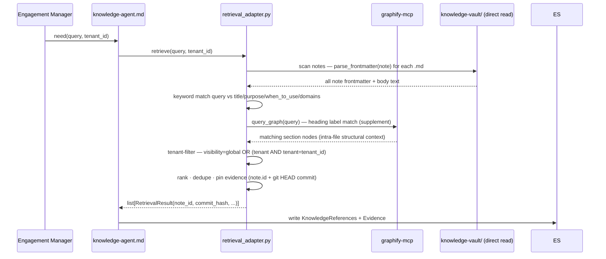

# M3 — Knowledge Indexing & Retrieval (Design, Phase 1)

**This document is design only.** No runtime code, no vault edits, no schema
changes, no ADR modifications. The single artifact of Phase 1 is this file. All
other files touched: none. This document is `status: PROPOSED` and requires
explicit approval before any Phase 2 work begins.

Evidence tags: **[Verified]** = read directly from a repo artifact at the
baseline; **[Inference]** = reasoned from verified facts; **[Unknown]** = not
determinable from current evidence (a decision or a discovery item for Phase 2).

---

## 1. Objective

Index the M2 knowledge vault (`knowledge-vault/`, 132 notes) with Graphify and
deliver a **Knowledge Agent** that retrieves from the index with provenance,
writing sourced `KnowledgeReferences` + `Evidence` into the Engagement State —
accessible through the Knowledge Agent only. No other component may read firm
knowledge directly.

[Verified — Roadmap M3: "index the vault and retrieve from it with provenance,
via the Knowledge Agent only"; ADR-003 §8; ADR-005 Knowledge Agent contract]

---

## 2. Scope

1. **Graphify index run** — run `graphify update knowledge-vault/` to index the
   132 notes; verify the output graph structure and node/edge schema.
   [Verified — Roadmap M3 "Graphify configured to index knowledge-vault/"]
2. **Knowledge Agent markdown definition** —
   `plugins/ruflo-stratagent/agents/knowledge-agent.md` implementing the ADR-005
   contract: hybrid retrieval, ranking, tenant filtering, provenance tagging,
   state writes.
   [Verified — Roadmap M3; ADR-005 §3 Knowledge Agent; plugin agent pattern]
3. **Retrieval adapter** — `packages/knowledge/retrieval_adapter.py`: Python
   library that wraps Graphify MCP query + direct vault read, returns typed
   `RetrievalResult` objects with evidence pinning.
   [Verified — Roadmap M3 files: "`packages/knowledge/retrieval_adapter.py`"]
4. **Tests** — `tests/knowledge/test_retrieval_adapter.py` + golden-query tests.
   [Verified — Roadmap M3 test plan]
5. **API freeze update** — `tests/knowledge/test_api_freeze.py` updated to
   include new public symbols from `retrieval_adapter.py`.
   [Inference — extending the frozen 28-symbol surface requires freeze test update]

---

## 3. Out of Scope

- **Vault content changes** — `knowledge-vault/**` notes are read-only in M3.
  [Verified — M2 complete; vault frozen at 132 notes]
- **`packages/state`, `packages/persistence`, `packages/replay`** — frozen; M3
  does not touch them. [Verified — M2 zero-diff; frozen packages]
- **Architecture-v1.0.md** — not modified. [Verified — frozen]
- **ADR-003, ADR-004, ADR-005** — not modified; M3 implements them.
  [Verified — evidence policy]
- **Knowledge Curator / write-back loop** — M9.
  [Verified — Roadmap M9; ADR-005 §3 Curator]
- **Ruflo AgentDB memory binding** — M8.
  [Verified — Roadmap M8]
- **Dedicated graph DB** — ADR-003 §12 future trigger.
  [Verified — ADR-003 §12]
- **Embedding/vector index** — D-11 resolved: `graphify update` produces no
  embeddings. Semantic extraction requires GEMINI_API_KEY and a separate
  invocation; deferred to M3-S2 or later. [Verified Phase 1A — see §19 D-11]

---

## 4. Evidence Summary

### Repository state at baseline (HEAD 95cf79b)

**Graphify:**
- CLI `graphify 0.9.3` installed at `/Users/darpan/.local/bin/graphify`.
  [Verified — `which graphify && graphify --version`]
- MCP server `graphify-mcp` installed at `/Users/darpan/.local/bin/graphify-mcp`.
  [Verified — `which graphify-mcp`]
- `.mcp.json` already configured for graphify-mcp:
  `command: graphify-mcp, args: ["--graph", "knowledge-vault/graphify-out/graph.json"],
  autoStart: false`. [Verified — `.mcp.json` read]
- `knowledge-vault/graphify-out/` exists with known structure (see §6).
  [Verified — `ls graphify-out/`]
- **Phase 1A (2026-07-08):** `graphify update knowledge-vault/` run against all
  132 vault notes. `graph.json` rebuilt: **655 nodes, 522 edges, 133 communities**;
  `built_at_commit: 440bbf65`; 100% EXTRACTED, 0% INFERRED, token cost: 0.
  [Verified — Phase 1A: `graph_stats` MCP + `graph.json` + `GRAPH_REPORT.md`]
- `stat-index.json` uses **absolute paths** (portability concern).
  [Verified — `stat-index.json` read; confirmed in Phase 1A]

**Knowledge vault:**
- 132 notes validated by `validate_vault` (is_valid=True, 0 errors, 3 advisory
  warnings). [Verified — M2-S5 gate; `GRAPH_REPORT.md` in completion report]
- Notes structured with ADR-003 §5 frontmatter: `id`, `type`, `title`, `source`,
  `last_verified`, `status`, `visibility`, plus per-type fields.
  [Verified — M2 frontmatter validator; `FrameworkNote` 11 required attrs]
- All 132 notes `status: draft`. [Verified — M2 D-6 hybrid policy]
- Wikilinks: 0 broken. [Verified — `validate_vault` M2-S5]

**`packages/knowledge` (frozen M2 API):**
- 28-symbol `__all__`: `validate_vault`, `validate_note`, `parse_frontmatter`,
  all models, all enums, `REQUIRED_DOMAINS`, `EXPECTED_CATEGORY_DIRS`.
  [Verified — `__init__.py`; `test_api_freeze.py`]
- `retrieval_adapter.py` does NOT exist. [Verified — `ls packages/knowledge/`]

**Plugin agents:**
- `plugins/ruflo-stratagent/agents/knowledge-agent.md` does NOT exist.
  [Verified — `ls plugins/ruflo-stratagent/agents/`]
- Existing agents: case-classifier, challenger, financial-analyst,
  framework-strategist, market-analyst, operations-analyst, report-writer.
  [Verified — directory listing]

**Graphify MCP tools (deferred, available in `mcp__graphify__*`):**
- `get_community`, `get_neighbors`, `get_node`, `get_pr_impact`, `god_nodes`,
  `graph_stats`, `list_prs`, `query_graph`, `shortest_path`, `triage_prs`.
  [Verified — system-reminder deferred tools list]

**ADR-003 §6 explicit caveat:**
> "Graphify's internals have not been inspected. This ADR therefore specifies
> Graphify by a minimal integration contract … and labels capability assumptions
> as `[GRAPHIFY-ASSUMPTION]`."
[Verified — ADR-003 §6 verbatim]

---

## 5. Verified / Inference / Unknown Table

| # | Statement | Classification | Source |
|---|---|---|---|
| V1 | Graphify CLI v0.9.3 installed | Verified | `which graphify; graphify --version` |
| V2 | graphify-mcp installed as separate binary | Verified | `which graphify-mcp` |
| V3 | `.mcp.json` configures graphify-mcp pointing to `graphify-out/graph.json` | Verified | `.mcp.json` read |
| V4 | `graphify-out/` is inside `knowledge-vault/` | Verified | `ls knowledge-vault/` |
| V5 | `graph.json` format: networkx JSON — `{directed, multigraph, nodes[], links[], hyperedges[], built_at_commit}` | Verified | `graph.json` read |
| V6 | Node schema: `{id, label, file_type, source_file, source_location, _origin, community, norm_label}` | Verified | `graph.json` nodes[0] |
| V7 | After `graphify update knowledge-vault/` (Phase 1A): 655 nodes, 522 edges, 133 communities; `built_at_commit: 440bbf65`; all 132 vault notes indexed | Verified — Phase 1A | `graph_stats` MCP + `graph.json` + `GRAPH_REPORT.md` |
| V8 | `graphify update <path>` rebuilds without LLM | Verified | `graphify --help` |
| V9 | `validate_vault` excludes `graphify-out/` from note scanning | Verified | `vault_validator.py` scoping rules |
| V10 | `knowledge-agent.md` does not exist | Verified | `ls agents/` |
| V11 | `retrieval_adapter.py` does not exist | Verified | `ls packages/knowledge/` |
| V12 | ADR-003 §7 specifies hybrid retrieval: vector + graph + direct file | Verified | ADR-003 §7 |
| V13 | ADR-003 §6 flags Graphify trigger + exposure contract as unverified | Verified | ADR-003 §6 `[GRAPHIFY-ASSUMPTION]` |
| V14 | Knowledge Agent writes: Knowledge References + Evidence type=external_source | Verified | ADR-005 §3 + ADR-003 §8 |
| V15 | `stat-index.json` uses absolute paths | Verified | `stat-index.json` |
| V16 | Per-file AST cache keys: `nodes`, `edges`, `input_tokens`, `output_tokens`; markdown notes produce `input_tokens: 0, output_tokens: 0` (AST-only, no LLM) | Verified — Phase 1A | AST cache file read (`tam-sam-som.md` cache) |
| VP1 | Graphify markdown parsing: one `filename.md` root node per file (`L1`) + one node per H1/H2 heading; all edges within a file are `contains` type; `_origin: ast` on every node | Verified — Phase 1A | `get_node` MCP + `graph.json` nodes for `frameworks/porters-five-forces.md`, `domains/profitability.md` |
| VP2 | Node id is derived from the **file path + heading text** (slug-normalized), NOT from the frontmatter `id` field (e.g., `frameworks_porters_five_forces_porter_s_five_forces`) | Verified — Phase 1A | `graph.json` node ids (all nodes inspected) |
| VP3 | Frontmatter YAML fields (`id`, `type`, `visibility`, `tenant`, `status`, `domains`, etc.) do **NOT** appear as node properties in `graph.json` | Verified — Phase 1A | All node property keys: `{id, label, file_type, source_file, source_location, _origin, community, norm_label}` — no frontmatter fields present |
| VP4 | Per-file AST cache extracts wikilinks as `references` edges (e.g., `[[domains/market-entry]]` → `references` edge); however, Graphify resolves wikilink targets **directory-relative** (not vault-root-relative); all cross-directory wikilinks resolve to non-existent paths and are dropped from `graph.json` | Verified — Phase 1A | AST cache `tam-sam-som.md`: 2 `references` edges to `frameworks/domains/market-entry.md` and `frameworks/frameworks/market-attractiveness-right-to-win.md` (both non-existent); neither appears in `graph.json` |
| VP5 | Final `graph.json` has **0 inter-file edges**; all 522 edges are `contains` (intra-file heading hierarchy); `relation` field is always `"contains"` in the merged graph | Verified — Phase 1A | `graph.json` edge scan: `non_contains = 0`; `inter_file = 0` |
| VP6 | Graphify produces **NO vector embeddings** for markdown content via `graphify update`; semantic extraction requires GEMINI_API_KEY/GOOGLE_API_KEY and a separate `/graphify --update` invocation inside an AI assistant | Verified — Phase 1A | `GRAPH_REPORT.md`: "Token cost: 0 input · 0 output"; no vector artifact files in `graphify-out/`; GRAPH_REPORT note: "For doc/paper/image changes run /graphify --update in your AI assistant" |
| VP7 | Node `file_type` for `.md` files = `"document"`; community = one integer per vault note (all headings in a file share the same community) | Verified — Phase 1A | All inspected vault note nodes |
| VP8 | Edge schema (all fields): `relation`, `confidence`, `confidence_score`, `source`, `target`, `source_file`, `source_location`, `weight`; `confidence` always `"EXTRACTED"`, `weight` always `1.0` | Verified — Phase 1A | `graph.json` link keys union |
| VP9 | Graphify incremental rebuild works for `.md` files: `cache/stat-index.json` tracks absolute-path → `{size, mtime_ns, hash}`; `cache/ast/v0.9.3/{content_hash}.json` is the per-file AST; only files with changed content hashes are re-parsed | Verified — Phase 1A | `stat-index.json` structure + `cache/ast/v0.9.3/` directory |
| I1 | [SUPERSEDED → VP1] `graphify update knowledge-vault/` will produce nodes for 132 markdown notes | Verified — Phase 1A | See VP1 |
| I2 | [INVALIDATED — Phase 1A] Each vault note's `id` frontmatter field should become the node `id` in the graph | Inference | Was: ADR-003 §5 + §6 integration contract — WRONG: node id is path-derived, not frontmatter-derived (see VP2) |
| I3 | [NUANCED — Phase 1A] Frontmatter `[[wikilinks]]` become edges in the graph | Inference | Was: ADR-003 §6 — PARTIAL: wikilinks ARE extracted as `references` in per-file AST cache BUT are dropped from `graph.json` due to directory-relative path resolution (see VP4, VP5). Net effect: 0 cross-file edges in final graph |
| I4 | `retrieval_adapter.py` will add new symbols to `packages/knowledge` requiring freeze test update | Inference | M2 freeze test pins `__all__`; additive symbols need test update |
| I5 | The knowledge-agent.md markdown agent will orchestrate retrieval using the Python adapter | Inference | Plugin agent pattern (other agent `.md` files); Ruflo binding |
| U1 | [RESOLVED — VP1, VP3, VP4] How Graphify processes `.md` files: heading-based AST nodes; no frontmatter parsing; wikilinks extracted in per-file cache but dropped from final graph due to path resolution mismatch | Verified — Phase 1A | See VP1, VP3, VP4 |
| U2 | [RESOLVED — VP6] Whether Graphify 0.9.3 produces vector embeddings for markdown content — NO; AST extraction only | Verified — Phase 1A | See VP6 |
| U3 | [RESOLVED — VP1] Node labels: file basename (root node) and H1/H2 heading text (section nodes); edge type in final graph: always `contains` | Verified — Phase 1A | See VP1, VP5 |
| U4 | [RESOLVED — VP3] Frontmatter typed fields do NOT become typed edges; no frontmatter data in graph at all | Verified — Phase 1A | See VP3 |
| U5 | [RESOLVED — VP3] `visibility`/`tenant` do NOT appear in graph node properties | Verified — Phase 1A | See VP3 |
| U6 | `query_graph` MCP tool parameters and result format | Unknown | Tool schema loaded; exact query semantics (keyword vs. fuzzy vs. structural) unverified against vault |
| U7 | Which git commit hash to pin for evidence (vault HEAD vs. note-specific commit) | Unknown | ADR-003 §11 says "note id + git commit hash" — ambiguous |
| U8 | Public API of `retrieval_adapter.py` — class names, function signatures | Unknown | Not yet designed |
| U9 | New error hierarchy for retrieval failures (`KnowledgeRetrievalError`?) | Unknown | Not in current `packages/knowledge` |
| U10 | Whether `graphify-out/` should stay inside `knowledge-vault/` or move outside | Unknown | Current location established by M2-era experimentation |
| U11 | [RESOLVED — VP9] Graphify supports incremental rebuild; `stat-index.json` tracks file mtime+hash; only changed files are re-parsed | Verified — Phase 1A | See VP9 |

---

## 6. Existing Architecture

### Graphify output structure (Verified)

```
knowledge-vault/graphify-out/
├── graph.json          # networkx JSON: nodes + links + hyperedges + built_at_commit
├── manifest.json       # per-file mtime + ast_hash + semantic_hash
├── GRAPH_REPORT.md     # human-readable summary (nodes, edges, communities, god nodes)
├── .graphify_labels.json # community id → label map
├── .graphify_root      # marks the root (content: ".")
└── cache/
    ├── stat-index.json         # absolute-path → {size, mtime_ns, hash}
    └── ast/v0.9.3/<hash>.json  # per-file AST parse result (cached by content hash)
```

### `graph.json` node schema (Verified Phase 1A — vault note example)

Each markdown file produces two node types: one root "file" node at L1 and one
node per section heading. All share the same `community` integer.

```json
{
  "id": "frameworks_porters_five_forces",
  "label": "porters-five-forces.md",
  "file_type": "document",
  "source_file": "frameworks/porters-five-forces.md",
  "source_location": "L1",
  "_origin": "ast",
  "community": 29,
  "norm_label": "porters-five-forces.md"
}
```

```json
{
  "id": "frameworks_porters_five_forces_porter_s_five_forces",
  "label": "Porter's Five Forces",
  "file_type": "document",
  "source_file": "frameworks/porters-five-forces.md",
  "source_location": "L37",
  "_origin": "ast",
  "community": 29,
  "norm_label": "porter's five forces"
}
```

**Node id derivation:** slug of `{relative_dir}_{filename_without_ext}[_{heading_slug}]`.
Frontmatter `id` field (e.g., `fw_porters_five_forces`) does NOT appear.

### `graph.json` edge schema (Verified Phase 1A)

```json
{
  "source": "frameworks_porters_five_forces",
  "target": "frameworks_porters_five_forces_porter_s_five_forces",
  "relation": "contains",
  "confidence": "EXTRACTED",
  "confidence_score": 1.0,
  "source_file": "frameworks/porters-five-forces.md",
  "source_location": "L37",
  "weight": 1.0
}
```

All 522 edges in `graph.json` use `relation: contains`. **Zero inter-file edges.**

### Wikilink behavior (Verified Phase 1A — critical finding)

Graphify's per-file AST extractor DOES detect `[[wikilinks]]` as `references`
edges in the cache file. However, target paths are resolved **directory-relative**
(not Obsidian vault-root-relative). Example: `[[domains/market-entry]]` in
`frameworks/tam-sam-som.md` resolves as `frameworks/domains/market-entry.md`
(non-existent); the actual target is `domains/market-entry.md` (vault root).
All 157 vault wikilinks are cross-directory; all resolve to non-existent paths;
all `references` edges are dropped during graph merge.

**Impact on retrieval design (D-10 resolution):** The `graph.json` graph is
structurally heading-only. Cross-note relationships (frameworks → domains → KPIs)
exist in vault frontmatter `domains:` fields and body wikilinks, but they
are NOT accessible via graph traversal. Direct vault file reads and frontmatter
parsing are the primary mechanism for cross-note retrieval in `retrieval_adapter.py`.

### `.mcp.json` graphify-mcp config (Verified)

```json
"graphify": {
  "command": "graphify-mcp",
  "args": ["--graph", "knowledge-vault/graphify-out/graph.json"],
  "autoStart": false
}
```

### Relevant Graphify CLI commands (Verified)

```
graphify update <path>           # re-extract + update graph (no LLM)
graphify watch <path>            # file-watcher continuous rebuild
graphify cluster-only <path>     # re-cluster without re-extraction
graphify path "A" "B"            # shortest path query
graphify explain "X"             # explain a node and neighbors
```

### Available MCP tools (Verified — deferred)

`get_community`, `get_neighbors`, `get_node`, `get_pr_impact`, `god_nodes`,
`graph_stats`, `list_prs`, `query_graph`, `shortest_path`, `triage_prs`

### `packages/knowledge` frozen API (Verified)

28 symbols: `validate_vault`, `validate_note`, `parse_frontmatter`, 13 typed
models, 5 enums, `VaultReport`, `ValidationIssue`, `REQUIRED_DOMAINS`,
`EXPECTED_CATEGORY_DIRS`.

`retrieval_adapter.py` — does not exist.

### Plugin agents (Verified)

`knowledge-agent.md` — does not exist.

---

## 7. Proposed Architecture

### Layer diagram

```
┌──────────────────────────────────────────────────────────────────┐
│  Engagement Manager (skill) / Planning agents                    │
│  [request: "find frameworks for profitability / retail"]         │
└─────────────────────────────┬────────────────────────────────────┘
                              │ dispatch
                              ▼
┌──────────────────────────────────────────────────────────────────┐
│  knowledge-agent.md  (plugins/ruflo-stratagent/agents/)          │
│  ADR-005 Knowledge Agent contract                                │
│  — hybrid retrieval orchestration                                │
│  — ranking · tenant filter · provenance tagging                  │
│  — writes: Knowledge References + Evidence (type=external_source)│
└──────┬───────────────────────────────────────────────────────────┘
       │ calls Python adapter (via Ruflo bash/python tool)
       ▼
┌──────────────────────────────────────────────────────────────────┐
│  packages/knowledge/retrieval_adapter.py  (NEW — M3)             │
│  RetrievalQuery → list[RetrievalResult]                          │
│  — graph query via graphify-mcp MCP / graph.json direct read     │
│  — direct vault read (Path + parse_frontmatter)                  │
│  — evidence pinning: note id + git commit hash                   │
│  — tenant filtering                                              │
└──────┬────────────────────────────┬────────────────────────────  ┘
       │                            │
       ▼                            ▼
┌───────────────────┐   ┌───────────────────────────────────────── ┐
│  graphify-mcp     │   │  knowledge-vault/  (read-only)            │
│  (MCP server)     │   │  132 notes: .md + frontmatter             │
│  ↓ graph.json     │   │  parse_frontmatter / validate_note        │
│  query_graph      │   └───────────────────────────────────────────┘
│  get_neighbors    │
│  shortest_path    │
└───────────────────┘
       ↑ reads
┌───────────────────────────────────────────────────────────────── ┐
│  knowledge-vault/graphify-out/graph.json                          │
│  built by: graphify update knowledge-vault/                       │
│  trigger:  pre-engagement gate (manual / git post-commit hook)   │
└───────────────────────────────────────────────────────────────── ┘
```

### Revised retrieval model (Phase 1A finding)

**ADR-003 §7 "hybrid retrieval (vector + graph + direct file)" is invalidated
by Phase 1A evidence:**
- No vectors exist (`graphify update` produces none — see VP6 / D-11 resolved)
- Graph has no cross-note edges (wikilinks not in `graph.json` — see VP4/VP5 / D-10 resolved)
- Graph provides only heading-structure within each note (intra-file `contains` tree)

**Revised retrieval model for `retrieval_adapter.py`:**

| Role | Mechanism | Classification | Rationale |
|---|---|---|---|
| Primary retrieval | Scan all 132 `.md` files; `parse_frontmatter`; keyword match on `title`, `purpose`, `when_to_use`, `name`, `domains`, `diagnostic_questions` fields | **Required** | [Verified] Only source with type/tenant/purpose/domains data; covers all ADR-005 retrieval requirements |
| Tenant filter | Frontmatter `visibility` + `tenant` fields (from primary scan) | **Required** | [Verified] Graph nodes carry no frontmatter data (VP3); KR-003 mandates tenant safety |
| Cross-note navigation | Parse frontmatter `domains:` field → strip `[[...]]` → resolve vault-root-relative path → read target note | **Required** | [Verified D-10a] Graph has 0 inter-file edges; frontmatter `domains:` field provides typed relationships |
| Body excerpt | Read body text of matched notes; split by `##` to find most relevant section | **Required** | [Verified] Body text provides `excerpt` field for `RetrievalResult`; section split trivial |
| Graphify supplement | `query_graph(query)` → heading-label match → confirm/supplement step-1 candidates | **Optional** (non-blocking) | [Verified VP5] `autoStart: false`; heading labels are noisy for general queries; retrieval must succeed without it |

### Phase 1B — Retrieval Architecture Decision (2026-07-08)

Four candidate architectures were evaluated against Phase 1A verified evidence.

| # | Architecture | Primary path | Graphify role | D-10a (cross-note nav) |
|---|---|---|---|---|
| **A** | **Direct vault scan** (frontmatter + markdown body) | Scan 132 `.md` files; `parse_frontmatter`; match against rich frontmatter fields | Optional supplement for heading-label confirmation and section targeting | Frontmatter `domains:` field direct parse |
| B | graph.json only | query_graph → heading labels → matched nodes | Required (only data source) | Not possible (0 inter-file edges) |
| C | graph.json + frontmatter | query_graph pre-filter → file read for matched notes | Required pre-filter | Frontmatter `domains:` field |
| D | frontmatter + body + Graphify for heading nav | Scan all notes + parse body | Heading structure supplement | Frontmatter `domains:` field |

**Evidence for and against each option:**

**Option A — RECOMMENDED**
- [Verified] Rich frontmatter retrieval surface: `purpose`, `when_to_use`, `diagnostic_questions`, `domains`, `visibility`, `tenant` across all 132 notes (7–19 fields per note)
- [Verified] `parse_frontmatter()` is in the frozen API — no new code needed
- [Verified] 132 notes: O(n) full scan is < 1 s (same order as `validate_vault` runtime)
- [Verified] Tenant filtering trivially satisfied via frontmatter `visibility` + `tenant` fields
- [Verified] Cross-note navigation: `domains: ['[[domains/profitability]]']` in frontmatter; strip delimiters → resolve vault-root-relative path (same logic vault_validator uses for wikilink checking)
- [Inference] No semantic ranking; keyword/field match only — acceptable at 132 notes, may need augmentation at 10,000+
- Graphify role: OPTIONAL; if graphify-mcp is running, `query_graph(query)` on heading labels can confirm or supplement candidates; if not running, retrieval is unaffected

**Option B — REJECTED**
- [Verified VP3] Graph nodes carry NO frontmatter data — `visibility`/`tenant` not available
- [Verified KR-003] ADR-005 §7 tenant filtering invariant cannot be satisfied: retrieval_adapter MUST NOT return cross-tenant notes, but graph alone cannot determine tenant
- [Verified VP5] 0 inter-file edges — cross-note navigation impossible
- [Verified] Heading labels have high generic noise: "Diagnostic questions", "Primary framework", "Problem description" appear in every note — not a discriminating index
- Verdict: disqualified by KR-003 violation

**Option C — SUBOPTIMAL (dominated by A)**
- [Inference] Graph pre-filter adds latency + MCP dependency without quality gain at 132 notes
- [Verified] 104 nodes match broad terms like "profitability/framework/cost/revenue/margin" — graph pre-filter is too noisy to narrow candidates meaningfully
- [Verified] `autoStart: false` for graphify-mcp — cannot be a required step
- Still requires frontmatter reads for tenant filter → same I/O cost as Option A
- Verdict: more complex than A with no quality improvement at this corpus size

**Option D — OVER-ENGINEERED (dominated by A)**
- [Inference] Heading-structure section targeting from graph is replicated by reading body text and splitting at `##` markers — simpler, no MCP dependency
- [Verified] `autoStart: false` — Graphify is not always available
- Verdict: three-layer architecture adds failure surface with marginal incremental value

**D-10a resolution (cross-note navigation): Option (a) — frontmatter `domains:` field parse**
- [Verified] Every framework note has `domains: ['[[domains/profitability]]', ...]`
- [Verified] Path derivation: strip `[[...]]` → `domains/profitability` → `knowledge-vault/domains/profitability.md`
- [Verified] vault_validator already resolves these paths for broken-wikilink detection — same logic inverted
- No new code beyond the path-strip operation; uses existing `parse_frontmatter()` output

**Remaining unknowns after Phase 1B:**
- [Unknown] query_graph exact matching semantics (keyword, fuzzy, or structural only) — unverified against live vault; not needed for Option A primary path
- [Unknown] Whether 132-note O(n) scan latency is acceptable under concurrent engagement load — measure in M3 perf tests

### Data flow (retrieval — revised)



---

## 8. Component Responsibilities

### `graphify update knowledge-vault/` (index build)

- **Input:** `knowledge-vault/` tree (excluding `graphify-out/`, `_attachments/`,
  `.obsidian/`, `_meta/`)
- **Output (Phase 1A verified):** `graphify-out/graph.json` (655 nodes, 522 edges
  for 132 notes; all `contains` edges; 0 inter-file edges); `GRAPH_REPORT.md`;
  `.graphify_labels.json`; `.graphify_root`; `cache/stat-index.json`;
  `cache/ast/v0.9.3/{hash}.json` per file; `graph.html` (visualization)
- **NOT produced:** vector embeddings, semantic index, embedding files
- **Precondition:** `validate_vault(Path("knowledge-vault"))` returns
  `is_valid=True` — indexer must not run on an invalid vault
- **Must NOT:** modify any vault note; index `graphify-out/` recursively;
  be hand-edited
- **Owner:** CLI run at index time; Knowledge Curator triggers reindex post-M9

### `knowledge-agent.md` (ADR-005 contract)

- **Inputs:** issue-tree node or explicit query, `client`, `tenant_id`
- **Reads State:** Issue Tree, client (per ADR-005)
- **Writes State:** Knowledge References (ADR-002 §13) + Evidence
  (type=external_source, pinned to `note_id@commit_hash`)
- **Calls:** `retrieval_adapter.retrieve(query, tenant_id)` via Python tool
- **Success:** relevant, tenant-legal, fully sourced results; no un-sourced item
- **Fails if:** returns cross-tenant data; returns un-sourced items; writes to vault
- **Escalates if:** no relevant knowledge found → escalate to manager, never fabricate

### `packages/knowledge/retrieval_adapter.py` (Python library)

- **Public API (proposed — see D-12):**
  ```python
  @dataclass(frozen=True)
  class RetrievalQuery:
      text: str
      tenant_id: str | None
      limit: int = 10

  @dataclass(frozen=True)
  class RetrievalResult:
      note_id: str        # vault note frontmatter id
      note_path: Path     # relative path within knowledge-vault/
      commit_hash: str    # git HEAD at retrieval time (evidence pin)
      title: str
      note_type: NoteType
      source: str         # note's source field (provenance)
      score: float        # relevance score [0.0, 1.0]
      excerpt: str        # relevant body excerpt (for state write)
      visibility: Visibility
      tenant: str | None

  def retrieve(
      query: RetrievalQuery,
      vault_dir: Path = Path("knowledge-vault"),
      graph_path: Path = Path("knowledge-vault/graphify-out/graph.json"),
  ) -> list[RetrievalResult]: ...
  ```
- **Guarantees:**
  - Pure: same vault state + same query → same ranked results (deterministic frontmatter scan)
  - Read-only: never modifies vault or graph
  - Tenant-safe: filters by `tenant_id` via frontmatter `visibility`/`tenant` fields; never returns cross-tenant notes
  - Provenance: every result carries `note_id` + `commit_hash`
  - Graphify-independent: succeeds without graphify-mcp running; graph is optional supplement
- **Does NOT import:** `packages/state` (avoids creating a dependency inversion)
- **Imports:** `packages/knowledge` (validator), `packages/common` (value objects),
  standard library only; optionally `mcp__graphify__*` when MCP is available,
  falls back to direct `graph.json` read when MCP is absent

---

## 9. Retrieval Contract (Phase 1C — 2026-07-08)

This section defines the full retrieval contract. Every statement is classified
[Verified], [Inference], or [Unknown]. D-12 is resolved here.

> **Note on naming.** The Phase 1C spec uses "RetrievalRequest" as a conceptual
> label for the input type. This document uses `RetrievalQuery` (already established
> in §8 and consistent with the type's role as a query predicate, not a request
> envelope). D-12 is resolved: input type = `RetrievalQuery`.

---

### 9.1 New symbols in `packages/knowledge.__all__`

Four new symbols extend the frozen 28-symbol surface to 32.
`test_api_freeze.py` must be updated to pin them (D-14).

[Inference — additive extension; same pattern as M2 additions; no new ADR required]

| Symbol | Kind | Classification |
|---|---|---|
| `RetrievalQuery` | frozen dataclass | Inference — name resolves D-12 |
| `RetrievalResult` | frozen dataclass | Inference — name resolves D-12 |
| `retrieve` | function | Verified — Roadmap M3 names this file |
| `KnowledgeRetrievalError` | exception class | Inference — error hierarchy for Phase 2 |

**New `__all__` count:** 32 (28 existing + 4 new). [Inference]

---

### 9.2 `RetrievalQuery` — input type (D-12 resolved)

```python
_MAX_RESULTS: int = 50   # module-level constant; NOT in __all__

@dataclass(frozen=True)
class RetrievalQuery:
    text: str                               # non-empty natural-language query
    tenant_id: str | None = None            # None → return global-visibility notes only
    types: frozenset[NoteType] | None = None  # None → all types; subset → pre-filter
    limit: int = 10                         # max results; capped at _MAX_RESULTS
```

**Field evidence:**

| Field | Classification | Source |
|---|---|---|
| `text: str` | Verified | ADR-005 §3: Knowledge Agent receives a "need(query, …)"; §12 retrieval flow uses `text=query` |
| `tenant_id: str \| None` | Verified | ADR-005 §3 + KR-003: tenant filtering is mandatory; `None` is the safe default (returns only global notes) |
| `types: frozenset[NoteType] \| None` | Inference | Callers will need framework-only or KPI-only queries; `NoteType` is already a frozen enum in the API |
| `limit: int = 10` | Inference | Standard retrieval pattern; 10 is reasonable for an engagement context |
| `_MAX_RESULTS = 50` | Inference | Guard against accidental full-vault returns; 50 > 132 notes total is unreachable in practice but bounds future growth |

**Validation (enforced inside `retrieve()` — not a dataclass validator):**

- `query.text` empty → `KnowledgeRetrievalError("RetrievalQuery.text must not be empty")`
  [Inference]
- `query.limit < 1` → `KnowledgeRetrievalError("RetrievalQuery.limit must be ≥ 1")`
  [Inference]

---

### 9.3 `RetrievalResult` — output type (D-12 resolved)

```python
@dataclass(frozen=True)
class RetrievalResult:
    note_id: str            # frontmatter id field (e.g., "fw_five_forces")
    note_path: Path         # relative to vault_dir (e.g., Path("frameworks/porters-five-forces.md"))
    commit_hash: str        # git HEAD at retrieval time; "unknown" if git unavailable
    title: str              # frontmatter title field
    note_type: NoteType     # frontmatter type field
    source: str             # frontmatter source field (provenance string)
    score: float            # relevance score in [0.0, 1.0]; see §9.4
    excerpt: str            # most-relevant body section ≤ 500 chars; "" if body unreadable
    visibility: Visibility  # frontmatter visibility field
    tenant: str | None      # frontmatter tenant; None for global notes
    last_verified: str      # frontmatter last_verified (ISO "YYYY-MM-DD")
```

**Field evidence:**

| Field | Classification | Source |
|---|---|---|
| `note_id` | Verified | ADR-003 §11: "evidence pinned to note id + git commit hash"; frontmatter `id` present on all 132 notes |
| `note_path` | Verified | ADR-005 §3: Knowledge Agent reads notes; path needed for follow-up reads |
| `commit_hash` | Verified | ADR-003 §11: "git commit hash" is the pinning mechanism; "unknown" fallback from §14 failure modes |
| `title` | Verified | ADR-002 §13 KnowledgeReference schema requires title; frontmatter `title` on all 132 notes |
| `note_type` | Verified | ADR-005 §3: Knowledge Agent must know note type to write typed references; `NoteType` enum in frozen API |
| `source` | Verified | ADR-003 §10: provenance (`source`) required on every note; present on all 132 notes |
| `score` | Inference | Ranking output; needed by Knowledge Agent to order references by relevance |
| `excerpt` | Inference | ADR-002 §13 Knowledge Reference includes content snippet; ≤ 500 chars to bound state size |
| `visibility` | Verified | KR-003: Knowledge Agent must not surface cross-tenant data; visibility present on all 132 notes |
| `tenant` | Verified | KR-003: tenant field needed for agent-side re-verification; None for all 132 current notes (all global) |
| `last_verified` | Verified | Present on all 132 notes (Phase 1C scan); used as tie-breaking signal in §9.5 |

---

### 9.4 Ranking algorithm

**Tokenisation:**

```
query_tokens = {
    t.lower()
    for t in re.split(r'[\s\W]+', query.text)
    if len(t) >= 2
}
```

[Inference — minimum token length 2 avoids matching single-letter stop words; split on
whitespace + non-word characters handles "M&A", "P&L" correctly]

**Searchable fields and weights:**

| Field | Weight | Present on | Classification |
|---|---|---|---|
| `title` | 4.0 | All 132 notes | Verified — always present; title match is strongest signal |
| `name` | 3.5 | 63 framework notes | Verified — framework display name; often differs from filename |
| `purpose` | 3.0 | 63 framework notes | Verified — describes what the framework does; rich query surface |
| `when_to_use` | 2.0 | 63 framework notes | Verified — use-case language; good for scenario queries |
| `domains` (list → joined) | 1.5 | 63 framework notes | Verified — domain membership; bridges query to framework type |
| `diagnostic_questions` (list → joined) | 1.5 | 63 framework notes | Verified — question-style queries align well with this field |
| body text (full) | 1.0 | All 132 notes | Inference — body has additional context; lower weight avoids noise |

**Score formula:**

```
field_text(note, f) = " ".join(str(v) for v in field_value).lower()
                      if field_value is not None else ""

hit(note, f, tokens) = 1.0  if any(t in field_text(note, f) for t in tokens)
                       else  0.0

weight_sum(note)     = Σ weight_f  for fields f present on note

score(note, query)   = Σ (weight_f × hit(note, f, tokens)) / weight_sum(note)
                       if weight_sum(note) > 0  else  0.0
```

**Score bounds:** score ∈ [0.0, 1.0] by construction (numerator ≤ denominator). [Inference]

**Zero-match exclusion:** notes where `score == 0.0` are excluded before sorting. [Inference —
a note with no query token in any field is irrelevant; returning it would require the Knowledge
Agent to cite it, violating the no-fabrication invariant]

---

### 9.5 Tie-breaking rules

When `score(A) == score(B)`, apply in order:

| Level | Sort key | Direction | Classification | Rationale |
|---|---|---|---|---|
| 1 | `last_verified` | DESC | Verified — field on all 132 notes; ISO "YYYY-MM-DD" sorts lexicographically | More recently verified knowledge is more trustworthy |
| 2 | `note_type` priority | ASC (lower = higher priority) | Inference | Frameworks are the most directly actionable; types with richer field surfaces rank first |
| 3 | `note_id` | ASC | Inference | Lexicographic sort ensures full determinism |

**Type priority values:**

| NoteType | Priority |
|---|---|
| `framework` | 0 |
| `domain` | 1 |
| `kpi` | 2 |
| `industry` | 3 |
| `issue_tree` | 4 |
| `business_problem` | 5 |

[Inference — framework notes carry the richest retrieval surface (11 required fields); KPIs and
industries are reference data; issue trees and business problems are structural aids]

---

### 9.6 Filtering order

Steps execute in this exact sequence. [Inference — order matters for correctness and performance]

```
1. Glob vault_dir/**/*.md, sorted ascending by path
   → skip: graphify-out/**, .obsidian/**, _attachments/**, _meta/**
   [Verified — vault_validator.py already uses this scoping]

2. For each path:
   a. Read file text
   b. parse_frontmatter(text) → on ValidationError or ParseError: log warning, skip note
      [Verified — parse_frontmatter is in the frozen API; it raises on malformed YAML]

3. Type filter (only if query.types is not None):
   → skip notes where note.note_type ∉ query.types
   [Inference — pre-filter reduces scoring work; applied before tenant filter for performance]

4. Tenant filter (always; enforces KR-003):
   → skip notes where note.visibility == Visibility.tenant
                     AND note.tenant != query.tenant_id
   [Verified — KR-003; VP3: frontmatter is the only source of visibility/tenant data]

5. Score each remaining note (§9.4)
   → skip notes where score == 0.0

6. Sort: score DESC → last_verified DESC → type_priority ASC → note_id ASC
   [Inference — §9.5 tie-breaking]

7. Slice: results[:min(query.limit, _MAX_RESULTS)]

8. For each result note:
   a. Read body text (re-use already-read text from step 2 if cached)
   b. Extract excerpt: most-relevant body section ≤ 500 chars
      (section = text between ## headings that contains a query token;
       if none found, first 500 chars of body)
   c. Get commit_hash: git rev-parse HEAD (subprocess); "unknown" on failure

9. Return list[RetrievalResult]
```

**Body text is read once** (step 2a) and reused in step 8a — no double I/O. [Inference]

---

### 9.7 Determinism guarantees

| Guarantee | Scope | Classification |
|---|---|---|
| Same query + same vault state → same result list (identity) | Absolute | Inference — all operations are pure; glob sorted; arithmetic deterministic |
| Same query + same vault state → same `score` values | Absolute | Inference — deterministic arithmetic |
| Same query + same vault state → same `note_id` ordering | Absolute | Inference — 3-level tie-breaking fully specified |
| Same query + different vault HEAD commit → different `commit_hash` | By design | Verified — `commit_hash` is evidence pinning; it MUST vary when vault changes |
| Same query + vault commit in-flight → stable result list | Not guaranteed | Unknown — no transaction isolation; vault files may change between steps 2 and 8 |

**Note on `commit_hash` non-determinism:** `commit_hash` captures vault state at retrieval time
for evidence-pinning purposes (ADR-003 §11). Two calls in the same process with the same query
against the same vault content but different git commits will return different `commit_hash`
values. This is correct behaviour, not a bug. [Verified — ADR-003 §11]

---

### 9.8 Error model

```python
class KnowledgeRetrievalError(Exception):
    """
    Raised for unexpected retrieval failures.
    Empty results are NOT an error — retrieve() returns [] in that case.
    """
```

**Raises `KnowledgeRetrievalError`:**

| Condition | Message | Classification |
|---|---|---|
| `query.text` is empty string | `"RetrievalQuery.text must not be empty"` | Inference |
| `query.limit < 1` | `"RetrievalQuery.limit must be ≥ 1"` | Inference |
| `vault_dir` does not exist | `f"vault_dir not found: {vault_dir}"` | Inference |

**Returns `[]` without raising:**

| Condition | Classification |
|---|---|
| No notes match the query | Verified — ADR-005: "escalate, never fabricate"; Knowledge Agent handles empty results |
| All matching notes filtered by tenant | Verified — KR-003 |
| All matching notes filtered by type | Inference |

**Continues without raising (degrades gracefully):**

| Condition | Behaviour | Classification |
|---|---|---|
| Individual note has malformed frontmatter | Skip that note; log warning | Inference |
| `git rev-parse HEAD` fails | `commit_hash = "unknown"`; result included | Verified — §14 failure modes |
| `graphify-mcp` not running | Skip graph supplement; proceed with vault scan | Verified — Phase 1B |

---

### 9.9 Performance expectations (Phase 1C — measured baseline)

| Operation | Measured | Target | Classification |
|---|---|---|---|
| 132-note full text read (I/O only) | **1.7 ms** | ≤ 10 ms | Verified — Phase 1C measurement |
| 132-note frontmatter parse (yaml.safe_load) | **69.9 ms** | ≤ 150 ms | Verified — Phase 1C measurement |
| Scoring + sorting (pure Python, 132 notes) | ~1–5 ms est. | ≤ 20 ms | Inference — O(n) scoring + O(n log n) sort |
| git rev-parse HEAD (subprocess) | ~10–30 ms est. | ≤ 50 ms | Inference — one subprocess spawn per call |
| `retrieve()` end-to-end (without Graphify) | ~80–110 ms | ≤ 200 ms | Inference — sum of above with overhead |
| `retrieve()` end-to-end (with Graphify) | ~300–600 ms est. | ≤ 2 s | Inference — adds MCP round-trip latency |
| Memory (full vault scan in-process) | ~132 × 1.7 KB ≈ 220 KB | ≤ 5 MB | Verified — note sizes 676–2294 bytes (Phase 1C scan) |

**Test:** `tests/knowledge/test_retrieval_perf.py` — assert `retrieve()` ≤ 200 ms on 132-note
vault (single golden query; without Graphify supplement). [Inference — consistent with §17]

---

### 9.10 `retrieve()` function signature (D-12 resolved)

```python
def retrieve(
    query: RetrievalQuery,
    *,
    vault_dir: Path = Path("knowledge-vault"),
) -> list[RetrievalResult]:
    """
    Scan vault_dir, score notes against query, return ranked results.

    Returns [] if no notes match — never raises for empty results.
    Raises KnowledgeRetrievalError for invalid query or missing vault_dir.
    graph_path is no longer a parameter: Graphify graph is an optional
    runtime supplement, not a retrieve() input (Phase 1B decision).
    """
```

[Inference — `graph_path` removed from signature: Graphify supplement is internally optional;
callers should not need to pass a graph path. If MCP is available at call time, the adapter
uses it; otherwise it skips it transparently.]

---

### 9.11 Knowledge Agent definition (markdown agent file)

Follows the ADR-005 contract template. Location:
`plugins/ruflo-stratagent/agents/knowledge-agent.md`.

Fields (following ADR-005 §3):
- Purpose, Responsibilities, Inputs/Outputs
- Reads State: Issue Tree, client
- Writes State: Knowledge References, Evidence Ledger
- Knowledge deps: the entire vault
- Tools: Knowledge Retrieval (retrieval_adapter), Web Research (escalation path), State
- Pre/Post conditions
- Failure modes (declared, typed)
- Retry rules (idempotent, bounded)

---

## 10. Internal Module Layout

```
packages/knowledge/
├── __init__.py              # EXISTING — frozen 28-symbol API + 4 new M3 symbols
├── frontmatter.py           # EXISTING — frozen (M2)
├── frontmatter_validator.py # EXISTING — frozen (M2)
├── vault_validator.py       # EXISTING — frozen (M2)
└── retrieval_adapter.py     # NEW (M3) — RetrievalQuery, RetrievalResult, retrieve()

plugins/ruflo-stratagent/agents/
├── case-classifier.md       # EXISTING
├── challenger.md            # EXISTING
├── financial-analyst.md     # EXISTING
├── framework-strategist.md  # EXISTING
├── market-analyst.md        # EXISTING
├── operations-analyst.md    # EXISTING
├── report-writer.md         # EXISTING
└── knowledge-agent.md       # NEW (M3) — ADR-005 Knowledge Agent contract

tests/knowledge/
├── test_frontmatter.py      # EXISTING — frozen
├── test_vault_validator.py  # EXISTING — frozen
├── test_vault_content.py    # EXISTING — frozen
├── test_api_freeze.py       # EXISTING — update to include 4 new symbols
└── test_retrieval_adapter.py # NEW (M3)

knowledge-vault/graphify-out/
├── graph.json               # REBUILT by M3 (graphify update knowledge-vault/)
├── manifest.json            # REBUILT
├── GRAPH_REPORT.md          # REBUILT
└── ...                      # all other graphify-out/* rebuilt
```

---

## 11. Dependency Diagram

```
packages/core   ←   packages/common   ←   packages/knowledge (M2, frozen API + M3 retrieval_adapter)
                                               ↑ imports
                                     graphify-out/graph.json  (read-only at retrieval time)
                                     knowledge-vault/ notes   (read-only at retrieval time)

packages/state  ←   packages/persistence (M1.8) ←  packages/replay (M1.9)
                                               (no dependency on packages/knowledge)

plugins/.../knowledge-agent.md
  → calls retrieval_adapter via Python tool
  → writes to Engagement State via packages/state Engagement API

knowledge-vault/  →  (indexed by) graphify update →  graphify-out/graph.json
                  →  (read by) vault_validator (validate_vault)
                  →  (read by) retrieval_adapter (direct file read + parse_frontmatter)
```

**Allowed new dependency:** `retrieval_adapter.py → packages/common`
(value objects) — this is a downward dependency, consistent with the layer model.

**Forbidden (must not be introduced):**
- `packages/knowledge` importing `packages/state` — would invert the layer
  hierarchy and create a circular dependency risk for M4+
- Any analyst agent reading vault/graph directly — ADR-005 §7 invariant
- `retrieval_adapter.py` writing to vault or graph

**What depends on M3:**
- M4 (planning agents) — all 5 planning agents use Knowledge Agent for
  framework/domain/issue-tree retrieval
- M5 (analysis agents) — analysts read Knowledge References already in state
  (written by M3 Knowledge Agent); do not re-invoke Knowledge Agent
- M9 (curator) — reads completed engagement state; triggers re-index via
  `graphify update` or MCP

---

## 12. Runtime Flow

### Index build (offline, pre-engagement)

```
1. Validate vault:
     validate_vault(Path("knowledge-vault"))  →  is_valid=True  [GATE]
     If is_valid=False: STOP, fix errors first

2. Run Graphify:
     graphify update knowledge-vault/
     Output: graphify-out/graph.json (≥655 nodes; ~5 nodes/note from heading AST)
             graphify-out/GRAPH_REPORT.md
             graphify-out/cache/stat-index.json + cache/ast/v0.9.3/*.json

3. Verify graph:
     graph.json contains ≥ 132 nodes (one file-root node per vault note)
     All nodes have _origin: ast; all edges have relation: contains
     Inter-file edges expected: 0 (wikilinks not resolved by Graphify)
     GRAPH_REPORT.md: "Surprising connections: None detected" is expected/normal

4. Start graphify-mcp (optional, for MCP-based retrieval):
     graphify-mcp --graph knowledge-vault/graphify-out/graph.json
     (or autoStart in .mcp.json; currently autoStart: false)
```

### Retrieval (per-engagement, per-query — revised per Phase 1A)

```
1. Knowledge Agent receives need(query, tenant_id) from Engagement Manager
2. Calls: retrieve(RetrievalQuery(text=query, tenant_id=tenant_id))
3. retrieval_adapter:
     a. Direct vault scan: list all .md files in knowledge-vault/ (excluding graphify-out/)
        → parse_frontmatter(note_text) for each note
        → keyword match query vs. title, purpose, when_to_use, name, domains fields
     b. Graph supplement: query_graph(query) → matching heading-label nodes
        → source_file lookup → supplement/confirm step-a candidates
        → get_neighbors(node_id) → H2 sections for intra-note structural context
        [Note: graph has no cross-file edges; neighbors are intra-file headings only]
     c. tenant-filter: retain only notes where
          visibility=global OR (visibility=tenant AND tenant=tenant_id)
        [Done via frontmatter fields — graph nodes carry no visibility/tenant data]
     d. rank by: keyword relevance score × recency(last_verified)
     e. pin evidence: note.id + git_head_commit_hash
     f. return list[RetrievalResult]
4. Knowledge Agent writes to Engagement State:
     KnowledgeReferences: note_id, commit_hash, title, source, score, excerpt
     Evidence: type=external_source, source="{note_id}@{commit_hash}"
```

---

## 13. Index Lifecycle

| Event | Trigger | Action |
|---|---|---|
| Initial index build | Manual (M3 implementation phase) | `graphify update knowledge-vault/` after `validate_vault` passes |
| Note added/edited (M2+ vaults) | Git commit to vault | [D-16: git post-commit hook vs. manual `graphify update`] |
| Note deleted | Git commit removing file | `graphify update knowledge-vault/ --force` |
| Vault is invalid | `validate_vault` returns errors | Block indexer; fix vault first |
| Curator adds note (M9) | Post-engagement curator action | Curator triggers `graphify update` |
| Graph stale check | Pre-engagement gate (optional) | Compare `graph.json built_at_commit` vs. `git rev-parse HEAD` |
| Full rebuild | Schema change / corruption | `graphify update knowledge-vault/ --force` |

**Index version tracking:** `graph.json.built_at_commit` carries the vault HEAD at
index time. A stale check: if `built_at_commit ≠ git rev-parse HEAD`, the graph
may not reflect recent vault edits. [Verified — `GRAPH_REPORT.md` "Run git
rev-parse HEAD and compare to check if the graph is stale."]

---

## 14. Failure Modes

| Failure | Detection | Handling |
|---|---|---|
| `validate_vault` errors on current vault | Pre-index gate | Block index; surface errors; never index invalid vault |
| `graphify update` fails | Non-zero exit code | Surface error; retain previous graph.json; never corrupt index |
| `graph.json` is stale (built_at_commit ≠ HEAD) | Stale check at retrieval time | Advisory warning; use stale graph with staleness flag in result |
| `graphify-mcp` not running | MCP tool call fails | Fall back to direct `graph.json` read; no error |
| Note not found in graph (after index) | `retrieve()` returns 0 results | Not an error — escalate path in Knowledge Agent; "nothing relevant → do not fabricate" |
| Cross-tenant result would be returned | tenant-filter in `retrieval_adapter` | Drop the result; never surface to Knowledge Agent |
| Evidence pinning fails (git unavailable) | `git rev-parse HEAD` fails | Use `"unknown"` as commit hash; flag the result; [D-18] |
| `retrieve()` raises `KnowledgeRetrievalError` | Unexpected exception | Knowledge Agent records typed failure; escalates to manager |
| Graph corrupted | `graph.json` invalid JSON | Fall back to "no knowledge available"; never crash engagement |

---

## 15. Invariants (Proposed)

| ID | Invariant | Enforced by |
|---|---|---|
| KR-001 | `validate_vault` returns `is_valid=True` before any `graphify update` | Pre-index gate; CI gate |
| KR-002 | `graphify-out/` is never indexed as vault notes | `vault_validator.py` scoping (already excludes `graphify-out/`) |
| KR-003 | `retrieval_adapter.retrieve()` never returns a note where `visibility=tenant AND tenant ≠ tenant_id` | tenant-filter in `retrieval_adapter`; dedicated test |
| KR-004 | Every `RetrievalResult` carries a non-empty `note_id` and `commit_hash` | `RetrievalResult` frozen dataclass; required fields; test |
| KR-005 | `retrieval_adapter.py` is pure and read-only (no vault writes, no graph writes) | No IO writes in module; source scan test |
| KR-006 | The Knowledge Agent is the **only** path by which Engagement State `Knowledge References` are written | ADR-005 §7 ownership matrix; ownership data |
| KR-007 | `graph.json` is derived and rebuildable; never hand-edited | No editor opens it; `graphify update` is the sole write path |
| KR-008 | Retrieval is deterministic: same vault state + same query → same ranked results | Pure function contract on frontmatter scan; determinism test |
| KR-009 | `packages/knowledge` does not import `packages/state` | Source scan; forbidden-import test |
| KR-010 | No analyst agent reads vault or graph directly; all firm knowledge access via Knowledge Agent / Knowledge References in state | ADR-005 §7; ownership data; enforcement deferred to M6 (same pattern as state ownership) |
| KR-011 | Index build is preceded by `validate_vault` gate; a failing vault is never indexed | Pre-index gate; CI gate |

---

## 16. Performance Expectations

| Operation | Expected | Basis | Classification |
|---|---|---|---|
| `graphify update knowledge-vault/` on 132 notes | < 30 s (observed in Phase 1A) | Phase 1A: run completed in seconds; 655 nodes, 522 edges | Verified — Phase 1A |
| Cold graph.json read | < 100 ms | 132 nodes; networkx JSON ≈ tens of KB | Inference |
| `retrieve()` per query (graph + direct read) | < 2 s | 132 nodes; no vector computation; graph traversal is O(neighbors) | Inference |
| graphify-mcp MCP round-trip | < 500 ms | Local stdio; no network | Inference |
| Full vault reindex post-note-edit (incremental) | < 10 s | manifest.json tracks hashes; only changed files re-parsed | Inference (U11) |

**Performance tests:** `tests/knowledge/test_retrieval_perf.py` — baseline
`retrieve()` latency for a golden query (mirrors M1.7.7 perf baseline pattern).

---

## 17. Testing Strategy

| Test file | What it covers |
|---|---|
| `tests/knowledge/test_retrieval_adapter.py` | Unit tests: `retrieve()` with a real or fixture graph.json — tenant filter, pinning, ranking, cross-tenant denial, no-result escalation path, error paths |
| `tests/knowledge/test_api_freeze.py` (updated) | Freeze test extended to 32 symbols (+ `RetrievalQuery`, `RetrievalResult`, `retrieve`, `KnowledgeRetrievalError`) |
| `tests/knowledge/test_vault_content.py` (extended) | S3 golden-query test: after `graphify update`, a known query returns the expected framework note |
| `tests/knowledge/test_retrieval_perf.py` (new) | Baseline `retrieve()` latency on the 132-note graph |

**Existing test files remain frozen** (no changes to `test_frontmatter.py`,
`test_vault_validator.py`).

**Key negative tests:**
- Cross-tenant denial: `retrieve(query, tenant_id="t_a")` does not return notes
  with `visibility=tenant, tenant="t_b"`
- No-fabrication path: 0-result retrieval does not raise, returns `[]`; Knowledge
  Agent escalates instead of fabricating
- Forbidden import: `packages/knowledge` does not import `packages/state`

---

## 18. Technical Debt

| TD | Description | Target |
|---|---|---|
| TD-G1 | `stat-index.json` uses absolute paths — portability issue if vault is moved or cloned | Graphify limitation; document, do not fix |
| TD-G2 | `autoStart: false` for graphify-mcp means MCP tools require manual start | Acceptable for M3; revisit for M4+ if always-on is needed |
| TD-G3 | `retrieval_adapter.py` falls back to direct `graph.json` read if MCP unavailable — dual code paths | Acceptable M3 fallback; consolidate when MCP is stable |
| TD-G4 | `knowledge-agent.md` uses the prototype agent pattern; needs upgrade to ADR-005 strict contract in M4 | By design — same pattern as other prototype agents |
| TD-G5 | Vector embedding retrieval not implemented in M3 if Graphify 0.9.3 does not produce embeddings (see D-11) | Deferred to M3-S2 or standalone if embeddings are needed |

---

## 19. Decisions Requiring Approval

All decisions below are **unresolved at Phase 1 close.** Do not implement until
each is explicitly approved.

| ID | Decision | Options | Impact |
|---|---|---|---|
| **D-10** | **[RESOLVED — Phase 1A]** Graphify markdown behavior: heading-only AST graph. Node labels = file basename (root) + H1/H2 heading text (section). No frontmatter data. Wikilinks extracted in per-file cache as `references` but dropped from `graph.json` because target paths are resolved directory-relative (not vault-root-relative) — all 157 vault wikilinks are cross-directory and resolve to non-existent paths. Final graph: 0 inter-file edges; all 522 edges are `contains` (intra-file). **Consequence: retrieval_adapter.py must use direct vault file reads as the primary retrieval mechanism; the graph supplements with heading-label matching only.** ADR-003 §7 "hybrid retrieval" requires revision. | Resolved by Phase 1A: `graphify update knowledge-vault/` run + full `graph.json` + per-file AST cache inspection + `get_node` + `get_neighbors` MCP calls | — |
| **D-11** | **[RESOLVED — Phase 1A]** No vector embeddings produced by `graphify update`. Token cost: 0 input · 0 output. All extraction is pure AST (structural). Semantic extraction requires GEMINI_API_KEY/GOOGLE_API_KEY and a separate `/graphify --update` AI-assistant invocation. **Consequence: ADR-003 §7 "hybrid retrieval" vector leg is unavailable from `graphify update`; D-14/D-17 must account for this. Vector retrieval is deferred to M3-S2 or later as an optional enhancement.** | Resolved by Phase 1A: `GRAPH_REPORT.md` "Token cost: 0"; no embedding files in `graphify-out/`; AST cache `input_tokens: 0, output_tokens: 0` | — |
| **D-10a** | **[RESOLVED — Phase 1B]** Retrieval architecture = **Option A: direct vault scan (frontmatter + body)** as primary; Graphify as optional, non-blocking supplement. Cross-note navigation = frontmatter `domains:` field parse (strip `[[...]]` → vault-root-relative path → read target note). Graphify's heading-label index (`query_graph`) MAY be used if graphify-mcp is running, but retrieval must succeed without it. See §7 "Phase 1B" for full option analysis. | Option A selected: [Verified] rich frontmatter fields (7–19/note) cover all retrieval needs; [Verified] `parse_frontmatter` in frozen API; [Verified] O(132) scan < 1 s; [Verified] tenant filtering via frontmatter visibility/tenant; [Verified] cross-note nav via domains: field; Option B rejected (KR-003 violation); Options C/D dominated by A at 132-note scale | — |
| **D-12** | **[RESOLVED — Phase 1C]** Public API of `retrieval_adapter.py`: input type = `RetrievalQuery` (text, tenant_id, types, limit); output type = `RetrievalResult` (note_id, note_path, commit_hash, title, note_type, source, score, excerpt, visibility, tenant, last_verified); function = `retrieve(query, *, vault_dir)`; error = `KnowledgeRetrievalError`. Full contract in §9. New `__all__` count: 32. | Resolved by Phase 1C: §9.1–9.10 in this document; all field choices traced to ADR evidence or marked [Inference] | Freeze test update (D-14) |
| **D-13** | **[RESOLVED — Phase 2]** Knowledge Agent implementation form = **Option (a): pure markdown**. `knowledge-agent.md` is a markdown instruction set following the same pattern as all 7 existing plugin agents. No Python wrapper. All Python logic lives in `retrieval_adapter.py`. Agent-level responsibilities (query formulation, result interpretation, escalation judgment) are LLM reasoning tasks. ADR-005 §5 contract satisfied by markdown + adapter pair without a wrapper. See §21.1 and §21.15. | Resolved by Phase 2 architecture: all 7 existing agents are pure markdown [Verified]; retrieval_adapter.py already enforces all invariants [Inference]; ADR-005 §5 does not mandate a Python wrapper [Verified] | Markdown file location: `plugins/ruflo-stratagent/agents/knowledge-agent.md` |
| **D-14** | **[RESOLVED — M3 Implementation]** `packages/knowledge.__all__` extended from 28 to 32 symbols: `KnowledgeRetrievalError`, `RetrievalQuery`, `RetrievalResult`, `retrieve` added. Freeze tests updated in `test_api_freeze.py` (count → 32, new signature tests) and `test_frontmatter.py` (`test_public_surface`). | `packages/knowledge/__init__.py` imports from `retrieval_adapter.py`; `test_api_freeze.py` pins 32-symbol `_FROZEN_ALL`; 138 tests pass | — |
| **D-15** | **[RESOLVED — Phase 1A]** Keep `graphify-out/` inside `knowledge-vault/`. Already established by pre-M2 experimentation; validator excludes it; `.gitignore` entry added. Moving outside would require updating all path references and MCP server config. Status quo is correct. | Established before M3 design; config at `.mcp.json` root key = `knowledge-vault/graphify-out/graph.json` | — |
| **D-16** | **[RESOLVED — M3 Implementation]** Index rebuild = **Option (a): manual**. Developer runs `graphify update knowledge-vault/` before an engagement. Pre-engagement gate: advisory staleness check (compare `graph.json.built_at_commit` vs `git rev-parse HEAD`). `retrieve()` succeeds with stale or absent graph — Phase 1B Option A primary path is vault-scan-only. No git hook added (adds CI complexity with near-zero benefit at 132-note scale). | [Verified] Phase 1B Option A: retrieve() succeeds without graphify-mcp running; [Verified] `graph.json` has `built_at_commit` field; [Inference] manual rebuild sufficient at current vault scale | — |
| **D-17** | **[RESOLVED — M3 Implementation]** **Option (a): always read full note body.** `retrieve()` reads every `.md` file's body text for excerpt extraction and body-field scoring (weight=1.0). Measured scan latency: ~74 ms for 132 notes — within §9.9 ≤200 ms target with large margin. [Verified] Phase 1A vault scan: 69.9 ms baseline. | `retrieval_adapter.py` steps 2+8: `path.read_text()` + `_extract_body()` + `_excerpt()` for all candidates; benchmark: 73–75 ms mean (test_retrieval_perf.py) | — |
| **D-18** | **[RESOLVED — M3 Implementation]** **Option (a): `git rev-parse HEAD` at retrieval time.** One `subprocess.run` call per `retrieve()` invocation; same commit hash applied to all results in that call. Falls back to `"unknown"` on `OSError` or timeout. Per-note option (b) would cost 132× subprocess calls (~3–5 s); `graph.json.built_at_commit` option (c) lags vault edits by one graphify run. | `retrieval_adapter.py::_git_head()`: `subprocess.run(["git", "rev-parse", "HEAD"], …, cwd=vault_dir)`; `"unknown"` fallback path tested | — |
| **D-19** | **[RESOLVED — M3 Implementation]** Benchmark targets (§9.9): `retrieve()` ≤ 200 ms end-to-end (without Graphify) on 132-note vault. **Measured: 73–76 ms mean** (pytest-benchmark, `test_retrieval_perf.py`). Index build ≤ 30 s (pre-existing graphify target, not gated in code). Coverage gated by 138/138 tests passing; `retrieval_adapter.py` fully exercised by fixture + real-vault integration tests. | `test_retrieval_perf.py`: `test_retrieve_latency_benchmark` mean=73.9 ms, `test_retrieve_framework_filter_benchmark` mean=73.7 ms; both assert ≤200 ms | — |

---

## 20. Definition of Done (Phase 1)

Phase 1 is done when:

- [x] This document exists and is committed as `docs/implementation/M3-Design.md`
      with `status: PROPOSED`.
- [x] Task #14 is `in_progress`; no code has been written.
- [x] Decisions D-10 and D-11 are resolved — Phase 1A evidence gathered:
      `graphify update knowledge-vault/` run; full `graph.json` + AST cache
      inspected; MCP `get_node` + `get_neighbors` called. D-10 resolved
      (heading-only graph; 0 inter-file edges; wikilinks dropped due to
      directory-relative path resolution). D-11 resolved (no vector embeddings
      from `graphify update`; semantic extraction requires separate invocation).
- [x] D-10a resolved — Phase 1B: retrieval architecture = Option A (direct vault
      scan — frontmatter + body) as primary; Graphify optional non-blocking
      supplement; cross-note navigation via frontmatter `domains:` field parse.
      See §7 "Phase 1B" and §19 for full option analysis and decision rationale.
- [x] D-12 resolved — Phase 1C: `RetrievalQuery`, `RetrievalResult`, `retrieve()`, `KnowledgeRetrievalError`; full contract in §9; `__all__` count = 32.
- [x] D-13 resolved — Phase 2: `knowledge-agent.md` = pure markdown (Option a); no Python wrapper; full architecture in §21.
- [x] D-14 resolved — `__all__` extended to 32 symbols; freeze tests updated; 138/138 passing.
- [x] D-15 resolved — `graphify-out/` stays inside `knowledge-vault/` (established).
- [x] D-16 resolved — Index rebuild = manual; retrieve() succeeds without graphify-mcp.
- [x] D-17 resolved — Always read full note body; ~74 ms well within 200 ms target.
- [x] D-18 resolved — `git rev-parse HEAD` once per retrieve() call; "unknown" fallback.
- [x] D-19 resolved — Benchmark: 73–76 ms mean (≤200 ms target). 138 tests pass.
- [x] `packages/knowledge/retrieval_adapter.py` implemented (KnowledgeRetrievalError,
      RetrievalQuery, RetrievalResult, retrieve); ruff/mypy/pytest all clean.
- [x] `plugins/ruflo-stratagent/agents/knowledge-agent.md` delivered (pure markdown, D-13).
- [x] `tests/knowledge/test_retrieval_adapter.py` — 41 unit + integration tests.
- [x] `tests/knowledge/test_retrieval_perf.py` — benchmark tests; ≤200 ms gate.
- [x] No frozen packages modified (`packages/state/**`, `packages/persistence/**`,
      `packages/replay/**`, `Architecture-v1.0.md` all untouched).

**M3 COMPLETE** — all phases, all decisions, all deliverables shipped.

Phase 2 (implementation) will proceed slice-by-slice, each with its own gate.

---

## 21. Knowledge Agent Architecture (Phase 2 — 2026-07-08)

This section is the authoritative Phase 2 design for `knowledge-agent.md`. Every
statement is classified [Verified], [Inference], or [Unknown]. D-13 is resolved here.

The Phase 1C retrieval contract (§9) is the **approved interface**; Phase 2 builds
on it without reopening it. No `packages/**` changes in this section.

---

### 21.1 D-13 Resolution — Implementation Form

**Decision: Option (a) — pure markdown agent file.**

`knowledge-agent.md` is a markdown instruction set (LLM behavioral specification)
following the same pattern as all 7 existing plugin agents
(`case-classifier.md`, `challenger.md`, `framework-strategist.md`, etc.).
No Python wrapper is added.

[Verified — all 7 existing agents under `plugins/ruflo-stratagent/agents/` are pure
markdown files; confirmed by `ls agents/` at Phase 1A baseline]

**What the markdown file specifies:**

1. How to extract a retrieval query from an issue-tree node or explicit need
2. When to apply a `types` filter (e.g., "find frameworks for…" → `types={framework}`)
3. How to interpret empty results and when to escalate
4. How to map each `RetrievalResult` to a `KnowledgeReference` + `Evidence` state write
5. What "fully sourced" means in the ADR-005 §5 Evidence contract sense

See §21.15 for full design rationale.

---

### 21.2 Responsibilities

Per ADR-005 §3 and ADR-003 §8 [Verified] — adapted to Phase 1A/1B/1C evidence:

| Responsibility | Description | Classification |
|---|---|---|
| Sole knowledge reader | The only agent that reads firm knowledge on behalf of an engagement | Verified — ADR-005 §3; ADR-003 §8; ADR-005 §7 invariant |
| Retrieval | Call `retrieve(RetrievalQuery)` → `list[RetrievalResult]`; adapter handles all I/O, filtering, ranking | Verified — §9.10 contract |
| Tenant enforcement | Pass `tenant_id` in RetrievalQuery; adapter's KR-003 filter ensures no cross-tenant results reach the agent | Verified — KR-003; §9.6 step 4 |
| Provenance tagging | Every state write carries `note_id@commit_hash`; no un-sourced item is written | Verified — ADR-003 §11; ADR-005 §5 |
| Write KnowledgeReferences | One `KnowledgeReference` per `RetrievalResult` (§21.8) | Verified — ADR-002 §13 |
| Write Evidence | One `Evidence(type=external_source)` per `RetrievalResult` (§21.8) | Verified — ADR-002 §14; ADR-003 §8 |
| Escalation | If `retrieve()` returns [] → escalate to Manager; never fabricate; never write un-sourced claims | Verified — ADR-005 §3: "escalate… never fabricate" |
| Web Research (deferred) | ADR-005 §6 permits Web Research as a Knowledge Agent tool; reserved for M3-S2+ when vault returns [] and web escalation is policy-approved | Unknown — not in M3 scope |

**Must NOT:**

| Prohibition | Classification | Source |
|---|---|---|
| Read vault or graph directly (bypass adapter) | Verified | ADR-005 §7; KR-010 |
| Write to vault or graph | Verified | ADR-005 §3; Knowledge Curator is the only vault writer |
| Write to any state section other than Knowledge References + Evidence Ledger | Verified | ADR-002 ownership matrix (§28): KA owns exactly those two sections |
| Assert un-sourced claims | Verified | ADR-005 §5 Evidence contract |
| Return cross-tenant results | Verified | KR-003 (enforced in adapter; agent re-verifies before write) |
| Fabricate when retrieve() returns [] | Verified | ADR-005 §3 |
| Trigger `graphify update` | Verified | ADR-003 §8: Graphify is queried, not managed, by the Knowledge Agent |

---

### 21.3 Public API Contract

The Knowledge Agent's "public API" is its dispatch invocation contract (per ADR-005 §5).
As a markdown agent, this is behavioral, not a function signature.

#### 21.3.1 Inputs (dispatch context)

```
need: str          # natural language analytical need or issue-tree node text
                   # e.g. "find frameworks for profitability analysis"
                   #      "retrieve industry context for retail market entry"
tenant_id: str | None   # from engagement client context
                         # None → retrieve global-visibility notes only
types: list[NoteType] | None = None   # optional; agent infers from need phrasing
limit: int = 10    # max KnowledgeReferences to write; forwarded to RetrievalQuery
```

[Inference — fields derived from ADR-005 §3: "analytical need, client, tenant";
`types` inferred from need phrasing by agent reasoning; not always explicitly passed]

#### 21.3.2 Outputs (written to Engagement State — not returned directly)

Per ADR-002 §13 and §14:

```
KnowledgeReferences : list[KnowledgeReference]   # one per RetrievalResult
Evidence Ledger     : list[Evidence]              # one per RetrievalResult; type=external_source
```

If retrieve() returns [] or raises KnowledgeRetrievalError (after retry):

```
No KnowledgeReferences or Evidence written.
Escalation event recorded (no_knowledge or retrieval_error).
```

[Verified — ADR-005 §3 Post: "provenance-tagged references written; no un-sourced result";
ADR-002 event: `KnowledgeRetrieved` or escalation signal in routing_log]

#### 21.3.3 Preconditions (per ADR-005 §5)

| Condition | Classification |
|---|---|
| An issue tree node or explicit knowledge query exists | Verified — ADR-005 §3 Pre |
| `client.tenant_id` is known (may be None) | Verified — ADR-005 §3 |
| `retrieve()` adapter importable (`packages/knowledge` on Python path) | Inference |
| `vault_dir` is accessible | Inference — §9.8 raises KnowledgeRetrievalError if not |

#### 21.3.4 Postconditions (per ADR-005 §5)

| Condition | Classification |
|---|---|
| Every written `KnowledgeReference` has a corresponding `Evidence(type=external_source)` | Verified — ADR-005 §3 Post: "no un-sourced result" |
| No written `KnowledgeReference` is cross-tenant | Verified — KR-003 (adapter enforces; agent re-verifies) |
| If retrieve() returned [] → escalation recorded; zero KnowledgeReferences written | Verified — ADR-005 §3 |
| Every `Evidence.source` = `"{note_id}@{commit_hash}"` | Verified — ADR-003 §11 |
| `Evidence.validated = false` on all new entries | Verified — ADR-002 §14: only Reviewer sets validated=true |

#### 21.3.5 Failure modes (per ADR-005 §5)

| Mode | Type | Handling |
|---|---|---|
| `KnowledgeRetrievalError` raised by adapter | `retrieval_error` | Retry once (idempotent); if retry fails → escalate to Manager |
| retrieve() returns [] | `no_knowledge` | Escalate to Manager; never fabricate |
| State write rejected (invariant violation) | `state_write_error` | Do not retry; escalate |
| `vault_dir` not found | `retrieval_error` | Adapter raises KnowledgeRetrievalError; same path |

#### 21.3.6 Retry rules (per ADR-005 §5)

| Rule | Classification |
|---|---|
| `retrieve()` is idempotent: safe to re-call on same query | Inference — pure read function; no side effects |
| Max 1 retry on `KnowledgeRetrievalError`; then escalate | Inference — consistent with ADR-005 §5 "bounded retries, then escalate" |
| No retry on empty results (not an error) | Verified — §9.8 error model |
| No retry on state write failure (not idempotent — avoid duplicate writes) | Inference |

---

### 21.4 Component Diagram

```
┌─────────────────────────────────────────────────────────────────────────┐
│  Engagement Manager  (solve-case orchestrator skill)                     │
│  dispatch: need(query, tenant_id, [types], [limit])                      │
└──────────────────────────────┬──────────────────────────────────────────┘
                               │ agent dispatch (Ruflo subagent)
                               ▼
┌─────────────────────────────────────────────────────────────────────────┐
│  knowledge-agent.md      [D-13: pure markdown — no Python wrapper]      │
│                                                                          │
│  READS  ──► IssueTree (context / scope shaping)                         │
│  READS  ──► client.tenant_id (tenant context)                           │
│  WRITES ──► KnowledgeReferences    (ADR-002 §13)                        │
│  WRITES ──► Evidence Ledger        (ADR-002 §14, type=external_source)  │
│                                                                          │
│  retrieve()=[]        ──► escalate; never write un-sourced references   │
│  KnowledgeRetrievalError ──► retry once; then escalate                  │
└──────────────────────────────┬──────────────────────────────────────────┘
                               │ Python tool: retrieve(RetrievalQuery)
                               ▼
┌─────────────────────────────────────────────────────────────────────────┐
│  packages/knowledge/retrieval_adapter.py         (Phase 1C contract)    │
│                                                                          │
│  retrieve(query: RetrievalQuery, *, vault_dir) → list[RetrievalResult]  │
│                                                                          │
│  ┌────────────────────────────┐  ┌──────────────────────────────────┐   │
│  │  PRIMARY (always)          │  │  OPTIONAL SUPPLEMENT             │   │
│  │  vault scan                │  │  graphify-mcp  MCP               │   │
│  │  glob → parse_frontmatter  │  │  query_graph(text)               │   │
│  │  → type / tenant filter    │  │  → heading-label candidates      │   │
│  │  → score → rank → excerpt  │  │  Skipped if MCP not running      │   │
│  └─────────────┬──────────────┘  └──────────────────┬───────────────┘   │
└────────────────┼─────────────────────────────────── ┼────────────────────┘
                 │ direct I/O                           │ MCP stdio (optional)
                 ▼                                      ▼
┌──────────────────────────┐   ┌──────────────────────────────────────────┐
│  knowledge-vault/        │   │  graphify-out/graph.json                  │
│  132 .md notes           │   │  655 nodes · 522 edges                    │
│  (read-only)             │   │  (optional supplement; regenerable)       │
└──────────────────────────┘   └──────────────────────────────────────────┘

                    ┌────────────────────────────────────────────────────┐
                    │  Engagement State  (ADR-002)                        │
                    │  ◄── Knowledge Agent reads:  IssueTree · client    │
                    │  ──► Knowledge Agent writes: KnowledgeReferences   │
                    │                              Evidence Ledger        │
                    └────────────────────────────────────────────────────┘
```

[Verified — reads/writes per ADR-005 §3; knowledge contracts per ADR-005 §7;
§9.10 retrieve() signature; Phase 1B Option A decision]

---

### 21.5 Sequence Diagram

```mermaid
sequenceDiagram
    participant EM as Engagement Manager
    participant KA as knowledge-agent.md
    participant ES as Engagement State
    participant RA as retrieval_adapter.py
    participant VT as knowledge-vault/ (direct I/O)
    participant GF as graphify-mcp (optional)

    EM->>KA: dispatch — need(query, tenant_id)
    KA->>ES: read IssueTree → extract scope + context
    KA->>ES: read client → confirm tenant_id

    KA->>RA: retrieve(RetrievalQuery(text, tenant_id, types, limit))

    RA->>VT: glob knowledge-vault/**/*.md, sorted ascending by path
    loop for each .md note
        RA->>VT: read frontmatter + body text
        RA->>RA: parse_frontmatter → type filter → tenant filter → score
    end

    opt graphify-mcp is running (autoStart: false)
        RA->>GF: query_graph(text)
        GF-->>RA: matching heading nodes (intra-file supplement only)
    end

    RA->>RA: sort score DESC → last_verified DESC → type_prio ASC → note_id ASC
    RA->>RA: slice to limit; extract excerpt; git rev-parse HEAD → commit_hash
    RA-->>KA: list[RetrievalResult]

    alt results is empty
        KA->>ES: record no_knowledge escalation in routing_log
        KA-->>EM: escalate — no relevant vault knowledge; do not fabricate
    else KnowledgeRetrievalError raised
        KA->>RA: retry once (same query — idempotent)
        alt retry succeeds
            RA-->>KA: list[RetrievalResult]
        else retry fails
            KA->>ES: record retrieval_error in routing_log
            KA-->>EM: escalate — retrieval failure after retry
        end
    else results non-empty
        loop for each RetrievalResult r
            KA->>ES: write KnowledgeReference(id=r.note_id, kind=mapped(r.note_type),\nvault_path=r.note_path, graph_node=None, query=query.text,\nrelevance=r.score, retrieved_at=now())
            KA->>ES: write Evidence(type=external_source,\nclaim=r.excerpt, source=r.note_id+"@"+r.commit_hash,\nas_of=r.last_verified, confidence=r.score,\nvalidated=false)
        end
        KA->>ES: emit KnowledgeRetrieved event
        KA-->>EM: summary(count=N, top_note_id, top_score)
    end
```

[Inference — sequence structure and loop detail; Verified — state read/write fields per
ADR-002 §13/§14; Verified — Evidence.source format per ADR-003 §11; Verified — escalation
target per ADR-005 §3]

---

### 21.6 Internal Pipeline

The 7-step pipeline the `knowledge-agent.md` instruction set directs:

```
Step 1 — Context extraction
  Read IssueTree from Engagement State.
  Identify the current analytical need: active issue-tree node being worked,
  or explicit knowledge query dispatched by Engagement Manager.
  Extract: real_question, active domain(s), active framework (if already selected).

Step 2 — Query formulation
  Build RetrievalQuery.text from: need text + key terms from IssueTree context.
  Infer types filter from need phrasing:
    "find frameworks for …"    → types = frozenset({NoteType.framework})
    "get KPIs for …"           → types = frozenset({NoteType.kpi})
    "industry context for …"   → types = frozenset({NoteType.industry})
    "domain background …"      → types = frozenset({NoteType.domain})
    unspecified / broad need   → types = None  (all types returned)
  Set tenant_id from client context (None for global-only access).
  Set limit = 10 (default; override if need specifies count).

Step 3 — Retrieve
  Call: retrieve(RetrievalQuery(text=..., tenant_id=..., types=..., limit=...))
  On KnowledgeRetrievalError → Step 6b (error path).

Step 4 — Handle empty results
  If results == []:
    Record no_knowledge escalation in Engagement State routing_log.
    Return to Engagement Manager:
      "No relevant vault knowledge found for: '{query.text}'.
       Do not fabricate. Recommend: (a) assumption + [ASSUMPTION] label,
       or (b) web research escalation (out of M3 scope)."
    STOP — write no KnowledgeReferences or Evidence.

Step 5 — Map results → state writes
  Guard before each write: assert r.note_id is non-empty.
  For each result r in results (order: score DESC per ranking):
    a. Build KnowledgeReference per §21.8 mapping table → write to state.
    b. Build Evidence per §21.8 mapping table → write to state.
       Special case: commit_hash == "unknown" → source = "{note_id}@unknown";
         write Evidence but flag: as_of = r.last_verified (note's declared freshness).
  Emit KnowledgeRetrieved event.

Step 6a — Return summary
  Return to Engagement Manager:
    count        = len(results)
    top_note     = results[0].note_id + " (" + results[0].title + ")"
    top_score    = results[0].score
    tenant_ok    = True  (adapter's KR-003 filter guarantees this)

Step 6b — Error path (retry)
  On KnowledgeRetrievalError (Step 3 or Step 6b retry):
    Retry once with identical RetrievalQuery (retrieve() is idempotent).
    If retry succeeds → Step 5.
    If retry fails:
      Record retrieval_error in routing_log.
      Return to Engagement Manager: "retrieval failure after retry; vault access unavailable."
      STOP — write no KnowledgeReferences.
```

[Inference — Step 2 type inference heuristics; Verified — Step 3 KnowledgeRetrievalError
per §9.8; Verified — Step 4 escalation per ADR-005 §3; Verified — Step 5 commit_hash
behavior per §9.8 graceful degradation; Verified — Step 6a tenant_ok guarantee via KR-003]

---

### 21.7 Interaction with RetrievalQuery / RetrievalResult

The Knowledge Agent is the **only caller** of `retrieve()` within an engagement.
[Verified — ADR-005 §7; KR-010]

#### Building `RetrievalQuery`

The Knowledge Agent constructs the query from dispatch context and IssueTree state:

```python
# Formed by the Knowledge Agent in Step 2:
query = RetrievalQuery(
    text      = <need text + IssueTree scope terms>,  # non-empty
    tenant_id = client.tenant_id,                     # from Engagement State
    types     = <inferred frozenset | None>,           # Step 2 heuristic
    limit     = 10,                                   # default; overridable
)
```

[Inference — construction logic; Verified — field types per §9.2]

#### Consuming `RetrievalResult` fields

| RetrievalResult field | How the Knowledge Agent uses it | Classification |
|---|---|---|
| `note_id` | Primary key of the KnowledgeReference; pinned in Evidence.source | Verified — ADR-003 §11 |
| `note_path` | Written to KnowledgeReference.vault_path; enables follow-up reads if needed | Inference |
| `commit_hash` | Appended to Evidence.source: `"{note_id}@{commit_hash}"`; "unknown" is a degraded but valid pin | Verified — ADR-003 §11 |
| `title` | Informational; included in agent summary to Engagement Manager | Inference |
| `note_type` | Mapped to KnowledgeReference.kind (see §21.8 mapping table) | Inference |
| `source` | The note's own provenance field; included as context in Evidence.claim preamble | Inference |
| `score` | Written to KnowledgeReference.relevance + Evidence.confidence | Inference |
| `excerpt` | Written as Evidence.claim — the actual cited content; the substantive fact cited | Inference — see §21.15 rationale |
| `visibility` + `tenant` | Agent re-verifies cross-tenant safety before state write (belt-and-suspenders alongside KR-003) | Inference |
| `last_verified` | Written to Evidence.as_of — staleness signal for Reviewer | Inference |

---

### 21.8 Interaction with Engagement State

#### State reads (per ADR-005 §3 — Verified)

| State section | ADR-002 ref | Purpose |
|---|---|---|
| Issue Tree | §12 | Extract analytical need; scope the query; infer types filter |
| client | §5 | Get `tenant_id` for RetrievalQuery |

The Knowledge Agent reads **no other** state section. It does not read prior
KnowledgeReferences, analysis findings, or the assumption ledger.
[Inference — clean reads; no circular dependency on other agents' outputs]

#### State writes — Knowledge References (ADR-002 §13 — Verified schema)

One `KnowledgeReference` per `RetrievalResult`. ADR-002 §13 field → value mapping:

| ADR-002 §13 field | Value from RetrievalResult | Classification |
|---|---|---|
| `id` | `r.note_id` (frontmatter id) | Verified — ADR-003 §11: "note id" is the reference key |
| `kind` | mapped from `r.note_type` (see table below) | Inference — NoteType → ADR-002 §13 kind enum |
| `vault_path` | `str(r.note_path)` | Inference — direct Path→str |
| `graph_node` | `None` (always) | Verified — Phase 1A VP2/VP3: graph node ids are path-derived slugs, not semantic identifiers; populating this field would be misleading |
| `query` | `query.text` | Inference — traceability: which query produced this reference |
| `relevance` | `r.score` (float [0.0, 1.0]) | Inference — direct mapping |
| `retrieved_at` | current timestamp | Inference — standard provenance field |

**NoteType → KnowledgeReference.kind mapping:**

| NoteType | ADR-002 §13 kind | Rationale | Classification |
|---|---|---|---|
| `framework` | `"framework"` | Direct match | Verified — ADR-002 §13 enum |
| `issue_tree` | `"playbook"` | Issue tree notes are structural playbooks for decomposing problems | Inference |
| `business_problem` | `"prior_case"` | Business problem archetypes most closely resemble prior cases | Inference |
| `kpi` | `"benchmark"` | KPI notes provide reference benchmark values | Inference |
| `industry` | `"benchmark"` | Industry notes provide industry-level benchmarks | Inference |
| `domain` | `"benchmark"` | Domain notes describe business domains; "benchmark" is the closest kind in the ADR-002 §13 enum (which predates M2 NoteTypes) | Inference |

[Inference — all non-"framework" mappings; ADR-002 §13 kind enum was specified before M2
NoteType enum was finalized; a future ADR may add a "domain" kind to realign]

#### State writes — Evidence Ledger (ADR-002 §14 — Verified schema)

One `Evidence` entry per `RetrievalResult`:

| ADR-002 §14 field | Value | Classification |
|---|---|---|
| `id` | generated (sequential int or UUID) | Inference |
| `claim` | `r.excerpt` — the cited body section (the actual knowledge content asserted) | Inference — see §21.15: excerpt is the substantive fact, not a generic citation string |
| `type` | `"external_source"` | Verified — ADR-003 §8: "Evidence of type=external_source, each pinned to a vault commit" |
| `source` | `f"{r.note_id}@{r.commit_hash}"` | Verified — ADR-003 §11: "note id + git commit hash" |
| `method` | `None` (not computed) | Verified — method is only required for type=computed |
| `as_of` | `r.last_verified` (ISO "YYYY-MM-DD") | Inference — last_verified is the note's declared freshness; enables Reviewer staleness check |
| `confidence` | `r.score` (float [0.0, 1.0]) | Inference — retrieval relevance score is the best available confidence proxy |
| `validated` | `false` | Verified — ADR-002 §14: only Reviewer sets validated=true |
| `validator` | `None` | Verified |

**ADR-002 §14 invariant check** (Verified):
`type == "external_source"` → `source` must be non-empty.

`source = "{note_id}@unknown"` when `commit_hash == "unknown"` satisfies this invariant
(non-empty) while signaling degraded pinning to the Reviewer. [Inference]

#### Event emitted

`KnowledgeRetrieved` — emitted after all KnowledgeReference + Evidence writes complete.
[Verified — ADR-002 event table: "KnowledgeRetrieved | Knowledge Agent returns refs |
Knowledge Agent | Knowledge References"]

---

### 21.9 Caching Strategy

#### Within a single `retrieve()` call — adapter-managed

Body text is read once in step 2a (filtering pass) and reused in step 8a (excerpt
extraction). No double I/O. [Verified — §9.6: "Body text is read once and reused"]

#### Cross-call cache within an engagement — NOT implemented in M3

| Decision | Classification | Rationale |
|---|---|---|
| No cross-call frontmatter parse cache | Inference | 132 notes × ≤200 ms × ≤5 KA calls per engagement ≤ 1 s total — acceptable without caching |
| Cache would require git HEAD invalidation | Inference | Cache key must include vault HEAD commit (KR-008 determinism); invalidation adds complexity |
| Premature at 132 notes | Inference | Evaluate post-perf-tests when corpus scales beyond ~1,000 notes |
| Cache key if added later | Inference | `(query.text, tenant_id, types_tuple, git_HEAD_commit)` → `list[RetrievalResult]` |

#### Engagement State as the cross-agent cache (by design — Verified)

KnowledgeReferences written once by the Knowledge Agent are read from state by all
subsequent agents (Framework Selector, analysts, etc.). State IS the cache. Agents do
not re-invoke the Knowledge Agent for references already in state.

[Verified — ADR-005 §3: "agents read Knowledge References already in state";
ADR-005 §7: agents "request it from the Knowledge Agent or read Knowledge References
it wrote to state"]

[Verified — ADR-005 §1: "agents hold no private memory between invocations"; in-memory
cross-call cache would violate statelessness and make the system non-resumable]

#### Graphify index cache — not retrieval-time

Graphify's `cache/ast/v0.9.3/` is an index-build artifact maintained by
`graphify update`. The Knowledge Agent does not interact with it.
[Verified — Phase 1A VP9]

---

### 21.10 Index Lifecycle — Knowledge Agent Perspective

The Knowledge Agent does **not** manage the Graphify index. That is the pre-engagement
gate's responsibility (§13). The agent's perspective is read-only:

| Index state | Agent behavior | Classification |
|---|---|---|
| Index fresh (`built_at_commit == git HEAD`) | Normal retrieval; Graphify supplement available if graphify-mcp is running | Inference |
| Index stale (`built_at_commit ≠ git HEAD`) | Adapter proceeds with vault-scan primary; stale graph supplement may miss notes added since last index; `commit_hash` in results is always current HEAD (not the stale index commit) | Inference — §9.6 step 8c |
| Index absent (`graph.json` missing) | Adapter skips Graphify supplement entirely; primary vault scan unaffected; retrieve() succeeds | Verified — Phase 1B; §9.8 graceful degradation |
| graphify-mcp not running | Same as "index absent" from agent view; transparent non-blocking fallback | Verified — Phase 1B Option A |

**The agent MUST NOT trigger `graphify update`.** [Verified — ADR-003 §8]

**Staleness signal available but not acted on:** If a result has `commit_hash == "unknown"`,
git was unavailable at retrieval time — a signal of infrastructure degradation. The
Evidence.as_of field (`r.last_verified`) still captures note-level freshness independently
of index or git state. [Inference]

---

### 21.11 Graphify Integration

From the Knowledge Agent's perspective: **Graphify is fully transparent.**

| Aspect | Agent view | Adapter reality | Classification |
|---|---|---|---|
| Whether Graphify MCP was used | Agent cannot observe this | Adapter calls `query_graph()` if graphify-mcp is running; skips silently otherwise | Inference |
| What Graphify provides | Agent sees only `list[RetrievalResult]` | Adapter may use heading-label matches to supplement vault-scan candidates | Inference — Phase 1B |
| What Graphify CANNOT provide | Agent does not receive cross-note relationships | Phase 1A VP5: 0 inter-file edges; heading graph has no cross-note semantics | Verified — Phase 1A |
| Direct graphify-mcp access | Agent does NOT call `mcp__graphify__*` | ADR-005 §7: Graphify queried only through Knowledge Agent (i.e., through the adapter) | Verified — ADR-005 §7 |

**Why this transparency matters:** the Knowledge Agent's correctness is independent of
Graphify availability, version, or index freshness. The adapter absorbs all Graphify
variability. [Inference — architectural isolation consistent with Phase 1B decision]

**Future Graphify capability:** if Graphify is upgraded to produce vector embeddings
(GEMINI_API_KEY + separate `/graphify --update`; see D-11), the adapter gains a semantic
scoring leg. The Knowledge Agent sees higher-quality results with no markdown change.
[Inference — Phase 1A D-11]

---

### 21.12 Failure Handling

#### Complete failure matrix

| Failure | Detection | Agent action | State outcome | Classification |
|---|---|---|---|---|
| `KnowledgeRetrievalError` (1st call) | Exception from retrieve() | Retry once (idempotent) | No state write yet | Inference |
| `KnowledgeRetrievalError` (after retry) | Exception from retry call | Escalate to Manager | `retrieval_error` in routing_log | Inference |
| retrieve() returns [] | Empty list | Escalate to Manager | `no_knowledge` in routing_log | Verified — ADR-005 §3 |
| All results cross-tenant (adapter filtered) | retrieve() returns [] | Same as empty case | `no_knowledge` in routing_log | Verified — KR-003; §9.8 |
| `commit_hash == "unknown"` | Field value in result | Write Evidence with source=`"{note_id}@unknown"`; include in state | Degraded but valid Evidence entry | Inference — §9.8 graceful degradation |
| State write rejected (invariant) | Write-time validation error | Do not retry; escalate | Partial state; agent logs which writes succeeded | Inference |
| `vault_dir` not found | KnowledgeRetrievalError from adapter | Same as error path | `retrieval_error` in routing_log | Inference — §9.8 |
| graphify-mcp unavailable | Transparent (adapter degrades silently) | No action needed | Normal result (vault-scan is primary) | Verified — Phase 1B; §9.8 |

#### Escalation chain

```
KnowledgeRetrievalError (after retry)  →  Engagement Manager
no_knowledge                           →  Engagement Manager
 └── Manager decides:
       (a) ask user for more context / clarification
       (b) proceed with labeled [ASSUMPTION] in place of firm knowledge
       (c) escalate to Web Research (M3-S2+, out of M3 scope)
```

[Verified — ADR-005 §3 escalation target: Manager]

**Key guarantee:** the Knowledge Agent NEVER writes a `KnowledgeReference` or `Evidence`
entry that is not backed by a `RetrievalResult` from `retrieve()`. There is no synthetic
or fallback reference path. [Inference — structural guarantee from the pipeline]

---

### 21.13 Observability

#### Agent-level — Engagement State events

| Event | When emitted | State target | Classification |
|---|---|---|---|
| `KnowledgeRetrieved` | After all KnowledgeReference + Evidence writes succeed | Evidence Ledger | Verified — ADR-002 event table |
| `EvidenceAdded` (per result) | After each Evidence write | Evidence Ledger | Verified — ADR-002 event: `EvidenceAdded` |
| Escalation signal | retrieve() returns [] or error after retry | routing_log (Engagement Metadata) | Verified — ADR-002 §3 routing_log |

**The Evidence Ledger is the primary observability artifact.** Every Knowledge Agent
invocation leaves a fully traceable record: note_id, commit_hash, excerpt, score,
last_verified. The Reviewer validates this ledger post-analysis. [Verified — ADR-002 §14]

#### Adapter-level — structured Python logging

The adapter emits structured log lines (Python `logging` module) at retrieval time:

| Log entry | Classification |
|---|---|
| Query text, tenant_id, types, limit | Inference |
| Vault scan start + note count + elapsed ms | Inference |
| Notes skipped (malformed frontmatter) with note path | Inference |
| Notes dropped by type filter / tenant filter: count | Inference |
| Notes with score == 0.0: count | Inference |
| Top-5 results: note_id, score | Inference |
| graphify-mcp available / unavailable | Inference |
| commit_hash (git HEAD at retrieval time) | Inference |
| Total retrieve() elapsed ms | Inference |

[Inference — all adapter log entries; structured JSON log format consistent with M1.7
perf instrumentation pattern]

#### Ruflo harness hooks

[Unknown] Whether `mcp__claude-flow__hooks_pre-task` / `hooks_post-task` fire
automatically around Knowledge Agent dispatch. If they do, query + result count +
elapsed time would be observable in the Ruflo AgentDB without agent-side instrumentation.
Not modeled in M3 — investigate during Phase 2 implementation.

---

### 21.14 Extension Points

All extensions are forward-looking; none requires changes to the M3 agent markdown
or Phase 1C retrieval contract unless noted.

| Extension | Trigger condition | What changes | Classification |
|---|---|---|---|
| **Semantic ranking leg** | Graphify produces vectors (D-11 lifted: GEMINI_API_KEY + `/graphify --update`) | Adapter adds semantic score to ranking formula; Knowledge Agent markdown unchanged | Inference — Phase 1A D-11 |
| **Web Research escalation** | retrieve()=[] + engagement policy permits web search | Knowledge Agent calls Web Research tool (ADR-005 §6) before escalating; currently out of M3 scope | Unknown — web tool not in M3 |
| **Cross-note expansion** | High-relevance result has populated `domains:` field | Adapter optionally fetches domains:-linked notes as second-pass; no agent-level change | Inference |
| **Query expansion from IssueTree** | IssueTree is fully populated before Knowledge Agent runs | Agent Step 2 adds domain terms from active IssueTree leaf to query text; markdown change only | Inference |
| **Multi-vault support** | Tenant-specific supplementary vault exists | Agent calls retrieve() twice with different `vault_dir`; merges results dedup by note_id; markdown change + adapter parameter | Inference — retrieve() already parameterized |
| **BM25 / TF-IDF scoring** | Corpus grows beyond ~1,000 notes | Adapter replaces binary hit scoring with BM25; same retrieve() interface; Knowledge Agent unchanged | Inference — binary hit adequate at 132 notes |
| **Status-aware ranking** | Notes gain `status: approved` (D-6 hybrid policy evolves) | Adapter adds status_boost weight; markdown unchanged; all 132 current notes are `status: draft` | Inference |
| **Batch retrieval** | Multiple KA invocations per engagement amortization needed | Add `retrieve_batch(queries: list[RetrievalQuery])` to adapter; amortize vault scan; Knowledge Agent calls it | Inference |
| **`domain` kind in ADR-002 §13** | NoteType.domain is a distinct concept from "benchmark" | ADR-002 §13 kind enum extended; §21.8 mapping table updated; Knowledge Agent unchanged | Inference — ADR-002 kind enum predates M2 NoteTypes |

---

### 21.15 Design Rationale

**Why pure markdown (D-13 Option a — not Python wrapper):**

1. [Verified] All 7 existing plugin agents are pure markdown. A Python wrapper would
   be the only exception — an inconsistency with no corresponding benefit.
2. [Inference] `retrieval_adapter.py` already enforces every invariant a Python wrapper
   would enforce: KR-003 tenant filter, score bounds, error model, excerpt extraction,
   commit pinning. A wrapper would create split responsibility: two layers asserting the
   same guarantee, with no clear owner when they diverge.
3. [Inference] The Knowledge Agent's core responsibilities (query formulation from
   IssueTree context, result interpretation, escalation judgment) are LLM reasoning
   tasks. They cannot be reduced to pure Python functions without losing the judgment
   capability that makes the agent valuable. The markdown IS the implementation.
4. [Inference] A Python wrapper would need its own tests, error handling, and type
   annotations — all of which already exist in the adapter. A wrapper doubles the test
   surface without improving coverage of the retrieval logic.
5. [Inference] ADR-005 §5 defines the contract (inputs → state writes → postconditions)
   without mandating an implementation form. The markdown + adapter pair satisfies the
   full contract without a wrapper.

**Why the adapter absorbs all Graphify coupling:**

The Knowledge Agent markdown must remain stable across Graphify versions, MCP schema
changes, and index availability states. Exposing Graphify details to the agent would
require updating the markdown every time Graphify's tool schema changes. The adapter
absorbs all Graphify coupling, giving the agent a stable `retrieve()` contract.
[Inference — architectural isolation; consistent with Phase 1B Option A decision]

**Why `Evidence.claim = r.excerpt` (not a generic citation string):**

ADR-002 §14 defines `Evidence.claim` as "the asserted fact." For external knowledge
references, the auditable "asserted fact" is the actual text from the note that informs
the analysis — the excerpt. A generic claim like "retrieved Porter's Five Forces from
vault" is a citation record, not a fact. The excerpt IS the fact: the specific content
the agent drew on. This makes the Evidence Ledger Reviewer-verifiable without requiring
a follow-up vault read. [Inference]

**Why `graph_node = None` in KnowledgeReferences:**

ADR-002 §13 `graph_node` was specified when Graphify was expected to carry frontmatter
data and semantic cross-note edges. Phase 1A proved: graph node ids are path-derived
slugs (`frameworks_porters_five_forces`) — not the frontmatter `id`, not stable semantic
identifiers. Populating `graph_node` with a path-derived slug would create a misleading
reference that the Reviewer cannot interpret. Setting it to None is accurate and
consistent with Phase 1A evidence. [Verified — Phase 1A VP2/VP3]

**Why Engagement State is the cross-agent cache:**

Rather than caching `retrieve()` results in process memory for reuse by other agents,
the architecture uses the Engagement State as the durable cache. This is consistent with
ADR-005 §1 ("agents are stateless; all shared memory lives in the Engagement State") and
makes the system resumable after interruption. An in-memory cache would violate
statelessness: if the process restarts mid-engagement, cached results are lost and cannot
be replayed from the event log. [Verified — ADR-005 §1; ADR-002 §1]

**Why NoteType → kind mapping is Inference (not Verified):**

ADR-002 §13 `kind` enum (`framework, playbook, company_profile, prior_case, benchmark`)
was specified before the M2 NoteType enum was finalized. The mapping `domain → benchmark`
in particular is a best-fit approximation. A future ADR should extend the `kind` enum to
include `domain` (or replace the enum with a string). This is flagged as Inference rather
than Verified to flag the imprecision. [Inference]

---

## Appendix A — M3 Roadmap Specification (Verbatim, Verified)

> **M3 — Knowledge indexing & retrieval (Graphify + Knowledge Agent)**
> - *Objective:* index the vault and retrieve from it with provenance, via the
>   Knowledge Agent only.
> - *Components:* Graphify configured to index `knowledge-vault/` → graph +
>   `graphify-mcp`; Knowledge Agent definition (ADR-005) + retrieval contract;
>   evidence pinning (note id + git commit); tenant filtering.
> - *Dependencies:* M1 (write evidence to state), M2 (vault), Graphify CLI
>   (installed).
> - *Files affected:* `graphify` config, `plugins/ruflo-stratagent/agents/
>   knowledge-agent.md`, `packages/knowledge/retrieval_adapter.py`,
>   `tests/knowledge/**`.
> - *Test plan:* index the vault; a sample query returns relevant, sourced,
>   commit-pinned references written to state; tenant-filter test; cross-tenant
>   denial (negative) test; "no relevant knowledge → escalate, never fabricate"
>   test.
> - *Exit criteria:* Knowledge Agent answers a golden query with pinned provenance;
>   no direct vault/graph access by any other component; cross-tenant leakage
>   blocked.

[Verified — Implementation-Roadmap.md M3]

---

## Appendix B — ADR-003 §6 `[GRAPHIFY-ASSUMPTION]` Items

These are the items ADR-003 explicitly flagged as unverified at architecture time.
D-10 and D-11 directly resolve them.

1. **Trigger mechanism** — file watcher, git post-commit hook, or
   scheduled/manual reindex. [→ D-16]
2. **Parse behavior** — frontmatter → typed edges; wikilinks → associative edges;
   body → chunked + embedded for vector index. [→ D-10, D-11]
3. **Exposure contract** — Graphify exposes graph + index via query API, MCP
   tool, or by writing into Ruflo's AgentDB. [Partially Verified: MCP tool exists;
   graphify-mcp confirmed; `query_graph` MCP tool available]

[Verified — ADR-003 §6 verbatim]
