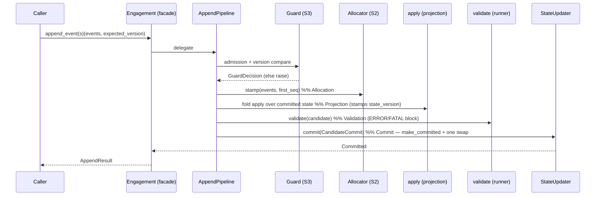

# StratAgent Architecture v1.0 — Frozen Baseline

# Executive Summary

**Purpose.** The definitive architectural baseline for StratAgent through the
end of M1.7. Every future milestone (M1.8 onward) treats this as **immutable**
unless a new ADR explicitly amends it. This is a checkpoint, not a milestone —
no new functionality was added to produce it.

**Repository version.** `v1.7.0`, HEAD `69a8b64`, working tree clean [Verified].

**Architecture status.** Frozen v1.0 = ADR-001…ADR-005 (approved, unmodified)
[Verified]. The Engagement State keystone (milestone M1) is implemented through
sub-milestone **M1.7** inclusive; M1.8 (persistence) and M1.9 (replay) are
designed-for but **not started** [Verified].

**Completion state.** M0–M1.7 complete. Quality gate green: ruff, black --check,
mypy --strict (51 source files), **267 tests**, 29 perf benchmarks; `state`
coverage **99%** (3 pre-existing uncovered lines: projection.py ×2, schema.py
`__main__` guard) [Verified].

# Repository Overview

Directory structure [Verified — `find`/`ls`]:

```
.claude-plugin/marketplace.json     local Ruflo marketplace (installable)
plugins/ruflo-stratagent/           THE PLUGIN — consulting vertical (domain)
  commands/ skills/ agents/ knowledge/
packages/                           Python implementation (capability packages)
  core/     base Pydantic model, settings, logging
  common/   value objects, DomainObject base, error root
  state/    Engagement State — the keystone (see Layers)
  knowledge/ planning/ analysis/ governance/ reporting/   scaffolds (empty)
scripts/    generate_schema.py, generate_traceability.py
tests/      state/ (unit) · perf/ (benchmarks) · foundation/schema/fixtures
docs/       architecture/ (ADRs) · implementation/ · api/ · performance/ · reviews/
knowledge-vault/   ADR-003 Obsidian vault (empty structure; Graphify-indexed)
schema/     generated engagement-state.schema.json (drift-tested)
.claude-flow/ .mcp.json   Ruflo harness (pinned 3.16.3) + Graphify MCP
engagements/ apps/        runtime artifacts (future) / reserved service shell
```

Major packages & responsibilities [Verified]:
- **core** — `StratAgentModel` (frozen-config Pydantic base), settings, logging.
- **common** — `ConfidenceScore`/`Identifier`/`Reference` value objects,
  `DomainObject` (immutable auto-id + audit fields), `StratAgentError` root.
- **state** — the entire Engagement State: models, sections, ledgers, events,
  identifiers, projection, validation, the append pipeline, replay integrity,
  ownership data, the facade. The only capability package with implementation.
- **knowledge/planning/analysis/governance/reporting** — scaffolds reserved for
  M2–M9; empty `__init__.py` [Verified].

# Architecture Layers

The layers below are the *implemented* code layers within the frozen ADR-001
seven-layer model (Presentation → Orchestration(Ruflo) → Consulting →
Knowledge → Memory → Tool → Infrastructure). M1.7 lives entirely in the domain
(state) layer.

### L1 — Foundation (`core`, `common`)
- **Purpose:** shared model conventions + value objects.
- **Responsibilities:** frozen Pydantic base; `ConfidenceScore` (0–1),
  `Identifier`/`Reference` (str aliases), `DomainObject`; error root.
- **Public contracts:** `StratAgentModel`, `DomainObject`, `ConfidenceScore`,
  `Identifier`, `Reference`, `new_id`, `StratAgentError`.
- **Dependencies:** none upward. **Extension points:** new value objects.
- **Protected boundary:** must not import `state` or any capability package.

### L2 — Domain data (`state.models`, `state.sections`, `state.ledgers`, `state.enums`, `state.identifiers`)
- **Purpose:** the Engagement State aggregate and its sections (ADR-002 §1–§25).
- **Responsibilities:** `EngagementState` (valid with only `metadata`; all else
  optional/empty), section models, Evidence/Assumption ledgers with record-level
  validation, strongly-typed NewType ids.
- **Public contracts:** the models + enums re-exported via `state.__all__`.
- **Dependencies:** `common`, `core`. **Extension points:** additive fields /
  new sections (schema-drift-tested). **Protected boundary:** record-level
  invariants (evidence provenance, load-bearing breakeven) live here.

### L3 — Events (`state.events`, `state.identifiers`)
- **Purpose:** the immutable event catalog (ADR-002 §26; Event Design Principles).
- **Responsibilities:** 49 frozen event models as a discriminated `Event` union;
  `EventMetadata` envelope (event_id, engagement_id, seq, occurred_at/recorded_at,
  actor, source, schema_version, causation/correlation); `EVENT_CATEGORIES`.
- **Public contracts:** `Event`, `EventMetadata`, `EventType`, `EventCategory`,
  `EventSource`, `EVENT_CATEGORIES`, typed ids.
- **Dependencies:** L2, L1. **Extension points:** new event types (additive;
  projection default-reducer tolerates unknowns). **Protected boundary:** events
  are frozen and append-only — "mutable by none" (ADR-002).

### L4 — Projection (`state.projection`)
- **Purpose:** fold events into state (ADR-002; the M1.5 contract).
- **Responsibilities:** pure `apply(state, event)` (singledispatch, one reducer
  per event) + `project(events)`; stamps `state_version = seq` (M1.7.2);
  `PROJECTION_VERSION = 2`.
- **Public contracts:** internal (not in `state.__all__`); consumed by the
  pipeline and future replay. **Dependencies:** L3, L2. **Protected boundary:**
  **pure, deterministic, seq-blind, IO-free**; version bumps follow
  `projection-versioning.md`.

### L5 — Validation (`state.validation`)
- **Purpose:** invariant checking, separate from projection (M1.6/M1.7.5).
- **Responsibilities:** 21 rules in 5 registries (structural/lifecycle/
  referential/business/governance); pure validators; `validate(state) ->
  ValidationReport`; `raise_if_invalid`; severity taxonomy.
- **Public contracts:** `ValidationReport`, `Violation`, `ViolationSeverity`,
  `ValidationGroup`, `StateValidationError` (re-exported).
  **Dependencies:** L2. **Extension points:** new rules via registries (frozen
  rule-id namespace; traceability drift-tested). **Protected boundary:**
  validators are pure/independent; orchestration only in the runner.

### L6 — Append pipeline & replay (`state.append`)
- **Purpose:** the single, guarded, atomic mutation path + the at-rest gate
  (M1.7.3/M1.7.4).
- **Responsibilities:** S2 arithmetic (`sequencing`,`versioning`), S3 decisions
  (`guard`), S4 orchestration (`pipeline`,`commit`), contracts (`errors`,
  `result`), replay integrity (`integrity`). Fixed order **Decision →
  Allocation → Projection → Validation → Commit**; `make_committed` the sole
  `Committed` constructor.
- **Public contracts:** re-exported errors + `AppendResult` only. Pipeline/
  guard/allocator/updater/`Committed`/`CandidateCommit`/`make_committed`/
  `verify_*` are **internal** (imported by tests and future M1.8/M1.9).
  **Dependencies:** L2–L5. **Extension points:** M1.8/M1.9 consume
  `make_committed` + `verify_log/verify_pair`. **Protected boundary:**
  single commit point; no arithmetic/business-rules in the pipeline.

### L7 — Facade (`state.facade`) + ownership data (`state.ownership`)
- **Purpose:** the sole public entry point + ownership truth as data.
- **Responsibilities:** `Engagement` (10 frozen methods) implementing
  `EngagementProtocol`; snapshot semantics; the event API. `ownership.py` holds
  the R/W matrix / section / event ownership datasets (data only — enforcement
  deferred to M6).
- **Public contracts:** `Engagement`, `EngagementProtocol` (see Public API).
  **Dependencies:** L2–L6. **Extension points:** alternative
  `EngagementProtocol` impls (file/AgentDB-backed). **Protected boundary:** the
  10-method public surface is frozen (S6 freeze test); state crosses only as
  detached snapshots.

# Event Flow

**Append (the write path)** [Verified — M1.7.3]:



- **Validation** runs on the *candidate post-state*; blocking = ERROR/FATAL
  counts (not `report.valid`); INFO/WARNING pass through as `AppendResult.warnings`.
- **Projection** is invoked only inside the pipeline; `apply` is pure and stamps
  `state_version`.
- **Replay (future consumer)** [Verified — M1.7.4]: any log fed to `project()`
  must first pass `verify_log` (R1–R18) / `verify_pair` (state_version match,
  identity, projection-version). Truncation surfaces only via the pair.
- **Ownership** [Verified — M1.7.6]: `state.ownership` records who may write each
  section/event; **not enforced at runtime** (M6). Read = all (ADR-002).
- **Traceability** [Verified]: `make traceability` regenerates
  `traceability-ADR-002.{md,json}` from the rule registry + ownership datasets;
  drift-tested.
- **Persistence boundary (future)** [Inference — design intent, not built]:
  M1.8 persists `CandidateCommit.events` and the `(log, snapshot)` pair; restore
  goes through `make_committed` after `verify_pair`. Nothing persistent exists
  today — M1.7 state is in-memory [Verified].

# State Model

- **`EngagementState`** [Verified] — the root aggregate; valid with only
  `metadata`; carries `state_version` (projection-derived) and
  `projection_version` (provenance).
- **`Engagement`** [Verified] — the facade wrapper; holds an `AppendPipeline`;
  exposes 10 methods; never leaks a live reference (snapshots only).
- **`Committed`** (internal) [Verified] — the immutable committed triple+:
  `log`, `state`, `event_ids`, `version`. Built only by `make_committed`.
- **`CandidateCommit`** (internal) [Verified] — the complete prepared-commit
  payload: `log`, `state`, `event_ids`, `validation_report`, `events` (the
  stamped batch M1.8 will persist).
- **`AppendResult`** (public) [Verified] — `success`, `version`,
  `projection_version`, `first_seq`, `last_seq`, `appended`, `warnings`.
- **`ValidationReport`** (public) [Verified] — `valid`, `violations`, `counts`,
  `duration_ms`, `groups_checked`.
- **Event log** [Verified] — the committed `tuple[Event, ...]`; append-only;
  the single ordering authority (contiguous 1-based `seq`). In-memory today.
- **Snapshots** [Verified] — `get_state()` deep copies; `Committed` is an
  immutable in-memory snapshot; durable snapshots are M1.8.
- **Versioning** [Verified] — `current_version == state_version == last seq ==
  committed log length` (the invariant triangle); `PROJECTION_VERSION = 2`.

# Module Dependency Graph

```
core  ←  common  ←  state.{models,sections,ledgers,enums,identifiers}
                         ↑
        state.events  ───┤
        state.projection ┤   (← events, models)
        state.validation ┤   (← models)
        state.append     ┤   (← models, events, projection, validation)
        state.ownership  ┤   (← events)
        state.facade  ───┘   (← append, validation, models)
```

- **Allowed:** downward only — `state → common → core`; within `state`, the
  layering L2→L7 above.
- **Forbidden [Verified — grep confirms zero violations]:** `core`/`common`
  importing `state`; `state` importing `knowledge/planning/analysis/governance/
  reporting`; `state` importing Ruflo/Graphify tooling; the facade importing
  append *internals* beyond the public `state.append` surface (F7 test).
- **Acyclic** [Verified]: no reverse edges found.

# Public API

`state.__all__` = **86 symbols** [Verified], the entire supported surface:
- **Facade:** `Engagement`, `EngagementProtocol` — the sole entry point.
- **Append API:** `AppendResult`, `AppendError`, `AppendErrorCode`,
  `VersionConflictError`, `EventAdmissionError`, `AppendUnsupportedError` —
  results/errors of the event API (public because callers handle them).
- **Validation surface:** `ValidationReport`, `Violation`, `ViolationSeverity`,
  `ValidationGroup`, `StateValidationError` — a report is unusable without them.
- **Domain models / enums / value objects / typed ids / events** — the data
  contract (models, section models, all enums, `ConfidenceScore`/`Identifier`/
  `Reference`/`DomainObject`/`new_id`, the 9 typed ids, `Event`/`EventMetadata`/
  `EventType`/`EventCategory`/`EventSource`/`EVENT_CATEGORIES`).

**Internal-only [Verified]:** the append pipeline mechanics (`AppendPipeline`,
`StateUpdater`, `Committed`, `CandidateCommit`, `make_committed`, guard,
sequencing, versioning), replay integrity (`verify_log`, `verify_pair`,
`ReplayErrorCode`), projection (`apply`, `project`, `PROJECTION_VERSION`),
validation internals (`validate`, registries, `_util`), and `state.ownership`.
These are imported by tests and reserved for M1.8/M1.9/M6 — deliberately not in
`__all__`. The freeze is guarded by `test_s6_public_api_freeze` (10 facade
methods + 86-symbol allowlist).

# Invariants

| ID / area | Invariant | Introduced | Enforced by |
|---|---|---|---|
| Record-level | evidence type→provenance; load-bearing→breakeven | M1.1 | Pydantic validators + tests |
| Immutability | events frozen; log append-only, mutable by none | M1.4 | frozen model config; R-tests |
| Determinism | same log ⇒ same state (incl. state_version) | M1.5/M1.7.2 | projection purity tests, P14 |
| Snapshot isolation | get_state/from_state never alias internal state | M1.7.1 (D1) | recursive-identity + mutable-collection tests |
| Version triangle | current_version == state_version == len(log) == last seq | M1.7.2/3 | P18, F2, invariant-triangle tests |
| Sequence | contiguous 1-based; seq=0 sentinel; single allocator | M1.7.3 (D2) | A1–A8, G-suite, verify_log R1–R5 |
| Optimistic concurrency | stale/ahead expected_version rejected | M1.7.3 (D3) | G-suite, VersionConflictError |
| Atomic commit | one reference swap; failure ⇒ byte-identical; no partial | M1.7.3 (D6) | P1–P16 |
| No-arithmetic / no-rules pipeline | pipeline delegates; owns neither | M1.7.3 | P17, P19 source-scans |
| Single construction path | `Committed` built only by `make_committed` | M1.7.3 | P21/P23 source-scans |
| Post-state validation gate | ERROR/FATAL block; INFO/WARNING don't | M1.7.3 (D5) | P8, runner tests |
| Replay integrity | R1–R18 (genesis required; aggregate completeness; pair checks) | M1.7.4 | integrity R-suite |
| Gate preconditions | LIFE-001..008 (at-or-beyond; ended exempt) | M1.6/M1.7.5 | lifecycle registry tests |
| Ownership (data) | one writer per section; every event/section mapped | M1.7.6 | ownership completeness tests |
| Public-API freeze | 10 facade methods; 86-symbol surface | M1.3/M1.7.3-S6 | test_s6_public_api_freeze |

# Technical Debt (authoritative register: BACKLOG.md)

| TD | Status | Owner / target |
|---|---|---|
| TD-001 | Open | decide before M1 completes (Evidence.source rename) |
| TD-002 | Closed | M1.7.5 |
| TD-003 | Deferred | M6 (approval-actor/role enforcement; data ready) |
| TD-004 | Closed | M1.7.5 |
| TD-005 | Closed | M1.7.1 |
| TD-006 | Closed | M1.7.3/M1.7.4 |
| TD-007 | Deferred | M1.8 (event schema upcasting) |
| TD-008 | Closed | M1.7.8 |
| TD-009 | Closed | M1.7.8 |
| TD-010 | Closed | M1.7.7 |
| TD-011 | Deferred | analysis-field maps (3rd consumer) |
| TD-012 | Deferred | PEP 695 `type` aliases repo-wide |

# Extension Points

- **Persistence (M1.8)** — persist `CandidateCommit.events` + the `(log,
  snapshot)` pair; restore via `verify_pair` → `make_committed`. `AppendPipeline`
  already accepts `log=` + `append_supported=`.
- **Replay (M1.9)** — fold a verified log through `project()`; construct an
  append-capable engagement (`append_supported=True`) from a replayed log;
  removes the read-only-adoption restriction. Property/stress suite (S7) lands here.
- **Snapshots (M1.9)** — periodic `Committed` snapshots; the projection-version
  policy governs re-projection.
- **Agent Manager (M6)** — enforces `state.ownership` (roles); serializes
  transitions; records gates (`QualityGate.by` captured).
- **Authorization (M6)** — role registry seeded by `ownership.Role`.
- **Knowledge Graph / Graphify** — the empty `knowledge-vault/` + Graphify MCP;
  Knowledge Agent (M3) reads via retrieval interfaces.
- **Ruflo / MCP** — pinned 3.16.3 harness; `mcp__claude-flow__*` orchestration
  tools; StratAgent detects and uses them, falls back to files otherwise.

# M1.8 Assumptions

**M1.8 may assume [Verified]:**
- `make_committed` is the single, pure construction path for `Committed`.
- `verify_log`/`verify_pair` are the ready at-rest gate; the canonical persisted
  artifact is the `(log, project(log))` pair.
- `CandidateCommit.events` is exactly the payload to persist — no reconstruction.
- Commit is one atomic reference swap; the write path is fully in-memory today.
- Determinism + the version triangle hold; `PROJECTION_VERSION = 2`.

**M1.8 must not change [Verified — frozen]:**
- ADR-001…005; the 10-method facade surface / 86-symbol `__all__`; projection
  purity/determinism/seq-blindness; event immutability; the append phase order;
  `make_committed` as sole constructor; the validation architecture; the replay
  invariants R1–R18. Any change to these requires a new ADR.

# Risks

- **[Low] In-memory only** — no durability until M1.8; a crash loses state. By
  design; M1.8's job.
- **[Low] Ownership unenforced** — `state.ownership` is data; nothing prevents a
  wrong-role write until M6. Mitigated: the pipeline is the only writer and no
  agents exist yet.
- **[Low] Single-writer concurrency model** — optimistic concurrency defends
  interleaved logical writers, not OS threads (documented). Distributed/
  multi-process explicitly out of scope.
- **[Low] TD-012 deferral** — PEP 695 alias modernization pending pydantic
  verification; no functional impact.
- **[Inference] Ruflo/Graphify are fast-moving alphas** — pinned (3.16.3 /
  0.9.3) and isolated behind MCP/vault boundaries; `state` has zero imports of
  either [Verified].

# Final Verdict

## Repository ready for M1.8: **YES**

Every audit assertion passes [Verified]: all design docs APPROVED/COMPLETE (no
stale PROPOSED — the one match is a historical quote in the readiness review);
all reviews present; ADRs referenced and unmodified; implementation docs
synchronized (M1-Decomposition corrected, CHANGELOG closed, BACKLOG
authoritative); no stale TODO/FIXME; dependency graph acyclic with no layering
violations; the public surface is frozen and test-guarded; the six-step gate is
green (267 tests, 99% coverage); the working tree is clean. The architecture is
coherent, the boundaries M1.8 needs are in place, and nothing blocks
persistence work.
